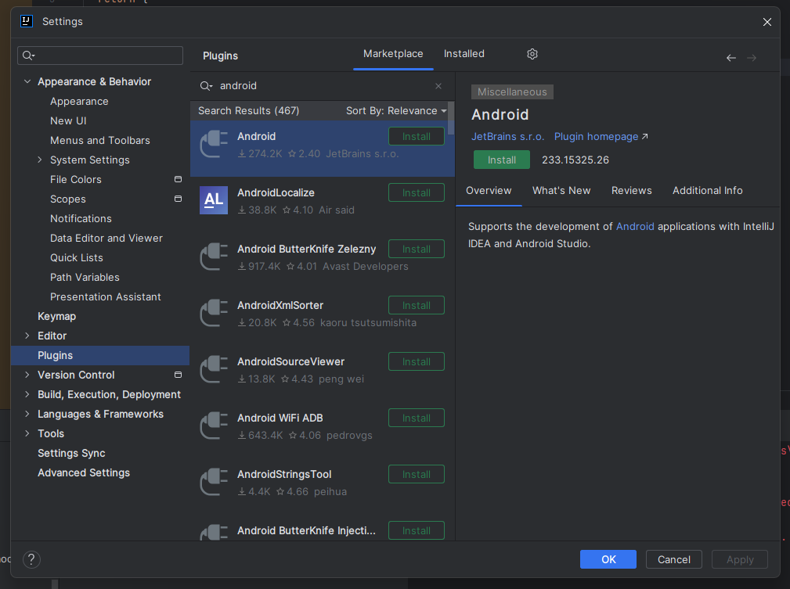
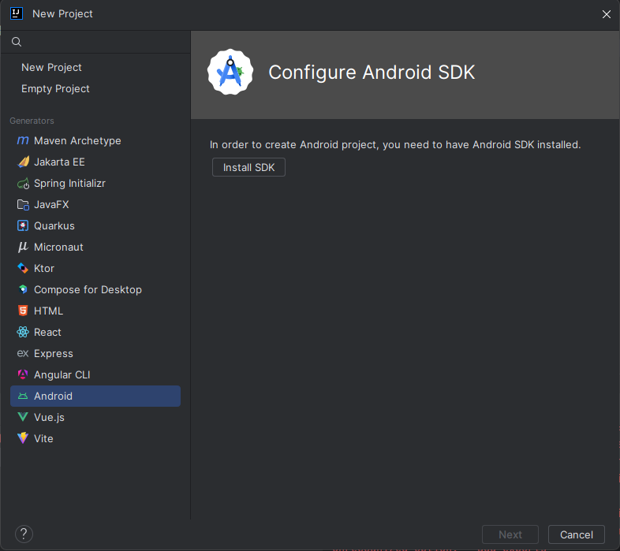
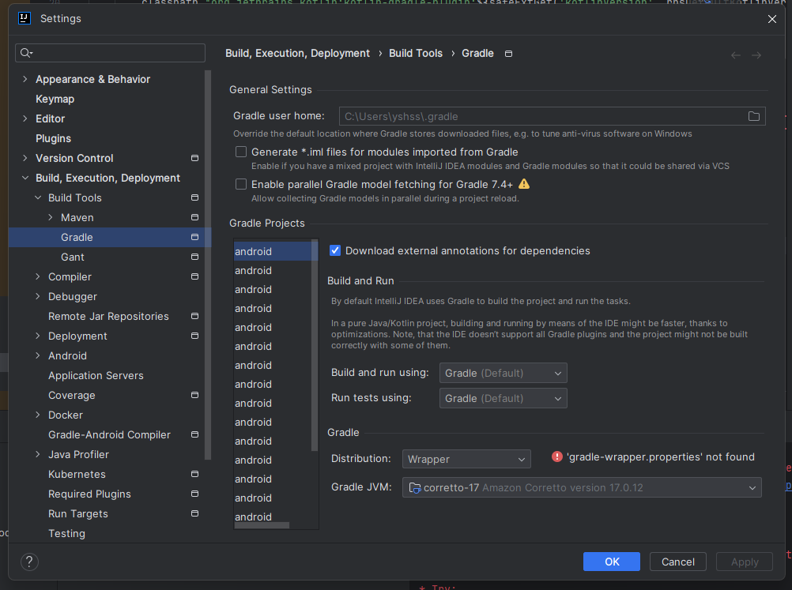

# 초기설정


### 프로젝트 설치

초기 리액트 네이티브 앱을 설치하기 위해서 설치할 경로에다가 cmd로 접속

이후 아래 명령어를 작성하면 `app`의 이름을 셋팅할 수 있다.

```
npx create-expo-app@latest
```


#### 설치완료 화면

**CMD**

### 

**IDE** : IntelliJ


### 에러 핸들링

초기 설치시에 이런 에러들이 많이 발생하는데 왜 발생하는지 잘 모르겠음...

나는 아래에 설치 과정을 통해서 에러 핸들링을 진행해봄

#### 안드로이드 플러그인 설치

Adnriod `Install` 클릭 후 IDE 재시작 필요



#### 안드로이드 SDK 설치

`Install SDK` 버튼 클릭 후 새창 나오는데 모두 확인 후 설치



구글 SDK 설치


라이센스 동의


### Gradle 빌드 설정



#### JDK 1.8이 JAVA_HOME 환경변수

17다운로드 받아서 설정 변경 후도 잘 적용이 안되서 그냥 1.8 자체를 지우고 컴퓨터 재부팅 후 정상적으로 되는 것을 확인


#### Andriod SDK 환변경수

SDK는 기본적으로 다음 위치에 설치됩니다.

```powershell
%LOCALAPPDATA%\Android\Sdk
```


SDK의 실제 위치는 Android Studio '설정' 대화 상자의 **언어 및 프레임워크** → **Android SDK** 에서 찾을 수 있습니다 .

다음 단계로 넘어가기 전에 새 환경 변수가 로드되었는지 확인하려면 새 명령 프롬프트 창을 여세요.

1. PowerShell을 엽니다
2. **Get-ChildItem -Path Env:\를** 복사하여 powershell에 붙여넣습니다.
3. 확인이 `ANDROID_HOME`추가되었습니다


#### Path에 platform-tools 추가

1. **Windows 제어판을** 엽니다 .
2. **사용자 계정을** 클릭한 다음 다시 **사용자 계정을 클릭합니다.**
3. **내 환경 변수 변경을** 클릭하세요
4. **경로** 변수를 선택합니다 .
5. 편집을 클릭하세요 **.**
6. **새로 만들기를** 클릭 하고 platform-tools 경로를 목록에 추가합니다.


#### android lib 에러는 잘 모르겠음...

일단 시작하면 모듈은 정상적으로 나오는걸로 확인

일단 나중에 보도록 하겠음


