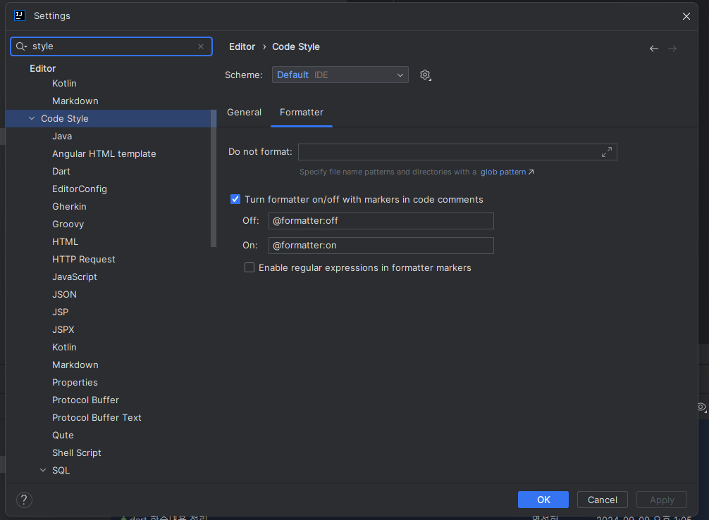

# 01. 자동정렬 무시하기

Settings > Editor > Code Style > Formatter

`Turn formatter on/off with markers in code commnets` 해당 내용이 `Check`가 되어 있는지 확인

기본적으로 체크가 되어 있었음




코드에 `//@formmater:off`를 추가시 그 주석 이후 코드 내용은 정렬이 안된다.

그리고 다시 `//@formatter:on` 을 입력해야 그 이후 코드 부터는 정상적으로 코드 정렬이 적용

```java
@Test
public void formatterOff() throws Exception {

    //@formatter:off    
    List<String> arrays1 = new ArrayList<>(); arrays1.add("Test"); arrays1.add("Formatter");    
    //@formatter:on   
    List<String> arrays2 = new ArrayList<>();
    arrays2.add("Test");
    arrays2.add("Formatter");
}
```

