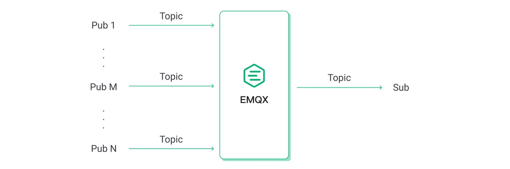
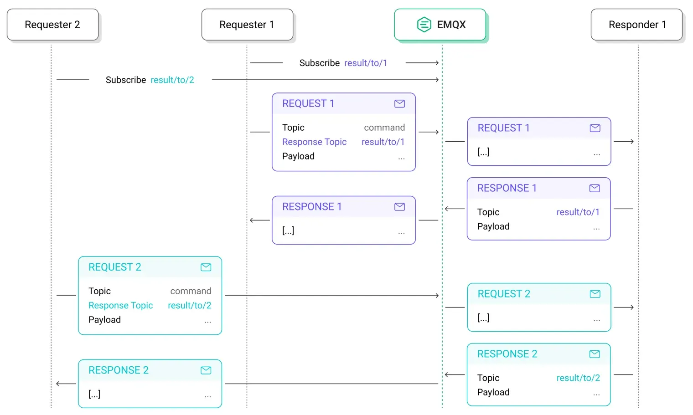
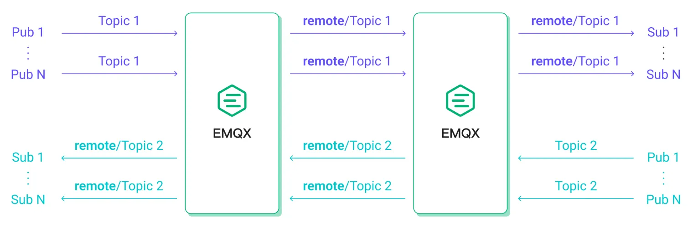
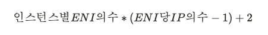
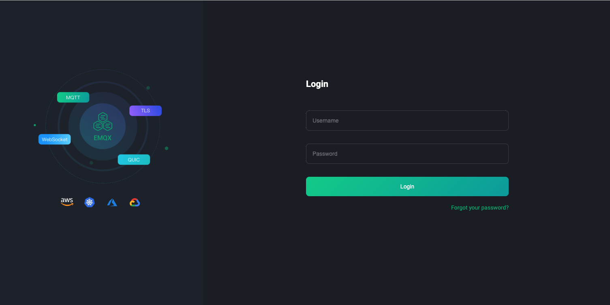
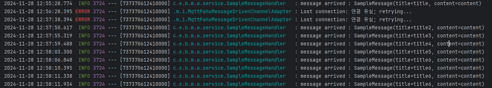

# EMQX

https://docs.emqx.com/en/emqx/v5.6/

## EMQX 개요


EMQX는 IoT 및 실시간 메시징 애플리케이션을 위해 설계된 [오픈 소스 , 확장성이 뛰어나고 기능이 풍부한 MQTT 브로커입니다. 클러스터당 최대 1억 개의 동시 IoT 장치 연결을 지원하는 동시에 초당 100만 개의 메시지 처리량과 밀리초 지연 시간을 유지합니다.](https://github.com/emqx/emqx)


## 주요 이점

#### [**대규모**](https://www.emqx.com/en/blog/how-emqx-5-0-achieves-100-million-mqtt-connections)

EMQX는 단일 클러스터에서 최대 **1억 개의** 동시 MQTT 연결을 확장할 수 있어 사용 가능한 MQTT 브로커 중 확장성이 가장 뛰어납니다.

#### [**고성능**](https://www.emqx.com/en/blog/mqtt-performance-benchmark-testing-emqx-single-node-supports-2m-message-throughput)

EMQX는 단일 브로커 내에서 초당 **수백만** 개의 MQTT 메시지를 처리하고 처리할 수 있습니다 .

#### [**낮은 대기 시간**](https://www.emqx.com/en/blog/mqtt-performance-benchmark-testing-emqx-single-node-message-latency-response-time)

EMQX는 밀리초 미만의 지연 시간을 보장하여 거의 실시간에 가까운 메시지 전달 기능을 제공하므로 메시지가 거의 즉시 수신됩니다.

#### [**완전한 MQTT 5.0**](https://www.emqx.com/en/blog/introduction-to-mqtt-5)

EMQX는 **MQTT 5.0 및 3.x** 표준을 모두 **완벽하게** 준수하여 더 나은 확장성, 보안 및 안정성을 제공합니다.

#### [**고가용성**](https://docs.emqx.com/en/emqx/v5.6/deploy/cluster/mria-introduction.html)

EMQX는 마스터리스 분산 아키텍처를 통해 높은 가용성과 수평적 확장성을 제공하여 안정적이고 확장 가능한 성능을 보장합니다.

#### [**클라우드 네이티브 및 K8s**](https://www.emqx.com/en/emqx-kubernetes-operator)

**EMQX는 Kubernetes Operator** 와 **Terraform을** 사용하여 온프레미스나 퍼블릭 클라우드에 쉽게 배포할 수 있습니다 .제품 비교[](https://docs.emqx.com/en/emqx/v5.6/#product-comparison)


## 제품 비교

EMQ는 EMQX에 대해 4가지 배포 옵션을 제공합니다. 두 가지 관리형 서비스(EMQX Cloud Serverless 및 EMQX Dedicated Cloud)와 두 가지 자체 호스팅 옵션(EMQX Open Source 및 EMQX Enterprise)입니다. 요구 사항에 가장 적합한 배포 옵션을 선택하는 데 도움이 되도록 다음 표에는 다양한 배포 유형에서 기능 지원을 비교한 내용이 나와 있습니다. 지원되는 기능을 자세히 비교하려면 [기능 비교를](https://docs.emqx.com/en/emqx/v5.6/getting-started/feature-comparison.html) 참조하세요 .

| 셀프호스팅                                                   | 서비스로서의 MQTT                                            |                                                              |                                                              |
| :----------------------------------------------------------- | :----------------------------------------------------------- | ------------------------------------------------------------ | ------------------------------------------------------------ |
| EMQX 오픈 소스                                               | EMQX 엔터프라이즈                                            | EMQX 클라우드 서버리스                                       | EMQX 전용 클라우드                                           |
| [오픈소스 다운로드](https://www.emqx.com/en/try?product=broker) | [무료 체험판 라이센스 받기](https://www.emqx.com/en/apply-licenses/emqx) | [무료로 시작하세요](https://accounts.emqx.com/signup?continue=https%3A%2F%2Fcloud-intl.emqx.com%2Fconsole%2Fdeployments%2F0%3Foper%3Dnew) | [무료 14일 체험판 시작하기](https://accounts.emqx.com/signup?continue=https%3A%2F%2Fcloud-intl.emqx.com%2Fconsole%2Fdeployments%2F0%3Foper%3Dnew) |
| ✔️ Apache 버전 2.0 <br />✔️ QUIC을 통한 MQTT <br />✔️ 메모리에 세션 저장 <br />✔️ Webhook 및 MQTT 데이터 브리지 지원 <br />✔️ 감사 로그 및 Single Sign-On(SSO) <br />✔️ MQTT-SN, STOMP 및 CoAP를 포함한 다중 프로토콜 게이트웨이 <br />✔️ 오픈 소스 커뮤니티 | ✔️ 상용 라이센스(비즈니스 소스 라이센스) <br />✔️ QUIC를 통한 MQTT <br />✔️ RocksDB의 세션 지속성 <br />✔️ Kafka/Confluent, Timescale, InfluxDB, PostgreSQL, Redis 등을 포함한 40개 이상의 엔터프라이즈 시스템과의 데이터 통합 <br />✔️ 감사 로그 및 Single Sign-On(SSO) <br />✔️ 역할 기반 액세스 제어(RBAC) <br />✔️ 파일 전송 <br />✔️ 메시지 코덱 <br />✔️ OCPP, JT/808 및 GBT32960에 대한 추가 지원이 포함된 다중 프로토콜 게이트웨이 <br />✔️ 24/7 글로벌 기술 지원 | ✔️ 사용량에 따른 결제 <br />✔️ 매월 무료 할당량 <br />✔️ 최대 1000개 연결 <br />✔️ 몇 초 안에 배포 시작 <br />✔️ 자동 확장 <br />✔️ 8/5 글로벌 기술 지원 | ✔️ 14일 무료 체험 <br />✔️ 시간당 청구 <br />✔️ 전 세계 다중 클라우드 지역 <br />✔️ 유연한 사양 <br />✔️ VPC 피어링, NAT 게이트웨이, 로드 밸런싱 등 <br />✔️ 40개 이상의 클라우드 서비스와 즉시 사용 가능한 통합 <br />✔️ 24시간 연중무휴 글로벌 기술 지원 |

\## 사용 사례

IoT 및 실시간 메시징 애플리케이션을 위해 설계된 MQTT 브로커인 EMQX는 다음 시나리오에서 다양한 비즈니스 요구 사항을 충족하는 데 자주 사용됩니다.

## 안정적이고 효율적인 Pub/Sub 메시징

EMQX는 MQTT(3.1, 3.1.1 및 5.0), HTTP, QUIC 및 WebSocket을 포함한 여러 프로토콜을 지원합니다. 또한 TLS/SSL 및 다양한 인증 메커니즘을 통해 MQTT와의 안전한 양방향 통신을 제공하여 IoT 장치 및 애플리케이션을 위한 안정적이고 효율적인 통신 인프라를 보장합니다.

미션 크리티컬 애플리케이션에 EMQX를 사용하면 다음과 같은 주요 이점을 얻을 수 있습니다.

- **주제 기반 Pub/Sub 메시징:** EMQX의 주제 기반 Publish/Subscribe 모델은 데이터 흐름을 간소화하여 효율적이고 유연한 메시지 라우팅을 보장합니다.
- **초저지연 전송:** 지연 시간이 1밀리초에 불과하여 빠른 데이터 전송을 구현하여 실시간 응답성을 보장합니다.
- **포괄적인 서비스 품질(QoS) 보장:** EMQX는 종단 간 다중 레벨 QoS 보장을 통해 안정적이고 유연한 메시지 전송을 제공합니다.

EMQX는 아래 나열된 다양한 시나리오에서 도움을 드릴 수 있습니다.

### 피어 투 피어 커뮤니케이션


EMQX로 피어투피어 통신을 구축할 수 있습니다. 비동기 Pub/Sub 모델에서 메시지 게시자와 구독자는 필요에 따라 동적으로 추가되거나 제거될 수 있으므로 서로 분리됩니다. 이러한 분리는 애플리케이션과 메시지 통신에 유연성을 제공합니다.

### 대규모 청중에게 메시지 방송


EMQX는 금융 시장 업데이트와 같이 일대다 메시징이 필수적인 시나리오에서 탁월합니다. 많은 수의 클라이언트에게 효과적으로 메시지를 브로드캐스트하여 시기적절한 정보 전달을 보장합니다.

### 대규모 엔드포인트의 데이터 통합



EMQX의 다대일 메시지 패턴은 공장 평면도, 현대식 건물, 소매점 체인 또는 전기 그리드와 같은 대규모 네트워크에서 데이터를 통합하는 데 이상적입니다. EMQX는 네트워크의 엔드포인트에서 클라우드 또는 온프레미스의 중앙 백엔드 서버로 데이터를 전송하고 전송하는 데 도움이 될 수 있습니다.

### 요청-응답 인식을 통한 추적 가능한 커뮤니케이션



EMQX는 MQTT 5.0 기능인 요청-응답을 지원합니다. 이 기능을 사용하면 이제 비동기 통신 아키텍트에서 통신 인식과 추적성을 높일 수 있습니다.

### 다양한 네트워크 간 데이터 통합



분할되거나 제한된 네트워크 환경에서 EMQX는 데이터 통합을 구축하고 원활한 메시징 환경을 제공할 수 있습니다.

### 흐르는 데이터 변환


내장된 강력한 SQL 기반 [규칙 엔진을](https://docs.emqx.com/en/emqx/v5.6/data-integration/rules.html) 통해 EMQX는 흐르는 데이터를 실시간으로 추출, 필터링, 강화 및 변환할 수 있습니다. 처리된 ATA는 외부 HTTP 서버 및 MQTT 서비스로 쉽게 수집할 수 있습니다. EMQX Enterprise를 사용하는 경우 주류 데이터베이스, 데이터 저장소 및 메시지 큐로 데이터를 수집할 수도 있습니다.


# EMQX 쿠버네티스

## 환경 준비

- 실행 중인 [Kubernetes 클러스터](https://kubernetes.io/docs/concepts/overview/) 의 경우 Kubernetes 버전에 대해 [Kubernetes 버전을 선택하는 방법을 확인하세요.](https://docs.emqx.com/en/emqx-operator/latest/#how-to-selector-kubernetes-version)
- [쿠버네티스 클러스터에 접근할 수 있는 kubectl](https://kubernetes.io/docs/tasks/tools/#kubectl) 도구 입니다. 명령을 사용하여 쿠버네티스 클러스터의 상태를 확인할 수 있습니다 `kubectl cluster-info`.
- [헬름](https://helm.sh/) 3 이상

### How to selector Kubernetes version

The EMQX Operator requires a Kubernetes cluster of version `>=1.24`.

| Kubernetes Versions     | EMQX Operator Compatibility                                  | Notes                                                        |
| :---------------------- | :----------------------------------------------------------- | :----------------------------------------------------------- |
| 1.24 or higher          | All functions supported                                      |                                                              |
| 1.22 (included) ～ 1.23 | Supported, except [MixedProtocolLBService](https://kubernetes.io/docs/reference/command-line-tools-reference/feature-gates/) | EMQX cluster can only use one protocol in `LoadBalancer` type of Service, for example TCP or UDP. |
| 1.21 (included) ～ 1.22 | Supported, except [pod-deletion-cost](https://kubernetes.io/docs/concepts/workloads/controllers/replicaset/#pod-deletion-cost) | When using EMQX Core + Replicant mode cluster, updating the EMQX cluster cannot accurately delete Pods. |
| 1.20 (included) ～ 1.21 | Supported, manual `.spec.ports[].nodePort` assignment required if using `NodePort` type of Service | For more details, please refer to [Kubernetes changelog](https://github.com/kubernetes/kubernetes/blob/master/CHANGELOG/CHANGELOG-1.20.md#bug-or-regression-4). |
| 1.16 (included) ～ 1.20 | Supported, not recommended due to lack of testing            |                                                              |
| Lower than 1.16         | Not supported                                                | `apiextensions/v1` APIVersion is not supported.              |

현재 k8s 버전은 1.30 이기때문에 문제 없는 것을 확인

## Cluster 설치

```bash
$ eksctl create cluster \
--name demo-eks \
--region ap-northeast-2 \
--with-oidc \
--nodegroup-name demo-ng \
--zones ap-northeast-2a,ap-northeast-2c \
--nodes 2 \
--node-type t3.medium \
--node-volume-size=20 \
--managed
```

t2.micro로 했을경우 ENI와 IPv4의 값이 각각 2여서 pod 생성이 4개까지 밖에 생성이 안됨

그래서 t3.small로 업그레이드 함



```bash
$ aws ec2 describe-instance-types --filters "Name=instance-type,Values=t3.medium" --query "InstanceTypes[].{Type: InstanceType, MaxENI: NetworkInfo.MaximumNetworkInterfaces, IPv4addr: NetworkInfo.Ipv4AddressesPerInterface, IPv6addr: NetworkInfo.Ipv6AddressesPerInterface}" --output table
------------------------------------------------
|             DescribeInstanceTypes            |
+----------+------------+---------+------------+
| IPv4addr | IPv6addr   | MaxENI  |   Type     |
+----------+------------+---------+------------+
|  4       |  4         |  3      |  t3.small  |
+----------+------------+---------+------------+
```


## EMQX Operator 설치

1. 설치하고 시작합니다 `cert-manager`.

   **팁**

   > `cert-manager`버전 `1.1.6`이상이 필요합니다. `cert-manager`이미 설치되어 시작되었다면 이 단계를 건너뜁니다.
   >
   > Helm을 사용하여 설치할 수 있습니다 `cert-manager`.

   ```bash
   $ helm repo add jetstack https://charts.jetstack.io
   $ helm repo update
   $ helm upgrade --install cert-manager jetstack/cert-manager \
     --namespace cert-manager \
     --create-namespace \
     --set installCRDs=true
   ```

   [또는 cert-manager 설치 가이드](https://cert-manager.io/docs/installation/) 에 따라 설치할 수 있습니다.

   **경고**

   > 기본 구성으로 Google Kubernetes Engine(GKE)에 cert-manager를 설치하면 부트스트래핑 문제가 발생할 수 있습니다. 따라서 구성을 추가하여 `--set global.leaderElection.namespace=cert-manager`리더 선거에서 다른 네임스페이스를 사용하도록 구성합니다. [cert-manager 호환성을 확인하세요.](https://cert-manager.io/docs/installation/compatibility/)

2. 아래 명령으로 EMQX Operator를 설치하세요:

   ```bash
   $ helm repo add emqx https://repos.emqx.io/charts
   $ helm repo update
   $ helm upgrade --install emqx-operator emqx/emqx-operator \
     --namespace emqx-operator-system \
     --create-namespace
   ```

3. EMQX Operator가 준비될 때까지 기다리세요:

   ```bash
   $ kubectl wait --for=condition=Ready pods -l "control-plane=controller-manager" -n emqx-operator-system
   
   pod/emqx-operator-controller-manager-57bd7b8bd4-h2mcr condition met
   ```

이제 운영자를 성공적으로 설치했으므로 다음 단계로 진행할 준비가 되었습니다. [EMQX 배포](https://docs.emqx.com/en/emqx-operator/latest/getting-started/getting-started.html#deploy-emqx) 섹션에서 EMQX 운영자를 사용하여 EMQX를 배포하는 방법을 알아봅니다.

또는, 운영자를 사용하여 EMQX를 업그레이드하거나 제거하는 방법을 알고 싶다면 이 섹션을 계속 읽어보세요.


# EMQX 설치

https://dev-seb.tistory.com/10 참고하여 작성하였습니다


### Helm 차트 생성

명령어를 수행한 위치에 mqtt-cluster 폴더가 생성

해당 내용은 1회만 수행하면 됨

이후부터는 helm install만 진행하면 됨

```bash
$ helm create mqtt-cluster
```


### values.yaml 수정

mqtt-cluster/values.yaml 에 있는 내용을 지우고 아래 내용을 입력

다만 나는 cluster node를 t3.large로 해서 cpu나 메모리 부족 오류가 발생해 스펙을 낮춰서 진행함

**팁**

> vi mqtt-cluster/values.yaml
>
> :%d -> enter 하면 모든 내용 삭제
>
> 그리고 아래 내용 복붙

```yaml
# mqtt-cluster/values.yaml
core:
  replicas: 3
  resources:
    requests:
      cpu: 250m
      memory: 512Mi

replicant:
  replicas: 7
  resources:
    requests:
      cpu: 250m
      memory: 1Gi

service:
  dashboard:
    spec:
      type: LoadBalancer
  listeners:
    spec:
      type: LoadBalancer
```


### cluster.yaml 내용

기존 내용 모두 삭제

```bash
$ cd mqtt-cluster
$ rm -r templates/*
$ touch templates/cluster.yaml
```

touch한 파일 안에 아래 내용 입력

```yaml
# mqtt-cluster/templates/cluster.yaml
apiVersion: apps.emqx.io/v2beta1
kind: EMQX
metadata:
  name: emqx
  namespace: {{ .Release.Namespace }}
spec:
  image: emqx:5.1
  coreTemplate:
    spec:
      replicas: {{ .Values.core.replicas }}
      resources:
{{ toYaml .Values.core.resources | indent 8 }}
  replicantTemplate:
    spec:
      replicas: {{ .Values.replicant.replicas }}
      resources:
{{ toYaml .Values.replicant.resources | indent 8 }}
  dashboardServiceTemplate:
    spec:
{{ toYaml .Values.service.dashboard.spec | indent 6 }}
  listenersServiceTemplate:
    spec:
{{ toYaml .Values.service.listeners.spec | indent 6 }}
```


### Helm 템플릿

```bash
$ helm template mqtt-cluster
---
# Source: mqtt-cluster/templates/cluster.yaml
apiVersion: apps.emqx.io/v2beta1
kind: EMQX
metadata:
  name: emqx
  namespace: default
spec:
  image: emqx:5.1
  coreTemplate:
    spec:
      replicas: 3
      resources:
        requests:
          cpu: 250m
          memory: 512Mi
  replicantTemplate:
    spec:
      replicas: 7
      resources:
        requests:
          cpu: 250m
          memory: 1Gi
  dashboardServiceTemplate:
    spec:
      type: LoadBalancer
  listenersServiceTemplate:
    spec:
      type: LoadBalancer
```

### Helm install

위 과정을 1회 이후 해당 작업만 수행 하면 됨

```bash
$ helm install mqtt mqtt-cluster -n mqtt --create-namespace
NAME: mqtt
LAST DEPLOYED: Thu Jan 25 17:20:36 2024
NAMESPACE: mqtt
STATUS: deployed
REVISION: 1
TEST SUITE: None

# 삭제시
$ kubectl delete ns mqtt
```

```bash
$ kubectl get pods -n mqtt
NAME                              READY   STATUS    RESTARTS   AGE
emqx-core-944bb84db-0             1/1     Running   0          43s
emqx-core-944bb84db-1             1/1     Running   0          43s
emqx-core-944bb84db-2             1/1     Running   0          43s
emqx-replicant-699944997b-4hw26   1/1     Running   0          31s
emqx-replicant-699944997b-7zrtl   1/1     Running   0          31s
emqx-replicant-699944997b-96wb4   1/1     Running   0          31s
emqx-replicant-699944997b-d8zdm   1/1     Running   0          31s
emqx-replicant-699944997b-jpnhh   1/1     Running   0          31s
emqx-replicant-699944997b-m9bcn   1/1     Running   0          31s
emqx-replicant-699944997b-tkkbb   1/1     Running   0          31s
```


### Dashboard

이 명령어를 수행하면 dashborad 로드밸런서가 있음

해당 external ip로 접근시 dashboard 접근이 가능

```bash
$ kubectl get svc -n mqtt
```

#### 기본 계정 정보

> username: admin
>
> password: public




### Application 로그

local 및 eks 환경에서 정상적으로 subscribe가 되는 것을 확인




# EMQX Core/Replicant

https://docs.emqx.com/en/emqx-operator/latest/tasks/configure-emqx-core-replicant.html

EMQX 설정에서 `coreTemplate`과 `replicantTemplate`은 각각 **Core 노드**와 **Replicant 노드**의 동작과 구성을 정의합니다. 이는 EMQX의 클러스터링 구조와 관련이 있으며, 각 템플릿은 다른 역할을 담당하는 노드의 설정을 구체화합니다.

------

### **1. `coreTemplate`**

- **Core 노드**는 클러스터의 **핵심** 역할을 담당합니다.
- 클러스터 상태를 관리하고, 노드 간의 데이터를 동기화하며, 중요한 메타데이터를 유지합니다.
- 일반적으로 EMQX 클러스터에서는 소수의 Core 노드만 필요합니다.
- Core 노드는 항상 클러스터를 구성하는 필수적인 요소로, 클러스터 내에서 장애 발생 시 복구를 위해 필요합니다.

#### **구성 예시**

```yaml
coreTemplate:
  spec:
    replicas: 3
    resources:
      requests:
        cpu: 250m
        memory: 512Mi
```

- ```
  replicas: 3
  ```

  : Core 노드의 개수를 3개로 설정합니다.

  - 클러스터를 구성하는 데 최소 3개의 Core 노드를 사용하는 것이 권장됩니다 (HA 구성).

- `resources`: Core 노드가 사용하는 CPU와 메모리를 정의합니다.

------

### **2. `replicantTemplate`**

- **Replicant 노드**는 클러스터의 **확장 가능성**을 담당합니다.
- 메시지 라우팅, 연결 처리, 클라이언트 요청 응답 등의 작업을 수행합니다.
- 클라이언트 수나 트래픽이 많아질수록 Replicant 노드를 추가하여 확장할 수 있습니다.
- Replicant 노드는 상태가 없는(Stateless) 역할을 수행하므로, 더 많은 수를 배치하여 클러스터의 처리 용량을 늘릴 수 있습니다.

#### **구성 예시**

```yaml
replicantTemplate:
  spec:
    replicas: 7
    resources:
      requests:
        cpu: 250m
        memory: 1Gi
```

- `replicas: 7`: Replicant 노드의 개수를 7개로 설정합니다. 클라이언트 연결 수와 메시지 처리량에 따라 적절히 설정합니다.
- `resources`: Replicant 노드가 사용하는 리소스를 정의합니다.
  - Replicant 노드는 주로 메시지 처리량에 따라 CPU와 메모리를 많이 소모할 수 있습니다.

------

### **Core 노드와 Replicant 노드의 차이**

| **항목**        | **Core 노드**                  | **Replicant 노드**                   |
| --------------- | ------------------------------ | ------------------------------------ |
| **역할**        | 클러스터 관리, 메타데이터 유지 | 메시지 라우팅, 연결 처리             |
| **필요 개수**   | 최소 3개 (권장)                | 트래픽에 따라 가변적                 |
| **상태 유지**   | 상태 유지 (Stateful)           | 상태 없음 (Stateless)                |
| **확장성**      | 제한적 (소수의 노드)           | 무제한 확장 가능                     |
| **복구 중요성** | 필수 (장애 발생 시 복구 필요)  | 복구 가능 (장애 발생 시 자동 재생성) |

------

### **이 설정이 의미하는 클러스터 구조**

- **Core 노드 (3개)**
  - 클러스터의 안정성을 보장하며, 장애 발생 시 데이터를 안전하게 유지하고 복구합니다.
- **Replicant 노드 (7개)**
  - 클라이언트 요청과 메시지 처리를 효율적으로 분산 처리하여 확장성을 제공합니다.

------

### **추가로 고려할 점**

- 클러스터 크기를 정할 때 트래픽, 연결 수, 메시지 처리량을 기반으로 Core와 Replicant의 비율을 조정해야 합니다.
- Core 노드는 적정 수를 유지해야 하며, 과도하게 많아지면 클러스터 관리가 복잡해지고 성능 저하를 유발할 수 있습니다.
- Replicant 노드는 트래픽 증가에 따라 동적으로 늘리거나 줄일 수 있습니다 (HPA 사용 가능).

위 설명을 통해 EMQX 클러스터의 구성과 Core/Replicant 노드의 역할을 이해하는 데 도움이 되셨기를 바랍니다. 😊


## HPA

네, **Core 노드**와 **Replicant 노드** 모두 HPA(Horizontal Pod Autoscaler)를 사용할 수 있습니다. 그러나 실제 사용 시 몇 가지 차이점과 주의사항이 있습니다.

------

### **1. Core 노드에 HPA 사용**

Core 노드에 HPA를 적용할 수 있지만, 클러스터의 안정성을 보장해야 하는 특성 때문에 신중하게 설정해야 합니다.

#### **특징 및 주의사항**

- **Core 노드는 상태(Stateful)를 유지**해야 하므로, Pod 수를 동적으로 변경하는 것이 까다로울 수 있습니다.
- Core 노드 수가 너무 적으면 클러스터 장애 복구에 문제가 발생할 수 있으며, 너무 많으면 불필요한 자원 낭비가 됩니다.
- Core 노드 수는 일반적으로 **홀수(예: 3개 또는 5개)**로 유지해야 합니다(Quorum을 위해).
- 추천 사용 사례:
  - CPU나 메모리 부하를 기준으로 스케일 업/다운이 필요할 때 HPA를 사용할 수 있지만, **최소 및 최대 노드 수를 엄격히 제한**해야 합니다.

#### **HPA 설정 예시 (Core 노드)**:

```yaml
apiVersion: autoscaling/v2
kind: HorizontalPodAutoscaler
metadata:
  name: emqx-core-hpa
  namespace: default
spec:
  scaleTargetRef:
    apiVersion: apps/v1
    kind: StatefulSet
    name: emqx-core
  minReplicas: 3
  maxReplicas: 5
  metrics:
  - type: Resource
    resource:
      name: cpu
      target:
        type: Utilization
        averageUtilization: 75
```

------

### **2. Replicant 노드에 HPA 사용**

Replicant 노드에 HPA를 적용하는 것은 더 일반적이며, EMQX 클러스터의 확장성을 극대화하는 데 유용합니다.

#### **특징 및 장점**

- Replicant 노드는 **상태가 없는(Stateless)** 구조로, 동적으로 Pod 수를 늘리거나 줄이는 것이 상대적으로 안전합니다.
- 클라이언트 연결 수, 메시지 처리량 증가 등으로 인해 리소스가 부족해질 때 자동으로 확장할 수 있습니다.
- 트래픽 감소 시 Replicant Pod 수를 줄여 비용 효율성을 높일 수 있습니다.

#### **HPA 설정 예시 (Replicant 노드)**:

```yaml
apiVersion: autoscaling/v2
kind: HorizontalPodAutoscaler
metadata:
  name: emqx-replicant-hpa
  namespace: default
spec:
  scaleTargetRef:
    apiVersion: apps/v1
    kind: Deployment
    name: emqx-replicant
  minReplicas: 1
  maxReplicas: 10
  metrics:
  - type: Resource
    resource:
      name: cpu
      target:
        type: Utilization
        averageUtilization: 70
```

------

### **Core와 Replicant 노드에 HPA를 적용할 때 차이점**

| **항목**               | **Core 노드**                           | **Replicant 노드**               |
| ---------------------- | --------------------------------------- | -------------------------------- |
| **HPA 사용 가능 여부** | 가능하지만 신중히 설정 필요             | 적극적으로 사용 가능             |
| **상태(State)**        | Stateful                                | Stateless                        |
| **스케일링 제한**      | 최소/최대 Replicas를 엄격히 제한해야 함 | 트래픽에 따라 자유롭게 설정 가능 |
| **확장성 목적**        | 장애 복구 및 안정성 보장                | 메시지 처리량 및 연결 수 확장    |

------

### **추가로 고려해야 할 점**

- Core 노드의 스케일링은 클러스터의 안정성을 저하시킬 수 있으므로, 스케일링 기준을 명확히 설정하세요.
- Replicant 노드는 클라이언트 연결 수나 메시지 처리량 같은 커스텀 메트릭을 사용해 HPA를 설정할 수 있습니다.
  - 예: EMQX의 대시보드 메트릭을 Prometheus로 수집해 HPA 기준으로 활용.
- Core 노드와 Replicant 노드의 리소스 분배를 사전에 충분히 계산해야 리소스 부족 문제를 방지할 수 있습니다.

------

이와 같은 설정을 통해 EMQX 클러스터에서 HPA를 효과적으로 활용할 수 있습니다! 😊


### 실제 HPA 적용 내역

**mqtt-cluster/templates/hpa.yaml** 생성

```yaml
{{- if .Values.replicant.hpa.enabled }}
apiVersion: autoscaling/v2
kind: HorizontalPodAutoscaler
metadata:
  name: {{ .Release.Name }}-replicant-hpa
  namespace: {{ .Release.Namespace }}
spec:
  scaleTargetRef:
    apiVersion: apps/v1
    kind: ReplicaSet
    name: emqx-replicant-6ff5bd6cdc
  minReplicas: {{ .Values.replicant.hpa.minReplicas }}
  maxReplicas: {{ .Values.replicant.hpa.maxReplicas }}
  metrics:
{{ toYaml .Values.replicant.hpa.metrics | indent 4 }}
  selector:
    matchLabels:
      app: emqx
{{- end }}
```

**templates 일부 내용**

```yaml
$ helm template mqtt-cluster/
---
# Source: mqtt-cluster/templates/hpa.yaml
apiVersion: autoscaling/v2
kind: HorizontalPodAutoscaler
metadata:
  name: release-name-replicant-hpa
  namespace: default
spec:
  scaleTargetRef:
    apiVersion: apps/v1
    kind: ReplicaSet
    name: emqx-replicant-6ff5bd6cdc
  minReplicas: 3
  maxReplicas: 7
  metrics:
    - resource:
        name: cpu
        target:
          averageUtilization: 70
          type: Utilization
      type: Resource
    - resource:
        name: memory
        target:
          averageUtilization: 80
          type: Utilization
      type: Resource    
  selector:
    matchLabels:
      app: emqx
```

### 

### HPA 적용 후 확인 내용

TARGETS 내용중 cpu: <unknown>/70%, memory: <unknown>/80% `unknown`이 발생...

```bash
$ kubectl get hpa -n mqtt
NAME                 REFERENCE                   TARGETS                                     MINPODS   MAXPODS   REPLICAS   AGE
mqtt-replicant-hpa   Deployment/mqtt-replicant   cpu: <unknown>/70%, memory: <unknown>/80%   1         7         0          12m
```

원인을 분석해 보니 ...

**Metrics Server가 설치되었는지 확인**: HPA는 Metrics Server로부터 메트릭 데이터를 받아 CPU, 메모리 사용량 등을 추적합니다. Metrics Server가 설치되지 않으면 HPA가 메트릭을 가져올 수 없습니다.

Metrics Server가 설치되어 있는지 확인하려면 다음 명령어를 실행합니다:

```bash
$ kubectl get deployment metrics-server -n kube-system
Error from server (NotFound): deployments.apps "metrics-server" not found
```


#### 메트릭 정보 수집 설치

```bash
$ helm repo add metrics-server https://kubernetes-sigs.github.io/metrics-server
$ helm repo update
$ helm install metrics-server metrics-server/metrics-server -n kube-system --create-namespace

$ kubectl get deployment metrics-server -n kube-system
NAME             READY   UP-TO-DATE   AVAILABLE   AGE
metrics-server   1/1     1            1           35s
```


# EMQX 배포 실패 이력...


### 추가 설치 사항

```bash
# csi 설정
$ helm repo add ebs-csi-driver https://kubernetes-sigs.github.io/aws-ebs-csi-driver
$ helm repo update
$ helm install ebs-csi-driver ebs-csi-driver/aws-ebs-csi-driver \
  --namespace kube-system \
  --create-namespace

# 설치된 내용 확인
$ kubectl get pods -n kube-system -l app.kubernetes.io/name=aws-ebs-csi-driver  


```

**gp2-storageclass.yaml** 생성 및 실행

```yaml
apiVersion: storage.k8s.io/v1
kind: StorageClass
metadata:
  name: gp2
provisioner: ebs.csi.aws.com
reclaimPolicy: Retain
allowVolumeExpansion: true
parameters:
  type: gp2

```

#### 기본 스토리지 클래스 설정하기

```bash
$ kubectl patch storageclass gp2 -p '{"metadata": {"annotations":{"storageclass.kubernetes.io/is-default-class":"true"}}}'
```

##### 해당 에러를 해결하기 위한 설정

```bash
$ kubectl get pvc -n emqx
NAME               STATUS    VOLUME   CAPACITY   ACCESS MODES   STORAGECLASS   VOLUMEATTRIBUTESCLASS   AGE
emqx-data-emqx-0   Pending                                                     <unset>                 41s
emqx-data-emqx-1   Pending                                                     <unset>                 41s
emqx-data-emqx-2   Pending                                                     <unset>                 41s

$ kubectl describe pvc emqx-data-emqx-0 -n emqx
Name:          emqx-data-emqx-0
Namespace:     emqx
StorageClass:  
Status:        Pending
Volume:        
Labels:        app.kubernetes.io/instance=emqx
               app.kubernetes.io/managed-by=Helm
               app.kubernetes.io/name=emqx
Annotations:   <none>
Finalizers:    [kubernetes.io/pvc-protection]
Capacity:      
Access Modes:  
VolumeMode:    Filesystem
Used By:       emqx-0
Events:
  Type    Reason         Age               From                         Message
  ----    ------         ----              ----                         -------
  Normal  FailedBinding  8s (x5 over 63s)  persistentvolume-controller  no persistent volumes available for this claim and no storage class is set
```

#### 권한 생성

##### 볼륨 생성 권한

```json
{
  "Version": "2012-10-17",
  "Statement": [
    {
      "Effect": "Allow",
      "Action": "ec2:CreateVolume",
      "Resource": "arn:aws:ec2:ap-northeast-2:699475938633:volume/*"
    }
  ]
}

```

##### 태그 생성 권한

```json
{
  "Version": "2012-10-17",
  "Statement": [
    {
      "Effect": "Allow",
      "Action": "ec2:CreateTags",
      "Resource": "arn:aws:ec2:ap-northeast-2:699475938633:volume/*"
    }
  ]
}

```

## EMQX 배포

```bash
$ helm install emqx emqx/emqx \
  --namespace emqx --create-namespace \
  --set service.type=LoadBalancer \
  --set replicas=2 \
  --set persistence.enabled=true \
  --set persistence.size=10Gi \
  --set persistence.storageClass=gp2
```

```bash
$ helm uninstall emqx -n emqx
$ kubectl delete ns emqx
```


1. 다음 내용을 YAML 파일로 저장하고 .을 사용하여 배포합니다 `kubectl apply`.

   emqx.yaml

   ```yaml
   apiVersion: apps.emqx.io/v2beta1
   kind: EMQX
   metadata:
     name: emqx
     namespace: mqtt
   spec:
     image: emqx:5
     coreTemplate:
       spec:
         ## EMQX custom resources do not support updating this field at runtime
         volumeClaimTemplates:
           ## More content: https://docs.aws.amazon.com/eks/latest/userguide/storage-classes.html
           ## Please manage the Amazon EBS CSI driver as an Amazon EKS add-on.
           ## For more documentation please refer to: https://docs.aws.amazon.com/zh_cn/eks/latest/userguide/managing-ebs-csi.html
           storageClassName: gp2
           resources:
             requests:
               storage: 10Gi
           accessModes:
             - ReadWriteOnce
     dashboardServiceTemplate:
       metadata:
         ## More content: https://kubernetes-sigs.github.io/aws-load-balancer-controller/v2.4/guide/service/annotations/
         annotations:
           ## Specifies whether the NLB is Internet-facing or internal. If not specified, defaults to internal.
           service.beta.kubernetes.io/aws-load-balancer-scheme: internet-facing
           ## Specify the availability zone to which the NLB will route traffic. Specify at least one subnet, either subnetID or subnetName (subnet name label) can be used.
           service.beta.kubernetes.io/aws-load-balancer-subnets: subnet-xxx1,subnet-xxx2
       spec:
         type: LoadBalancer
         ## More content: https://kubernetes-sigs.github.io/aws-load-balancer-controller/v2.4/guide/service/nlb/
         loadBalancerClass: service.k8s.aws/nlb
     listenersServiceTemplate:
       metadata:
         ## More content: https://kubernetes-sigs.github.io/aws-load-balancer-controller/v2.4/guide/service/annotations/
         annotations:
           ## Specifies whether the NLB is Internet-facing or internal. If not specified, defaults to internal.
           service.beta.kubernetes.io/aws-load-balancer-scheme: internet-facing
           ## Specify the availability zone to which the NLB will route traffic. Specify at least one subnet, either subnetID or subnetName (subnet name label) can be used.
           service.beta.kubernetes.io/aws-load-balancer-subnets: subnet-xxx1,subnet-xxx2
       spec:
         type: LoadBalancer
         ## More content: https://kubernetes-sigs.github.io/aws-load-balancer-controller/v2.4/guide/service/nlb/
         loadBalancerClass: service.k8s.aws/nlb
   ```

   EMQX CRD에 대한 자세한 내용은 [참고 문서](https://docs.emqx.com/en/emqx-operator/latest/reference/v2beta1-reference.html) 를 확인하세요 .

2. EMQX 클러스터가 실행 중일 때까지 기다리세요.

   ```
   $ kubectl get emqx
   
   NAME   IMAGE      STATUS    AGE
   emqx   emqx:5.1   Running   2m55s
   ```

   `STATUS`이것이 맞는지 확인하세요 `Running`. EMQX 클러스터가 준비될 때까지 시간이 걸릴 수 있습니다.