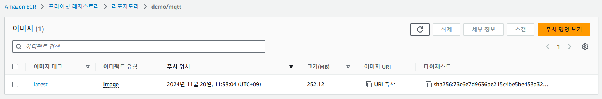
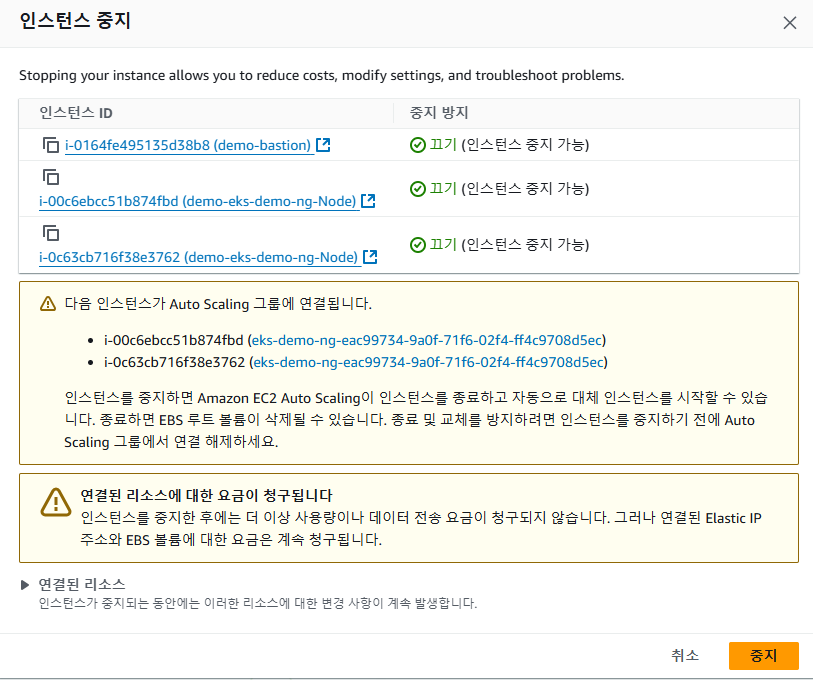

# AWS

## AWS CLI 설치 및 AWS ECR 이미지 업로드

---

### 1. **사전 준비**
- **AWS CLI 설치 및 설정**
  - [AWS CLI 설치 가이드](https://docs.aws.amazon.com/cli/latest/userguide/getting-started-install.html)에 따라 AWS CLI를 설치합니다.
  - 설치 후, 명령 프롬프트를 열고 AWS CLI를 설정합니다:
    ```bash
    aws configure
    ```
    - AWS Access Key ID, Secret Access Key, Default region을 입력합니다.

- **Docker 설치**
  - [Docker Desktop for Windows](https://www.docker.com/products/docker-desktop/)를 설치합니다.
  - Docker Desktop 실행 후 Docker가 정상적으로 실행 중인지 확인합니다:
    ```bash
    docker --version
    ```

---

### 2. **AWS ECR 인증**
1. **ECR 로그인**
   ECR 리포지토리에 Docker를 인증합니다. 명령 프롬프트를 열고 다음 명령을 실행합니다:
   ```bash
   #aws ecr get-login-password --region <리전> | docker login --username AWS --password-stdin <AWS_ACCOUNT_ID>.dkr.ecr.<리전>.amazonaws.com
   
   $ aws ecr get-login-password --region ap-northeast-2 | docker login --username AWS --password-stdin stdin 699475938633.dkr.ecr.ap-northeast-2.amazonaws.com
   ```
   - `<리전>`: AWS 리전 (예: `ap-northeast-2`)
   - `<AWS_ACCOUNT_ID>`: AWS 계정 ID

---

### 3. **Docker 이미지 빌드**
1. **Dockerfile 준비**
   로컬 디렉터리에 `Dockerfile`을 준비합니다. 예를 들어, 간단한 Nginx Dockerfile:
   ```dockerfile
   FROM openjdk:17-jdk-slim
   
   WORKDIR /app
   
   # 빌드된 JAR 파일을 복사
   COPY build/libs/*.jar app.jar
   
   # 포트 설정
   EXPOSE 8080
   
   # 애플리케이션 실행
   ENTRYPOINT ["java", "-jar", "app.jar"]
   ```
   
2. **Docker 이미지 빌드**
   Dockerfile이 있는 디렉터리에서 명령 프롬프트를 열고:
   ```bash
   # docker build -t <이미지_이름>:<태그> .
   $ docker build -t demo/mqtt .
   
   $ docker images
   REPOSITORY                       TAG       IMAGE ID       CREATED         SIZE
   demo/mqtt                        latest    6d9d094621cb   7 minutes ago   443MB
   my-kotlin-app                    latest    6d9d094621cb   7 minutes ago   443MB
   grafana/grafana-image-renderer   latest    ee9bfc455e2e   5 months ago    1.17GB
   influxdb                         latest    26438989c210   5 months ago    376MB
   nginx                            latest    dde0cca083bc   5 months ago    188MB
   grafana/grafana                  latest    f9095e2f0444   6 months ago    443MB
   busybox                          latest    65ad0d468eb1   18 months ago   4.26MB
   csh0034/mosquitto                latest    ac9b2f8c9fd7   2 years ago     11.8MB
   ```
   - `<이미지_이름>`: 이미지 이름 (예: `sample-app`)
   - `<태그>`: 태그 이름 (예: `latest`)

---

### 4. **ECR 리포지토리 생성**
1. **리포지토리 생성**
   ECR 리포지토리를 생성합니다:
   ```bash
   $ aws ecr create-repository --repository-name <리포지토리_이름> --region <리전>
   ```
   - `<리포지토리_이름>`: 원하는 리포지토리 이름
   - 결과에서 `repositoryUri`를 확인합니다.

2. **기존 리포지토리 확인**
   ```bash
   #aws ecr describe-repositories --region <리전>
   
   $ aws ecr describe-repositories --region ap-northeast-2
   ```

---

### 5. **이미지 태깅 및 업로드**
1. **이미지 태깅**
   빌드한 이미지를 ECR 리포지토리 URI에 태깅합니다:
   ```bash
   # docker tag <이미지_이름>:<태그> <AWS_ACCOUNT_ID>.dkr.ecr.<리전>.amazonaws.com/<리포지토리_이름>:<태그>
   $ docker tag demo/mqtt:latest 699475938633.dkr.ecr.ap-northeast-2.amazonaws.com/demo/mqtt:latest
   ```
   
2. **이미지 업로드**
   ECR에 이미지를 푸시합니다:
   ```bash
   # docker push <AWS_ACCOUNT_ID>.dkr.ecr.<리전>.amazonaws.com/<리포지토리_이름>:<태그>
   $ docker push 699475938633.dkr.ecr.ap-northeast-2.amazonaws.com/demo/mqtt:latest
   
   # push가 권한이 없으면 아래와 같이 적용하면 된다.
   $ aws ecr get-login-password --region ap-northeast-2 | docker login --username AWS --password-stdin 699475938633.dkr.ecr.ap-northeast-2.amazonaws.com
   ```

---

### 6. **ECR에서 이미지 확인**
ECR에 업로드된 이미지를 확인하려면:
```bash
# aws ecr list-images --repository-name <리포지토리_이름> --region <리전>
$ aws ecr list-images --repository-name demo/mqtt --region ap-northeast-2
{
    "imageIds": [
        {
            "imageDigest": "sha256:73c6e7d9636ae215c4be5be453a32b1469017771a87dd57448ebefeb3ca68a52",
            "imageTag": "latest"
        }
    ]
}
```



---

### 7. **예제 전체 명령**
1. **리포지토리 생성**
   ```bash
   aws ecr create-repository --repository-name my-sample-app --region ap-northeast-2
   ```

2. **Docker 빌드**
   ```bash
   docker build -t my-sample-app:latest .
   ```

3. **태깅**
   ```bash
   docker tag my-sample-app:latest <AWS_ACCOUNT_ID>.dkr.ecr.ap-northeast-2.amazonaws.com/my-sample-app:latest
   ```

4. **푸시**
   ```bash
   docker push <AWS_ACCOUNT_ID>.dkr.ecr.ap-northeast-2.amazonaws.com/my-sample-app:latest
   ```

---

### 8. **참고**
- **Windows 환경에서 파일 경로 문제**
  Dockerfile 경로 또는 파일 참조 시 백슬래시(`\`) 대신 슬래시(`/`)를 사용하세요.
  예: `COPY .\html /usr/share/nginx/html` → `COPY ./html /usr/share/nginx/html`

- **권한 오류 발생 시**
  - IAM 정책에 ECR 관련 권한을 추가해야 할 수 있습니다. `AmazonEC2ContainerRegistryFullAccess` 정책을 확인하세요.

이 과정을 따르면 Windows 로컬 환경에서도 ECR에 이미지를 성공적으로 업로드할 수 있습니다. 😊


## EKS 종료시 아래 내용이 멀까?

돈이 많이 나올까바 인스턴스를 중지하고 싶은데, 그냥 bastion 서버 종료하는건 상관없지만, eks node group을 삭제 할땐 이상한 경고가 발생

> 다음 인스턴스가 Auto Scaling 그룹에 연결됩니다.
>
> - i-00c6ebcc51b874fbd ([eks-demo-ng-eac99734-9a0f-71f6-02f4-ff4c9708d5ec](https://ap-northeast-2.console.aws.amazon.com/ec2/home?region=ap-northeast-2#AutoScalingGroupDetails:id=eks-demo-ng-eac99734-9a0f-71f6-02f4-ff4c9708d5ec))
> - i-0c63cb716f38e3762 ([eks-demo-ng-eac99734-9a0f-71f6-02f4-ff4c9708d5ec](https://ap-northeast-2.console.aws.amazon.com/ec2/home?region=ap-northeast-2#AutoScalingGroupDetails:id=eks-demo-ng-eac99734-9a0f-71f6-02f4-ff4c9708d5ec))
>
> 인스턴스를 중지하면 Amazon EC2 Auto Scaling이 인스턴스를 종료하고 자동으로 대체 인스턴스를 시작할 수 있습니다. 종료하면 EBS 루트 볼륨이 삭제될 수 있습니다. 종료 및 교체를 방지하려면 인스턴스를 중지하기 전에 Auto Scaling 그룹에서 연결 해제하세요.



### chatGPT의 답변

Amazon EC2 Auto Scaling은 Auto Scaling 그룹에 속한 인스턴스가 중지되거나 종료될 경우 자동으로 대체 인스턴스를 시작합니다. 하지만, EBS 루트 볼륨이 삭제되지 않도록 하거나 인스턴스를 종료 및 교체하는 것을 방지하고 싶다면, 해당 인스턴스를 **Auto Scaling 그룹에서 연결 해제**해야 합니다.

### 인스턴스를 Auto Scaling 그룹에서 안전하게 연결 해제하는 방법

1. **AWS 관리 콘솔에서 Auto Scaling 그룹으로 이동**
   - [Auto Scaling 그룹 콘솔](https://ap-northeast-2.console.aws.amazon.com/ec2/autoscaling)로 이동하여 인스턴스가 속한 Auto Scaling 그룹을 선택합니다.
2. **인스턴스 연결 해제**
   - Auto Scaling 그룹 상세 페이지에서 **활성 인스턴스** 목록에서 인스턴스를 선택합니다.
   - **인스턴스 연결 해제** 옵션을 선택합니다.
   - 이 작업을 통해 해당 인스턴스는 Auto Scaling 그룹의 관리 대상에서 제외되며, 중지하거나 종료해도 Auto Scaling 그룹에서 자동으로 대체 인스턴스를 시작하지 않습니다.
3. **인스턴스 중지 또는 종료**
   - 이제 안전하게 인스턴스를 중지하거나 종료할 수 있습니다. EBS 루트 볼륨도 삭제되지 않으며, Auto Scaling 그룹에서도 새로운 인스턴스를 생성하지 않습니다.
4. **다시 Auto Scaling 그룹에 연결할 필요가 있을 때**
   - 필요에 따라 인스턴스를 다시 Auto Scaling 그룹에 연결하려면 **인스턴스 재연결** 옵션을 사용하면 됩니다.

이 절차를 통해 인스턴스의 중지 및 종료 시 자동 대체 생성과 EBS 볼륨 삭제를 방지할 수 있습니다.