# AWS MQTT 쿠버네티스 설치 과정

CPMS와 유사하게 Bastion 서버를 통한 쿠버네티스 제어를 하여, chatGPT 한테 큰 틀에 대해서 물어본 뒤 구성을 진행하였습니다.


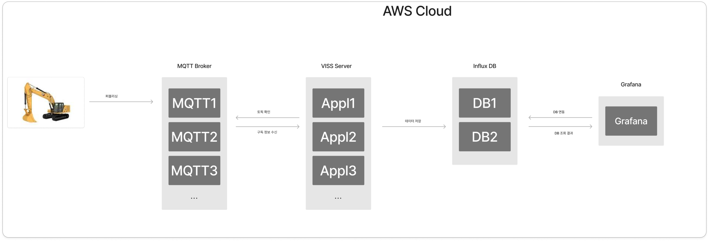

이와같은 구조를 생각하고 있고 이것에 대한 gpt의 답변은 아래와 같았다.


## chatGPT 답변1


AWS에서 쿠버네티스를 구성하여 여러 서버를 배포하려는 경우, 네임스페이스와 구조를 설정하는 방법은 애플리케이션의 독립성과 관리의 용이성을 고려하여 결정하는 것이 중요합니다. 아래와 같이 네임스페이스와 구조를 구성하는 방법을 제안드립니다.

### 1. 네임스페이스 구성

네임스페이스는 리소스의 논리적 분리와 관리 효율성을 위해 사용하는 것이 좋습니다. 다음과 같이 구성할 수 있습니다:

- **네임스페이스 1: mqtt-broker**
  - MQTT 서버는 다른 애플리케이션과 독립적일 수 있어, 별도의 네임스페이스에서 운영하면 좋습니다. 이 네임스페이스에 배포하면 브로커 서버 관련 리소스를 명확하게 분리하고 관리할 수 있습니다.
- **네임스페이스 2: app-server**
  - 애플리케이션 서버는 데이터베이스와의 연동이나 다른 마이크로서비스와의 통신이 빈번하다면, 관련 네임스페이스와 잘 연결될 수 있도록 별도의 네임스페이스로 구성합니다.
- **네임스페이스 3: monitoring**
  - InfluxDB와 Grafana를 함께 배포하여 모니터링 환경을 구성하는 네임스페이스입니다. 이 네임스페이스에 InfluxDB와 Grafana를 배포하면, 데이터 스토리지와 시각화 도구를 한 곳에 관리할 수 있어 편리합니다.

### 2. 클러스터 구조 및 네트워킹

- **클러스터 내 네트워킹**: 각 네임스페이스 간 네트워크 접근은 필요에 따라 제한하거나, 네임스페이스 내에서만 접근 가능하게 설정할 수 있습니다.
- **Ingress Controller**: 외부 접근이 필요한 서버에 대해 Ingress Controller를 사용하여 경로 기반 라우팅이나 인증을 추가할 수 있습니다.
- **Persistent Volumes**: InfluxDB는 데이터가 손실되지 않도록 스토리지가 중요하므로 EBS를 Persistent Volume으로 사용하여 안정성을 높일 수 있습니다.

### 3. 권장 구성 예시

- 네임스페이스: `mqtt-broker`, `app-server`, `monitoring`
- Ingress 설정: 외부에 노출할 애플리케이션 서버와 Grafana를 Ingress로 설정
- 각 네임스페이스에 필요한 역할 기반 접근 제어(RBAC) 및 보안 설정 적용

이렇게 구성하면 리소스를 논리적으로 분리하고 관리하기 수월하며, 네임스페이스 별로 접근 권한을 설정하여 보안성을 높일 수 있습니다.


## chatGPT 답변2

AWS에서 쿠버네티스를 관리하기 위해 **Bastion 서버**를 설정하는 것은 보안과 접근 관리 측면에서 매우 유용합니다. Bastion 서버를 통해 AWS 외부에서 쿠버네티스 클러스터에 안전하게 접근하고 관리할 수 있습니다. Bastion 서버를 구축하고 활용하는 방법을 안내드리겠습니다.

### Bastion 서버 설정 및 접근 절차

1. **Bastion 서버 생성**

   - **EC2 인스턴스**를 생성하고 Bastion 서버 역할을 부여합니다. 이 인스턴스는 보통 퍼블릭 서브넷에 위치시켜 외부에서 SSH 접속이 가능하도록 설정합니다.
   - 인스턴스 유형은 트래픽이 많지 않다면 `t3.micro`와 같은 작은 유형을 사용해도 충분합니다.

2. **보안 그룹 설정**

   - Bastion 서버의 보안 그룹을 통해 **포트 22**(SSH)를 허용하고, 접근 가능한 IP 대역을 제한하여 보안을 강화합니다. (예: 특정 IP 주소만 허용)
   - Bastion 서버가 EKS 클러스터와 통신할 수 있도록 **포트 443**을 포함한 필요한 포트를 허용합니다.

3. **IAM 역할 부여**

   - Bastion 서버에 쿠버네티스 클러스터 접근 권한이 있는 IAM 역할을 부여합니다.
   - 이 IAM 역할에는 클러스터를 제어할 수 있는 적절한 권한이 포함되어 있어야 하며, `eks:DescribeCluster`, `eks:GetToken` 등의 권한을 포함해야 합니다.

4. **kubectl 및 aws-cli 설치**

   - Bastion 서버에 접속한 후 `kubectl`과 `aws-cli`를 설치합니다.
   - `aws-cli`를 통해 AWS 클러스터에 접근할 수 있도록 `aws configure`를 통해 AWS 계정 정보를 설정하거나, 부여된 IAM 역할로 접근합니다.

5. **클러스터 접근 설정**

   - AWS CLI 명령어로 클러스터 인증을 받습니다.

     ```
     bash
     
     
     코드 복사
     aws eks update-kubeconfig --name <EKS_Cluster_Name> --region <Region>
     ```

   - 위 명령어를 통해 `kubeconfig` 파일이 업데이트되면, Bastion 서버에서 `kubectl` 명령어를 사용하여 쿠버네티스 클러스터를 제어할 수 있게 됩니다.

6. **로컬에서 Bastion 서버를 통한 클러스터 접근 (SSH 터널링)**

   - 로컬에서 직접 접근하는 대신, Bastion 서버를 거쳐 클러스터에 접근하고자 할 때 SSH 터널링을 활용할 수 있습니다.

     ```
     bash
     
     
     코드 복사
     ssh -i <Your_Key.pem> -L 6443:<EKS_API_Server_Endpoint>:443 ec2-user@<Bastion_Server_IP>
     ```

   - 터널링이 설정되면 `kubectl` 명령어로 로컬에서도 클러스터를 관리할 수 있습니다.

### Bastion 서버의 주요 활용

- **쿠버네티스 클러스터 관리**: Bastion 서버를 통해서만 접근이 가능하도록 설정하면 보안을 강화할 수 있습니다.
- **CI/CD 연결**: Bastion 서버를 통해 특정 CI/CD 파이프라인의 클러스터 접근을 제한하거나, 스크립트를 통해 클러스터 제어가 가능합니다.
- **추가 보안 옵션**: Bastion 서버를 AWS SSM (Session Manager)으로 연결하면 SSH 키 없이도 안전하게 접속할 수 있습니다.

이와 같이 설정하면 AWS EKS 클러스터에 외부 접근을 Bastion 서버를 통해 제어할 수 있어 보안이 강화됩니다.


## 내가 내린 결론

일단 가장 먼저 해야할건 bastion 서버를 구축하는 것이다.


bastion 서버를 통해서 쿠버네티스를 제어하고 보안도 강화 하려는 것이 목적이다.


### Bastion 서버의 역할

Bastion 서버는 네트워크 보안을 강화하기 위해 사용되는 **중계 서버** 또는 **게이트웨이 서버**입니다. 외부 네트워크에서 내부 시스템에 직접 접근하지 않고, Bastion 서버를 거쳐서만 내부 네트워크에 접근하도록 함으로써 **보안을 강화**할 수 있습니다.

#### Bastion 서버의 주요 역할과 특징

1. **보안 강화**
   - Bastion 서버를 통해서만 내부 네트워크에 접근하도록 제한함으로써, 외부 네트워크와 내부 네트워크 간의 경계에서 보안 계층 역할을 합니다.
   - 외부에서는 직접적으로 데이터베이스나 애플리케이션 서버에 접근할 수 없고, Bastion 서버를 경유해야 하기 때문에 보안이 강화됩니다.
2. **접근 제어**
   - Bastion 서버는 보통 **SSH**(Linux) 또는 **RDP**(Windows)로 접근 가능하게 설정됩니다.
   - 보안 그룹이나 방화벽 설정을 통해 특정 IP 주소나 포트에 대해서만 접근을 허용하여, 허가된 사용자만 접근할 수 있게 합니다.
3. **감사 및 모니터링 용이**
   - Bastion 서버는 보통 접근 이력을 관리하여 어떤 사용자가 내부 서버에 접속했는지 기록할 수 있습니다.
   - 접근을 Bastion 서버를 통해 제어하면 감사 로그를 통해 내부 시스템에 대한 접속 및 액션을 모니터링할 수 있습니다.
4. **AWS에서의 Bastion 서버 활용**
   - AWS에서는 Bastion 서버를 보통 **퍼블릭 서브넷**에 배치하고, 이를 통해서만 **프라이빗 서브넷**에 위치한 리소스에 접근하도록 구성합니다.
   - AWS Systems Manager의 Session Manager를 활용해 SSH 키 없이 Bastion 서버에 접근하도록 설정하면 보안을 더욱 강화할 수 있습니다.

#### Bastion 서버의 활용 예시

예를 들어, AWS 환경에서 프라이빗 서브넷에 위치한 데이터베이스가 있다면, 외부에서 데이터베이스에 직접 접근할 수 없습니다. 이 경우, Bastion 서버에 SSH 접속 후, 이 서버에서 데이터베이스에 접근하게 하면 **직접적인 외부 접근을 차단**하면서도 **인증된 접근**만 가능하게 설정할 수 있습니다.

요약하면, Bastion 서버는 외부 네트워크와 내부 리소스 사이의 보안 경계 역할을 하며, **접근 제어 및 모니터링**이 필요한 환경에서 매우 유용하게 사용되는 서버입니다.


# AWS에서 Bastion 구축 하는 법

https://youtu.be/uGhCjaExw0M?si=L7S418mQCznhZnNE

해당 자료를 토대로 구축을 시작 하였습니다.


### 1. EKS Cluster

- 클러스터 하드웨어 아키텍처

  - Default VPC : Bastion 서버

    - Ubuntu Linux OS, AWS CLI, eksctl, kubectl
    - Docker Container build 및 컨테이너 push

  - EKS Cluster

    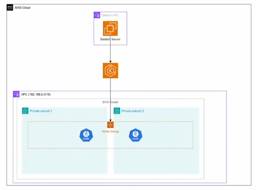

### 2. EKS 클러스터 관리 서버(Bastion) 생성 및 환경 구성


#### Defailt VPC에 kubectl, eksctl 실행을 위한 Bastion 생성

- 키페어 생성
  - 이름: demo-key
  - 프라이빗 키 파일 형식 : .pem <== default 값 확인해서 .ppk 만들어지지 않도록 주의!
- 보안 그룹 생성
  - 이름 : demo-bastion-sg
  - VPC : default VPC
  - 인바운드 규칙 : 내IP에서 ssh로의 접근 허용
- 인스턴스 생성
  - 이름 : demo-bastion
  - AMI : Ubuntu Server 24.04 LTS
  - 인스턴스 유형 : 
    - t2.medium => 무료가 아니여서 아래 내용 적용
    - t2.micro
  - 키페어 : demo-key
  - 네트워크
    -  VPC: Default VPC
    - 서브넷 : ap-northeast-2a
    - 보안그룹 : 기존 보안 그룹 선택 => demo-bastion-sg
  - 스토리지 : 8G, gp3
  - 인스턴스 생성 후 ubuntu 유저로 로그인

------

#### Bastion 서버를 클러스터 관리 서버로 구성

- AWS 프로 파일 등록

  - AWS CLI 연결을 위한 Access 키 생성

    - IAM => [보안 자격 증명] - [액세스키 만들기] - Access Key, Secret Key 확인 및 저장

    - Bastion Host(ubuntu Linux)에 AWS CLI 관리툴인 AWS 설치

    - 참고: https://docs.aws.amazon.com/ko_kr/cli/latest/userguide/getting-started-install.html

      - ```bash
        $ sudo apt install unzip
        
        curl "https://awscli.amazonaws.com/awscli-exe-linux-x86_64.zip" -o "awscliv2.zip"
        unzip awscliv2.zip
        sudo ./aws/install
        
        $ aws --version
        aws-cli/2.21.0 Python/3.12.6 Linux/6.8.0-1016-aws exe/x86_64.ubuntu.24
        ```

      - ```bash
        # config 설정
        
        $ aws configure
        AWS Access Key ID [None]: # IAM key
        AWS Secret Access Key [None]: # IAM Secret Key
        Default region name [None]: ap-northeast-2
        Default output format [None]: json
        
        # config 정보 확인
        $ aws sts get-caller-identity
        {
            "UserId": "699475938633",
            "Account": "699475938633",
            "Arn": "arn:aws:iam::699475938633:root"
        }
        ```

        

- kubectl 설치

  - **Kubectl 설치 명령으로 EKS 권한을 할당**

    - 설치 매뉴열 : https://docs.aws.amazon.com/ko_kr/eks/latest/userguide/install-kubectl.html

    - Kubernetes `1.31`

      ```bash
      curl -O https://s3.us-west-2.amazonaws.com/amazon-eks/1.31.0/2024-09-12/bin/linux/amd64/kubectl
      ```

    - 바이너리에 실행 권한을 적용합니다.

      ```bash
      chmod +x ./kubectl
      ```

    - 바이너리를 `PATH`의 폴더에 복사합니다. `kubectl` 버전이 이미 설치된 경우 `$HOME/bin/kubectl`을 생성하고 `$HOME/bin`이 `$PATH`로 시작하도록 해야 합니다.

      ```bash
      mkdir -p $HOME/bin && cp ./kubectl $HOME/bin/kubectl && export PATH=$HOME/bin:$PATH
      ```

    - (선택 사항) 셸 초기화 파일에 `$HOME/bin` 경로를 추가하면 셸을 열 때 구성됩니다.

      ###### 참고

      이 단계에는 Bash 셸을 사용한다고 가정합니다. 다른 셸을 사용하는 경우, 특정 셸 초기화 파일을 사용하도록 명령을 변경하십시오.

      ```bash
      echo 'export PATH=$HOME/bin:$PATH' >> ~/.bashrc
      ```

    - `kubectl`을 설치한 이후 버전을 확인할 수 있습니다.

      ```bash
      $ kubectl version --client
      Client Version: v1.31.0-eks-a737599
      Kustomize Version: v5.4.2
      ```

- eksctl 명령어 설치 후 사용

  - 설치 메뉴얼 : https://eksctl.io/installation/

  - 설치 내용

    - 최신 릴리스를 다운로드하려면 다음을 실행하세요.

      ```bash
      # for ARM systems, set ARCH to: `arm64`, `armv6` or `armv7`
      ARCH=amd64
      PLATFORM=$(uname -s)_$ARCH
      
      curl -sLO "https://github.com/eksctl-io/eksctl/releases/latest/download/eksctl_$PLATFORM.tar.gz"
      
      # (Optional) Verify checksum
      curl -sL "https://github.com/eksctl-io/eksctl/releases/latest/download/eksctl_checksums.txt" | grep $PLATFORM | sha256sum --check
      
      tar -xzf eksctl_$PLATFORM.tar.gz -C /tmp && rm eksctl_$PLATFORM.tar.gz
      
      sudo mv /tmp/eksctl /usr/local/bin
      
      $ eksctl version
      0.194.0
      ```

      

## 2. EKS 생성하기

### eksctl 명령으로 EKS 생성

- 클러스터 이름 : demo-eks

- 리전 : ap-northeast-2

- 노드 그룹 이름 : demo-ng

  - Node 인스턴스 타입 : 
    - t3.medium => 이건 free trier가 아닌거 같아 확인 필요
  - 노드 수 : 2
  - 노트 볼륨 크기 : 20G
  - 노드그룹 적용 가용 영역 : ap-northeast=2a, ap-northeast=2c. 생량 시 전체 가용영역 사용

- OpenID Connect (OIDC) 공급자 자동 설정 : Kubernetes의 서비스 계정과 AWS IAM 역할을 연결할 수 있도록 OIDC를 활성화

- ```bash
  $ eksctl create cluster \
  --name demo-eks2 \
  --region ap-northeast-2 \
  --with-oidc \
  --nodegroup-name demo-ng \
  --zones ap-northeast-2a,ap-northeast-2c \
  --nodes 2 \
  --node-type t3.medium \
  --node-volume-size=20 \
  --managed
  2024-11-15 05:49:57 [ℹ]  eksctl version 0.194.0
  2024-11-15 05:49:57 [ℹ]  using region ap-northeast-2
  2024-11-15 05:49:57 [ℹ]  subnets for ap-northeast-2a - public:192.168.0.0/19 private:192.168.64.0/19
  2024-11-15 05:49:57 [ℹ]  subnets for ap-northeast-2c - public:192.168.32.0/19 private:192.168.96.0/19
  2024-11-15 05:49:57 [ℹ]  nodegroup "demo-ng" will use "" [AmazonLinux2/1.30]
  2024-11-15 05:49:57 [ℹ]  using Kubernetes version 1.30
  2024-11-15 05:49:57 [ℹ]  creating EKS cluster "demo-eks" in "ap-northeast-2" region with managed nodes
  2024-11-15 05:49:57 [ℹ]  will create 2 separate CloudFormation stacks for cluster itself and the initial managed nodegroup
  2024-11-15 05:49:57 [ℹ]  if you encounter any issues, check CloudFormation console or try 'eksctl utils describe-stacks --region=ap-northeast-2 --cluster=demo-eks'
  2024-11-15 05:49:57 [ℹ]  Kubernetes API endpoint access will use default of {publicAccess=true, privateAccess=false} for cluster "demo-eks" in "ap-northeast-2"
  2024-11-15 05:49:57 [ℹ]  CloudWatch logging will not be enabled for cluster "demo-eks" in "ap-northeast-2"
  2024-11-15 05:49:57 [ℹ]  you can enable it with 'eksctl utils update-cluster-logging --enable-types={SPECIFY-YOUR-LOG-TYPES-HERE (e.g. all)} --region=ap-northeast-2 --cluster=demo-eks'
  2024-11-15 05:49:57 [ℹ]  default addons vpc-cni, kube-proxy, coredns were not specified, will install them as EKS addons
  2024-11-15 05:49:57 [ℹ]  
  2 sequential tasks: { create cluster control plane "demo-eks", 
      2 sequential sub-tasks: { 
          5 sequential sub-tasks: { 
              1 task: { create addons },
              wait for control plane to become ready,
              associate IAM OIDC provider,
              no tasks,
              update VPC CNI to use IRSA if required,
          },
          create managed nodegroup "demo-ng",
      } 
  }
  2024-11-15 05:49:57 [ℹ]  building cluster stack "eksctl-demo-eks-cluster"
  2024-11-15 05:49:58 [ℹ]  deploying stack "eksctl-demo-eks-cluster"
  2024-11-15 05:50:58 [ℹ]  waiting for CloudFormation stack "eksctl-demo-eks-cluster"
  2024-11-15 05:51:58 [ℹ]  waiting for CloudFormation stack "eksctl-demo-eks-cluster"
  2024-11-15 05:52:58 [ℹ]  waiting for CloudFormation stack "eksctl-demo-eks-cluster"
  2024-11-15 05:53:58 [ℹ]  waiting for CloudFormation stack "eksctl-demo-eks-cluster"
  2024-11-15 05:54:58 [ℹ]  waiting for CloudFormation stack "eksctl-demo-eks-cluster"
  2024-11-15 05:55:58 [ℹ]  waiting for CloudFormation stack "eksctl-demo-eks-cluster"
  2024-11-15 05:56:58 [ℹ]  waiting for CloudFormation stack "eksctl-demo-eks-cluster"
  2024-11-15 05:57:58 [ℹ]  waiting for CloudFormation stack "eksctl-demo-eks-cluster"
  2024-11-15 05:58:00 [!]  recommended policies were found for "vpc-cni" addon, but since OIDC is disabled on the cluster, eksctl cannot configure the requested permissions; the recommended way to provide IAM permissions for "vpc-cni" addon is via pod identity associations; after addon creation is completed, add all recommended policies to the config file, under `addon.PodIdentityAssociations`, and run `eksctl update addon`
  2024-11-15 05:58:00 [ℹ]  creating addon
  2024-11-15 05:58:00 [ℹ]  successfully created addon
  2024-11-15 05:58:00 [ℹ]  creating addon
  2024-11-15 05:58:01 [ℹ]  successfully created addon
  2024-11-15 05:58:01 [ℹ]  creating addon
  2024-11-15 05:58:01 [ℹ]  successfully created addon
  2024-11-15 06:00:04 [ℹ]  deploying stack "eksctl-demo-eks-addon-vpc-cni"
  2024-11-15 06:00:04 [ℹ]  waiting for CloudFormation stack "eksctl-demo-eks-addon-vpc-cni"
  2024-11-15 06:00:34 [ℹ]  waiting for CloudFormation stack "eksctl-demo-eks-addon-vpc-cni"
  2024-11-15 06:00:34 [ℹ]  updating addon
  2024-11-15 06:00:44 [ℹ]  addon "vpc-cni" active
  2024-11-15 06:00:44 [ℹ]  building managed nodegroup stack "eksctl-demo-eks-nodegroup-demo-ng"
  2024-11-15 06:00:44 [ℹ]  deploying stack "eksctl-demo-eks-nodegroup-demo-ng"
  2024-11-15 06:00:45 [ℹ]  waiting for CloudFormation stack "eksctl-demo-eks-nodegroup-demo-ng"
  2024-11-15 06:01:15 [ℹ]  waiting for CloudFormation stack "eksctl-demo-eks-nodegroup-demo-ng"
  2024-11-15 06:01:54 [ℹ]  waiting for CloudFormation stack "eksctl-demo-eks-nodegroup-demo-ng"
  2024-11-15 06:02:27 [ℹ]  waiting for CloudFormation stack "eksctl-demo-eks-nodegroup-demo-ng"
  2024-11-15 06:03:10 [ℹ]  waiting for CloudFormation stack "eksctl-demo-eks-nodegroup-demo-ng"
  2024-11-15 06:05:05 [ℹ]  waiting for CloudFormation stack "eksctl-demo-eks-nodegroup-demo-ng"
  2024-11-15 06:05:05 [ℹ]  waiting for the control plane to become ready
  2024-11-15 06:05:07 [✔]  saved kubeconfig as "/home/ubuntu/.kube/config"
  2024-11-15 06:05:07 [ℹ]  no tasks
  2024-11-15 06:05:07 [✔]  all EKS cluster resources for "demo-eks" have been created
  2024-11-15 06:05:07 [✔]  created 0 nodegroup(s) in cluster "demo-eks"
  2024-11-15 06:05:07 [ℹ]  nodegroup "demo-ng" has 2 node(s)
  2024-11-15 06:05:07 [ℹ]  node "ip-192-168-13-127.ap-northeast-2.compute.internal" is ready
  2024-11-15 06:05:07 [ℹ]  node "ip-192-168-38-201.ap-northeast-2.compute.internal" is ready
  2024-11-15 06:05:07 [ℹ]  waiting for at least 2 node(s) to become ready in "demo-ng"
  2024-11-15 06:05:07 [ℹ]  nodegroup "demo-ng" has 2 node(s)
  2024-11-15 06:05:07 [ℹ]  node "ip-192-168-13-127.ap-northeast-2.compute.internal" is ready
  2024-11-15 06:05:07 [ℹ]  node "ip-192-168-38-201.ap-northeast-2.compute.internal" is ready
  2024-11-15 06:05:07 [✔]  created 1 managed nodegroup(s) in cluster "demo-eks"
  2024-11-15 06:05:08 [ℹ]  kubectl command should work with "/home/ubuntu/.kube/config", try 'kubectl get nodes'
  2024-11-15 06:05:08 [✔]  EKS cluster "demo-eks" in "ap-northeast-2" region is ready
  ```

  

##### CloudFormation에서 어떤 스택이 생성되고 있는지 확인이 가능

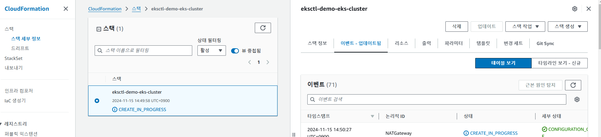


##### VPC 세부 정보

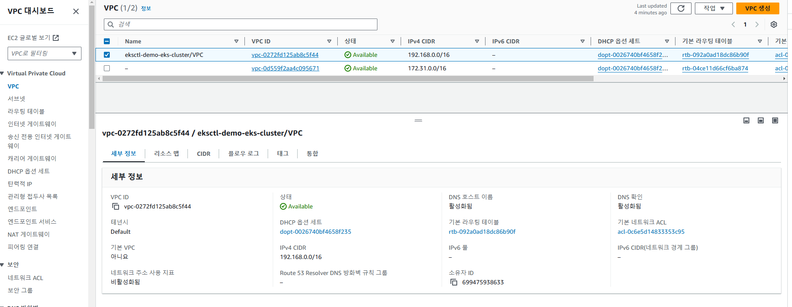

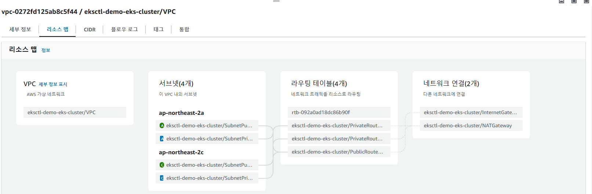


### 설치 확인 및 기본 환경 구성

- 설치 확인

  ```bash
  # 워커노드 정보 보기
  $ kubectl get nodes
  NAME                                                STATUS   ROLES    AGE   VERSION
  ip-192-168-13-127.ap-northeast-2.compute.internal   Ready    <none>   45m   v1.30.4-eks-a737599
  ip-192-168-38-201.ap-northeast-2.compute.internal   Ready    <none>   46m   v1.30.4-eks-a737599
  ```

  

- EKS에서 애플리케이션 배포 실습

  ```bash
  # CLI 명령어 완성기능 추가
  $ source <(kubectl completion bash)
  $ echo "source <(kubectl completion bash)" >> ~/.bashrc
  
  #Pod 배포 TEST. nginx 컨테이너 5개 실행하고 결과 확인
  $ kubectl create deployment webtest --image=nginx:1.14 --port=80 --replicas=5
  $ kubectl get pods -o wide
  
  #nginx 웹서버에 클라이언트 접속 가능하도록 구성하고 간단히 TEST
  $ kubectl expose deployment webtest --port=80 --type=LoadBalancer
  $ kubectl get services
  
  #1분 정도 후에 웹브라우저를 통해 웹서버 연결되는지 확인
  http://ac51d2303af38435ba244f34a1d69d56-1736031328.ap-northeast-2.elb.amazonaws.com/
  
  #서비스 중지
  # 1. 로드밸런서 삭제
  # 2. Service 및 deployment 삭제
  $ kubectl delete svc website
  $ kubectl delete deployments.apps webtest
  
  #etc svc 변경 방법 type을 vi에서 LoadBalancer를 다른 걸로 변경하고 :wq로 저장하고 나오면 적용되어 있음 신기
  $ kubectl edit svc webtest
  ...
  spec:
    allocateLoadBalancerNodePorts: true
    clusterIP: 10.100.252.178
    clusterIPs:
    - 10.100.252.178
    externalTrafficPolicy: Cluster
    internalTrafficPolicy: Cluster
    ipFamilies:
    - IPv4
    ipFamilyPolicy: SingleStack
    ports:
    - nodePort: 31563
      port: 80
      protocol: TCP
      targetPort: 80
    selector:
      app: webtest
    sessionAffinity: None
    type: LoadBalancer
  ...
  ```


**로드밸런서 생성** 

여기에 생성되는데 깜빡하고 그냥 삭제 해버림...

로드 밸런서는 명령어로 삭제해도 남아 있다고 하며, 이걸 삭제 해도 서비스는 살아 있음

독립적인 관계로 보임

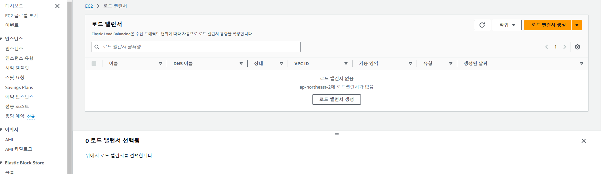


**로드밸런서 접속**

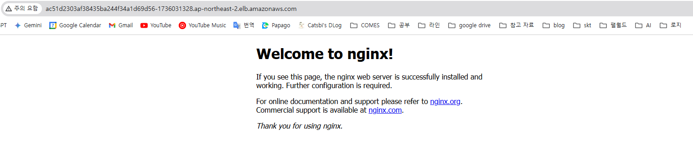

## aws-load-balancer-controller 배포

### aws-load-balancer-controller 배포

- AWS Ingress Controller
- Kubernetes 클러스터에서 AWS Elastic Load Balancers (ALB 및 NLB)를 자동으로 관리하고, 이를 통해 클러스터 내 애플리케이션을 외부로 노출
- **ALB (Appication Load Balancer)**
  - AWS Load Balancer Controller는 Kubernetes의 Ingress 리소스를 감시하여, 필요한 경우 ALB를 자동으로 생성하고 관리
  - HTTP/HTTPS 트래픽을 여러 파드에 걸쳐 로드밸런싱할 수 있음
- **NLB(Network Load Balancer)**
  - Service 리소스의 `LoadBalancer` 타입을 감시하여, 필요 시 NLB를 생성하여 TCP/UDP 트래픽을 관리
  - 낮은 지연 시간과 고성능이 요구되는 애플리케이션에 적합


### Helm 활용하여, Load Balancer Controller 생성하기

- Helm 설치

  ```bash
  $ curl -fsSL -o get_helm.sh https://raw.githubusercontent.com/helm/helm/main/scripts/get-helm-3
  $ chmod 700 get_helm.sh
  $ ./get_helm.sh
  
  $ helm --help
  ```

- Amazon EKS 클러스터 정보 수집 후 변수에 저장

  - cluster_name : 클러스터 이름
  - oidc_id : OIDC 자격증명 ID

  ```bash
  $ export cluster_name=demo-eks2
  
  $ aws eks describe-cluster --name demo-eks2 --query "cluster.identity.oidc.issuer" --output text | awk -F'/' '{print $NF}'
  48B3841CB653AF271A7917B7C6EA3EC0
  
  $ export oidc_id=48B3841CB653AF271A7917B7C6EA3EC0
  
  $ echo $oidc_id
  48B3841CB653AF271A7917B7C6EA3EC0
  ```

- AWS Load Balancer Controller 설치

  - 참고 : https://docs.aws.amazon.com/ko_kr/eks/latest/userguide/lbc-helm.html


###### IAM 정책을 생성합니다.

1. 사용자 대신 AWS API를 호출할 수 있는 AWS Load Balancer Controller의 IAM 정책을 다운로드합니다.

   - AWS
   - AWS GovCloud (US)

   ```bash
   $ curl -O https://raw.githubusercontent.com/kubernetes-sigs/aws-load-balancer-controller/v2.7.2/docs/install/iam_policy.json
   ```

2. 이전 단계에서 다운로드한 정책을 사용하여 IAM 정책을 만듭니다.

   ```bash
   $ aws iam create-policy \
       --policy-name AWSLoadBalancerControllerIAMPolicy \
       --policy-document file://iam_policy.json
   ```

   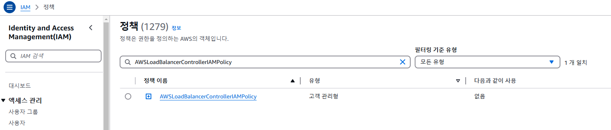

3. `eksctl`을 사용하여 IAM 역할 생성
   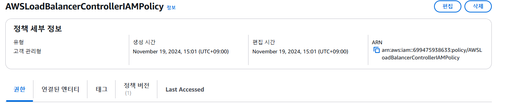

   ```bash
   $ eksctl create iamserviceaccount \
     --cluster=demo-eks2 \
     --namespace=kube-system \
     --name=aws-load-balancer-controller \
     --role-name AmazonEKSLoadBalancerControllerRole \
     --attach-policy-arn=arn:aws:iam::699475938633:policy/AWSLoadBalancerControllerIAMPolicy \
     --approve
   ```

4. 로드 밸런서 확인

   ```bash
   $ kubectl get sa -n kube-system | grep load
   aws-load-balancer-controller                  0         48s
   ```

5. 로드밸런서 상세 확인

   ```bash
   $ kubectl describe -n kube-system sa aws-load-balancer-controller
   Name:                aws-load-balancer-controller
   Namespace:           kube-system
   Labels:              app.kubernetes.io/managed-by=eksctl
   Annotations:         eks.amazonaws.com/role-arn: arn:aws:iam::699475938633:role/AmazonEKSLoadBalancerControllerRole
   Image pull secrets:  <none>
   Mountable secrets:   <none>
   Tokens:              <none>
   Events:              <none>
   ```


### 2단계: AWS Load Balancer Controller 설치

1. `eks-charts` 차트 Helm 리포지토리를 추가합니다. AWS에서는 [이 리포지토리](https://github.com/aws/eks-charts)를 GitHub에 유지합니다.

   ```bash
   $ helm repo add eks https://aws.github.io/eks-charts
   ```

2. 최신 차트가 적용되도록 로컬 리포지토리를 업데이트합니다.

   ```bash
   $ helm repo update eks
   ```

3. AWS Load Balancer Controller를 설치합니다.

   `my-cluster`를 클러스터 이름으로 바꿉니다. 다음 명령에서 `aws-load-balancer-controller`는 이전 단계에서 생성한 Kubernetes 서비스 계정입니다.

   차트 Helm 구성에 관한 자세한 내용은 GitHub에서 [`values.yaml`](https://github.com/aws/eks-charts/blob/master/stable/aws-load-balancer-controller/values.yaml)을 참조하세요.

   ```bash
   $ helm install aws-load-balancer-controller eks/aws-load-balancer-controller \
     -n kube-system \
     --set clusterName=demo-eks2 \
     --set serviceAccount.create=false \
     --set serviceAccount.name=aws-load-balancer-controller 
     
   $ kubectl get pod -A
   NAMESPACE     NAME                                           READY   STATUS    RESTARTS   AGE
   kube-system   aws-load-balancer-controller-6b86b7dc4-hmn62   1/1     Running   0          64s
   kube-system   aws-load-balancer-controller-6b86b7dc4-zsm9w   1/1     Running   0          64s
   kube-system   aws-node-866x2                                 2/2     Running   0          62m
   kube-system   aws-node-mptwj                                 2/2     Running   0          62m
   kube-system   coredns-5b9dfbf96-57pz2                        1/1     Running   0          66m
   kube-system   coredns-5b9dfbf96-wt4vl                        1/1     Running   0          66m
   kube-system   kube-proxy-l64w6                               1/1     Running   0          62m
   kube-system   kube-proxy-sv4vj                               1/1     Running   0          62m  
   ```

   1. [Amazon EC2 인스턴스 메타데이터 서비스(IMDS)에 대해 제한적인 액세스 권한](https://aws.github.io/aws-eks-best-practices/security/docs/iam/#restrict-access-to-the-instance-profile-assigned-to-the-worker-node)이 있는 Amazon EC2 노드에 컨트롤러를 배포하거나 Fargate에 배포하는 경우, 다음 `helm` 명령에 다음 플래그를 추가합니다.

      - `--set region=region-code`
      - `--set vpcId=vpc-xxxxxxxx`

   2. 차트 Helm 및 로드 밸런서 컨트롤러의 사용 가능한 버전을 보려면 다음 명령을 사용합니다.

      ```bash
      helm search repo eks/aws-load-balancer-controller --versions
      ```


### NLB 서비스 예시

- 쿠버네티스에서 AWS LoadBalancer Controller 설치한 상태에서 Service를 LoadBalancer로 하고, NLB 어노테이션과 함계 배포하게 되면, AWS LoadBalancer로 NLB가 생성됨.

  - 샘플 애플리케이션을 배포 실습(1)

    - https://docs.aws.amazon.com/ko_kr/eks/latest/userguide/network-load-balancing.html

    - 샘플 애플리케이션을 배포합니다.

      1. 애플리케이션에 대한 네임스페이스를 생성합니다.

         ```bash
         $ kubectl create namespace nlb-sample-app
         ```

      2. 다음 콘텐츠를 컴퓨터에서 `sample-deployment.yaml`이라는 파일에 저장합니다.

         ```bash
         apiVersion: apps/v1
         kind: Deployment
         metadata:
           name: nlb-sample-app
           namespace: nlb-sample-app
         spec:
           replicas: 3
           selector:
             matchLabels:
               app: nginx
           template:
             metadata:
               labels:
                 app: nginx
             spec:
               containers:
                 - name: nginx
                   image: public.ecr.aws/nginx/nginx:1.23
                   ports:
                     - name: tcp
                       containerPort: 80
         ```

      3. 매니페스트를 클러스터에 적용합니다.

         ```bash
         $ kubectl apply -f sample-deployment.yaml
         
         $ kubectl get pod -n nlb-sample-app
         NAME                             READY   STATUS    RESTARTS   AGE
         nlb-sample-app-fccbb75cd-49czc   1/1     Running   0          16s
         nlb-sample-app-fccbb75cd-t4x22   1/1     Running   0          16s
         nlb-sample-app-fccbb75cd-zzzdf   1/1     Running   0          16s
         ```

    - IP 대상에 대한 로드 밸런싱을 수행하는 인터넷이 연결된 Network Load Balancer를 사용하여 서비스를 생성합니다.

      1. 다음 콘텐츠를 컴퓨터에서 `sample-service.yaml`이라는 파일에 저장합니다. Fargate 노드에 배포하는 경우 `service.beta.kubernetes.io/aws-load-balancer-scheme: internet-facing` 줄을 제거합니다.

         ```
         apiVersion: v1
         kind: Service
         metadata:
           name: nlb-sample-service
           namespace: nlb-sample-app
           annotations:
             service.beta.kubernetes.io/aws-load-balancer-type: external
             service.beta.kubernetes.io/aws-load-balancer-nlb-target-type: ip
             service.beta.kubernetes.io/aws-load-balancer-scheme: internet-facing
         spec:
           ports:
             - port: 80
               targetPort: 80
               protocol: TCP
           type: LoadBalancer
           selector:
             app: nginx
         ```

      2. 매니페스트를 클러스터에 적용합니다.

         ```bash
         $ kubectl apply -f sample-service.yaml
         ```

    - 서비스가 배포되었는지 확인합니다.

      ```bash
      $ kubectl get svc nlb-sample-service -n nlb-sample-app
      NAME                 TYPE           CLUSTER-IP     EXTERNAL-IP   PORT(S)        AGE
      nlb-sample-service   LoadBalancer   10.100.52.77   <pending>     80:31998/TCP   2m41s
      
      ??? 왜 EXTERNAL-IP가 <pending> 이지?
      ```

      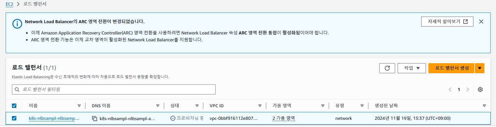


### ??? 왜 EXTERNAL-IP가 < pending > 이지?

서비스에 대한 상태를 확인 했을때 `elasticloadbalancing:DescribeListenerAttributes` 설정이 적용되지 않았음을 확인

```bash
$ kubectl describe service nlb-sample-service -n nlb-sample-app
Name:                     nlb-sample-service
Namespace:                nlb-sample-app
Labels:                   <none>
Annotations:              service.beta.kubernetes.io/aws-load-balancer-nlb-target-type: ip
                          service.beta.kubernetes.io/aws-load-balancer-scheme: internet-facing
                          service.beta.kubernetes.io/aws-load-balancer-type: external
Selector:                 app=nginx
Type:                     LoadBalancer
IP Family Policy:         SingleStack
IP Families:              IPv4
IP:                       10.100.140.174
IPs:                      10.100.140.174
Port:                     <unset>  80/TCP
TargetPort:               80/TCP
NodePort:                 <unset>  30316/TCP
Endpoints:                192.168.13.142:80,192.168.39.222:80,192.168.60.106:80
Session Affinity:         None
External Traffic Policy:  Cluster
Internal Traffic Policy:  Cluster
Events:
  Type     Reason             Age                From     Message
  ----     ------             ----               ----     -------
  Warning  FailedDeployModel  12m                service  Failed deploy model due to operation error Elastic Load Balancing v2: DescribeListenerAttributes, https response error StatusCode: 403, RequestID: 8ec2ef8b-d2a3-451b-b6f6-d82f2d4b0a0e, api error AccessDenied: User: arn:aws:sts::699475938633:assumed-role/AmazonEKSLoadBalancerControllerRole/1731998270212853240 is not authorized to perform: elasticloadbalancing:DescribeListenerAttributes because no identity-based policy allows the elasticloadbalancing:DescribeListenerAttributes action
```

#### AWS AmazonEKSLoadBalancerControllerRole policy 확인

```bash
$ aws iam list-attached-role-policies --role-name AmazonEKSLoadBalancerControllerRole

# 해당 설정이 미설정 되어 있는 것을 확인
$ curl -O https://raw.githubusercontent.com/kubernetes-sigs/aws-load-balancer-controller/v2.7.2/docs/install/iam_policy.json

# "elasticloadbalancing:DescribeListenerAttributes" 설정 추가
$ vi iam_policy.json

# aws-load-balancer-controller 재실행
$ kubectl rollout restart deployment/aws-load-balancer-controller -n kube-system
deployment.apps/aws-load-balancer-controller restarted

# SVC 삭제 후 다시 생성
$ kubectl delete -f sample-service.yaml
service "nlb-sample-service" deleted
$ kubectl apply -f sample-service.yaml
service/nlb-sample-service created

# 확인 정상적으로 적용 되어 있는 것을 확인
$ kubectl get svc -n nlb-sample-app
NAME                 TYPE           CLUSTER-IP      EXTERNAL-IP                                                                          PORT(S)        AGE
nlb-sample-service   LoadBalancer   10.100.158.20   k8s-nlbsampl-nlbsampl-4b49d9802a-ae6edaaba130a871.elb.ap-northeast-2.amazonaws.com   80:30884/TCP   3s
```

리소스에도 대상 nginx 정상적으로 적용되어 있는 것을 확인

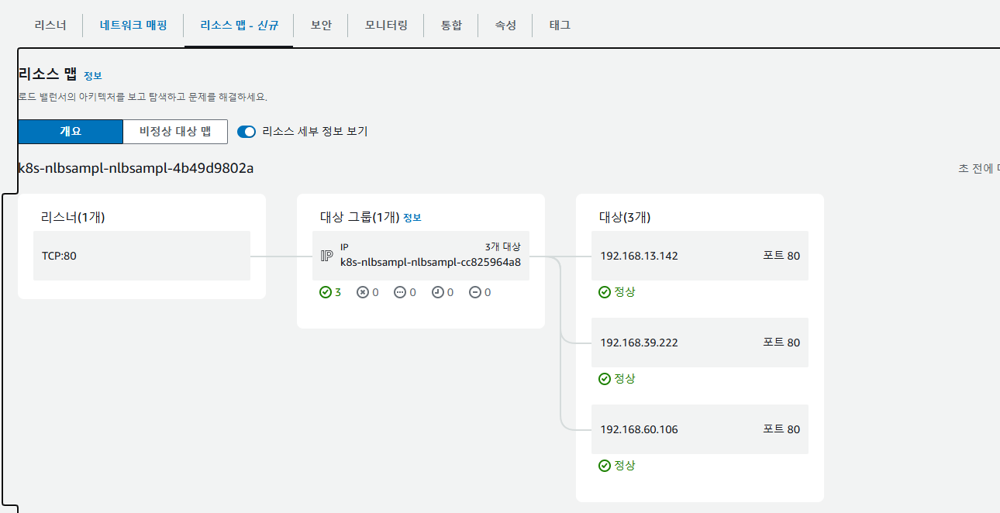

dns 정보로 nginx 확인 결과 정상적으로 3개중 하나의 연동 되는걸 확인

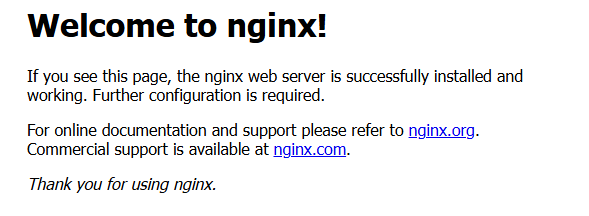

### ALB 서비스

- 참고 : https://docs.aws.amazon.com/ko_kr/eks/latest/userguide/alb-ingress.html

- **파드 배포 및 Ingress 배포**

  ```bash
  $ curl -O https://raw.githubusercontent.com/kubernetes-sigs/aws-load-balancer-controller/v2.7.2/docs/examples/2048/2048_full.yaml
  
  # replicas 5 -> 2개로 설정
  $ vi 2048_full.yaml
  
  $ kubectl apply -f 2048_full.yaml 
  namespace/game-2048 created
  deployment.apps/deployment-2048 created
  service/service-2048 created
  ingress.networking.k8s.io/ingress-2048 created
  
  $ kubectl get pod -n game-2048
  NAME                              READY   STATUS    RESTARTS   AGE
  deployment-2048-85f8c7d69-ccfmp   1/1     Running   0          68s
  deployment-2048-85f8c7d69-krjpd   1/1     Running   0          68s
  
  $ kubectl get pod -n game-2048 -o wide
  NAME                              READY   STATUS    RESTARTS   AGE   IP               NODE                                                NOMINATED NODE   READINESS GATES
  deployment-2048-85f8c7d69-ccfmp   1/1     Running   0          73s   192.168.51.249   ip-192-168-39-247.ap-northeast-2.compute.internal   <none>           <none>
  deployment-2048-85f8c7d69-krjpd   1/1     Running   0          73s   192.168.30.27    ip-192-168-10-42.ap-northeast-2.compute.internal    <none>           <none>
  
  $ kubectl get svc -n game-2048 -o wide
  NAME           TYPE       CLUSTER-IP      EXTERNAL-IP   PORT(S)        AGE   SELECTOR
  service-2048   NodePort   10.100.231.78   <none>        80:31143/TCP   86s   app.kubernetes.io/name=app-2048
  
  $ kubectl get Ingress -n game-2048 -o wide
  NAME           CLASS   HOSTS   ADDRESS                                                                        PORTS   AGE
  ingress-2048   alb     *       k8s-game2048-ingress2-ec2deb2d65-1343230107.ap-northeast-2.elb.amazonaws.com   80      105s
  
  $ kubectl describe -n game-2048 ingress ingress-2048
  Name:             ingress-2048
  Labels:           <none>
  Namespace:        game-2048
  Address:          k8s-game2048-ingress2-ec2deb2d65-1343230107.ap-northeast-2.elb.amazonaws.com
  Ingress Class:    alb
  Default backend:  <default>
  Rules:
    Host        Path  Backends
    ----        ----  --------
    *           
                /   service-2048:80 (192.168.51.249:80,192.168.30.27:80)
  Annotations:  alb.ingress.kubernetes.io/scheme: internet-facing
                alb.ingress.kubernetes.io/target-type: ip
  Events:
    Type    Reason                  Age    From     Message
    ----    ------                  ----   ----     -------
    Normal  SuccessfullyReconciled  2m56s  ingress  Successfully reconciled
    
  $ kubectl get targetgroupbinding -n game-2048
  NAME                               SERVICE-NAME   SERVICE-PORT   TARGET-TYPE   AGE
  k8s-game2048-service2-079e8fd7a5   service-2048   80             ip            4m40s  
  ```

  정상 생성

  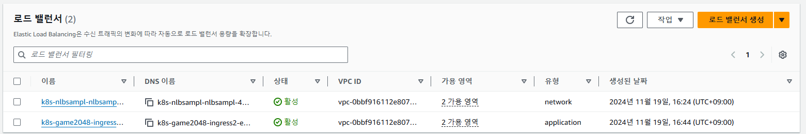

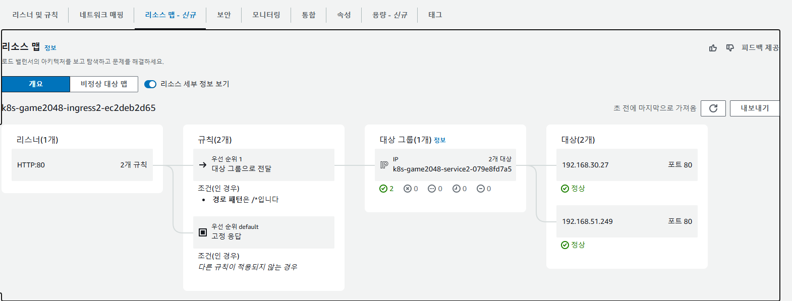

정상 작동도 확인


## 서비스 삭제하기

### 로드 밸런서 삭제

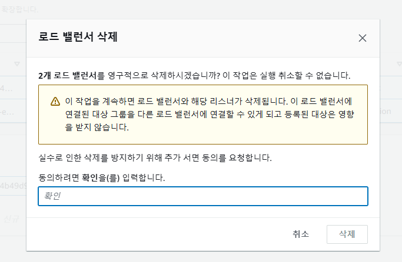

### 서비스와 네임스페이스 삭제

```bash
ubuntu@ip-172-31-13-134:~$ kubectl get ns
NAME              STATUS   AGE
default           Active   154m
game-2048         Active   8m39s
kube-node-lease   Active   154m
kube-public       Active   154m
kube-system       Active   154m
nlb-sample-app    Active   79m
ubuntu@ip-172-31-13-134:~$ kubectl delete ns nlb-sample-app --force
Warning: Immediate deletion does not wait for confirmation that the running resource has been terminated. The resource may continue to run on the cluster indefinitely.
namespace "nlb-sample-app" force deleted
ubuntu@ip-172-31-13-134:~$ kubectl delete ns game-2048 --force
Warning: Immediate deletion does not wait for confirmation that the running resource has been terminated. The resource may continue to run on the cluster indefinitely.
namespace "game-2048" force deleted
ubuntu@ip-172-31-13-134:~$ kubectl get ns
NAME              STATUS   AGE
default           Active   155m
kube-node-lease   Active   155m
kube-public       Active   155m
kube-system       Active   155m
```

### 클러스터 삭제

Amazon EKS 클러스터를 삭제하려면 다음 단계를 따라 진행하면 됩니다. 삭제 작업은 클러스터 및 관련 리소스를 정리하는 데 필요한 모든 단계를 포함합니다.

#### 삭제전 확인 할 수 있는 명령어

#### 1. **클러스터 이름 확인**

클러스터 이름을 확인하려면 다음 명령어를 사용하세요:

```
eksctl get clusters
```

#### 2.**노드 그룹 이름 확인**

```
eksctl get nodegroup --cluster <클러스터 이름>
```

---

#### 삭제 절차

#### 1. **노드 그룹 삭제**

먼저 클러스터에 연결된 노드 그룹을 삭제해야 합니다.

```bash
eksctl delete nodegroup --cluster <클러스터 이름> --name <노드 그룹 이름>
```

##### 확인:

노드 그룹 삭제 후에도 EC2 인스턴스나 Auto Scaling Group이 남아 있는지 확인합니다.  
남아 있다면 AWS Management Console 또는 CLI를 통해 수동으로 삭제합니다:
```bash
aws ec2 terminate-instances --instance-ids <인스턴스 ID>
aws autoscaling delete-auto-scaling-group --auto-scaling-group-name <ASG 이름> --force-delete
```

---

#### 2. **클러스터 삭제**
노드 그룹이 삭제되었으면 클러스터를 삭제합니다.

```bash
eksctl delete cluster --name <클러스터 이름>
```

---

#### 3. **로드 밸런서 및 보조 리소스 삭제**
EKS 클러스터에 의해 생성된 로드 밸런서와 관련 리소스를 삭제합니다.

##### 확인 및 삭제 방법:
- **로드 밸런서 삭제**
  ```bash
  aws elbv2 describe-load-balancers
  aws elbv2 delete-load-balancer --load-balancer-arn <로드 밸런서 ARN>
  ```

- **타겟 그룹 삭제**
  ```bash
  aws elbv2 describe-target-groups
  aws elbv2 delete-target-group --target-group-arn <타겟 그룹 ARN>
  ```

---

#### 4. **IAM 리소스 삭제**
EKS와 관련된 IAM 역할 및 정책을 삭제해야 합니다.

##### 4.1 IAM 역할 제거

```bash
aws iam delete-role --role-name <IAM 역할 이름>
```

##### 4.2 IAM 정책 제거
```bash
aws iam delete-policy --policy-arn <정책 ARN>
```

---

#### 5. **VPC 및 서브넷 삭제**
EKS는 VPC와 서브넷을 사용하므로, 사용하지 않는 경우 삭제합니다.

##### 5.1 VPC 확인
```bash
aws ec2 describe-vpcs --filters "Name=tag:aws:eks:cluster-name,Values=<클러스터 이름>"
```

##### 5.2 VPC 삭제
```bash
aws ec2 delete-vpc --vpc-id <VPC ID>
```

##### 5.3 서브넷 삭제
```bash
aws ec2 delete-subnet --subnet-id <서브넷 ID>
```

---

#### 6. **추가로 확인해야 할 리소스**
다음 리소스도 남아 있는지 확인하고 삭제합니다:
- **Security Groups**: `aws ec2 delete-security-group --group-id <Security Group ID>`
- **Elastic IPs**: `aws ec2 release-address --allocation-id <Elastic IP ID>`
- **Elastic Block Store (EBS) 볼륨**: `aws ec2 delete-volume --volume-id <볼륨 ID>`
- **CloudWatch 로그 그룹**: `aws logs delete-log-group --log-group-name <로그 그룹 이름>`

---

#### 7. **정리 완료 확인**
모든 관련 리소스를 삭제한 후 AWS Management Console에서 리소스가 남아 있지 않은지 확인합니다.

---

### EC2 인스턴스 중지

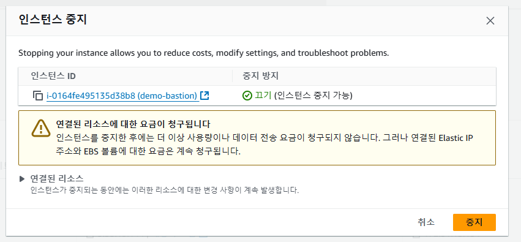