# MQTT

## 초기 셋팅

- 도커 : https://www.docker.com/products/docker-desktop/
- mqttfx : https://mqtt.iot01.com/apps/mqttfx/1.7.1/
- 참고 url
  - https://velog.io/@csh0034/Spring-Integration-MQTT-%EC%97%B0%EB%8F%99
  - https://github.com/Jinwon-Dev/TIL/blob/main/Network/mqtt.md


## 도커 셋팅

```
docker run -d  -p 1883:1883 -p 9001:9001 --restart always --name mosquitto csh0034/mosquitto
```


일단 해당 공식 파일로는 connection이 안되서, 따로 설정이 필요한 상황

그러나 csh0034/mosquitto로 하면 정상적으로 되서 일단 해당 이슈는 추후 수정 예정

# Influx DB

## 참고자료

https://datamoney.tistory.com/287


## 도커 셋팅

### 볼륨 설정

도커는 디비 데이터도 같이 삭제 될 수 있으므로, influx DB 볼륨을 생성해서 해당 볼륨에 데이터를 저장할 수 있도록 셋팅

```
docker volume create influxdb-storage
```


### Influx DB 도커 실행

```
docker run -d --name influxdb -p 8086:8086 -v influxdb-storage:/var/lib/influxdb2 influxdb:latest
```

> 2024-06-12 네트워크 설정 추가

```
docker run -d --name influxdb --network=grafana-network -p 8086:8086 -v influxdb-storage:/var/lib/influxdb2 influxdb:latest
```

해당 포트로 접속하니 계정생성 후 화면

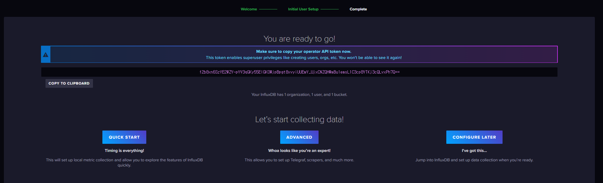

먼가 이 토큰 값은 중요해 보이니 따로 저장

#### Token

```
f2b8xn6SzYE2WZY-pYV3qGKy55EIGK0WjpBpgt8xvyiUUEmY_UjxCNZQHWmBu1emsL1C3cp8YTKj3cQLvxPh7Q==
```


### Java 셋팅

두가지 디펜던시를 할 수 있는데, 차이점이 있다

```
implementation("org.influxdb:influxdb-java:2.21") // influxDB 1.x 버전에 대한 client
implementation("com.influxdb:influxdb-client-java:6.0.0") // influxDB 2.x 버전에 대한 client
```

도커로 생성한 Influx DB 버전 확인 방법

```
C:\Users\Yeom>docker exec -it influxdb /bin/bash
influxd version
root@288b3a43f222:/# influxd version
InfluxDB v2.7.6 (git: 3c58c06206) build_date: 2024-04-12T21:51:21Z
```


나는 아래 셋팅으로 진행 하려고 한다.


##### application.yml

```
influxdb:
  url: http://localhost:8086
  token: f2b8xn6SzYE2WZY-pYV3qGKy55EIGK0WjpBpgt8xvyiUUEmY_UjxCNZQHWmBu1emsL1C3cp8YTKj3cQLvxPh7Q==
  org: Test
  bucket: test
```


### InfluxDB와 MySQL 비교

#### 1. **기본 개념 및 목적**

**InfluxDB:**

- **타임 시리즈 데이터베이스 (TSDB):** InfluxDB는 타임 시리즈 데이터의 수집, 저장, 조회 및 시각화를 위한 오픈 소스 데이터베이스입니다.
- **주요 용도:** 모니터링, IoT 센서 데이터, 애플리케이션 메트릭, 이벤트 로깅 등 시간에 따라 변화하는 데이터를 다루는 데 최적화되어 있습니다.
- **특징:** 자동화된 데이터 압축 및 다운샘플링, 고성능 읽기/쓰기 작업, 시계열 쿼리 언어 (Flux)를 사용하여 시간 기반 데이터의 효율적 조회 및 분석.

**MySQL:**

- **관계형 데이터베이스 (RDBMS):** MySQL은 전통적인 관계형 데이터베이스로, 테이블 간의 관계를 정의하고 SQL을 사용하여 데이터를 관리합니다.
- **주요 용도:** 웹 애플리케이션, 전자 상거래, 블로그, CRM 시스템 등 다양한 애플리케이션에서 사용됩니다.
- **특징:** ACID 속성을 갖춘 트랜잭션 처리, 강력한 데이터 무결성 및 일관성, 다양한 조인 및 복잡한 쿼리 기능.

#### 2. **데이터 모델링**

**InfluxDB:**

- 데이터 구조:

   시계열 데이터는 Measurement (측정값), Tag (태그), Field (필드)로 구성됩니다.

  - **Measurement:** 데이터를 그룹화하는 데 사용되는 개념 (테이블과 비슷함).
  - **Tag:** 인덱싱 가능한 메타데이터로, 쿼리 성능을 높이기 위해 사용.
  - **Field:** 실질적인 데이터 값으로, 인덱싱되지 않음.
  - **Timestamp:** 각 데이터 포인트에 대한 시간 정보.

- **예제:** CPU 사용률 데이터를 저장할 때, 측정값은 "cpu_usage", 태그는 "host"와 "region", 필드는 "usage_user"와 "usage_system"으로 구성될 수 있습니다.

**MySQL:**

- 데이터 구조:

   테이블, 행, 열로 구성됩니다.

  - **테이블:** 데이터를 저장하는 구조로, 각 테이블은 열 (속성)과 행 (레코드)로 구성됩니다.
  - **스키마:** 각 테이블의 구조를 정의하며, 각 열은 데이터 타입과 제약 조건을 가집니다.

- **예제:** 사용자 정보를 저장할 때, "users" 테이블은 "id", "name", "email" 등의 열로 구성될 수 있습니다.

#### 3. **쿼리 언어**

**InfluxDB:**

- InfluxQL 및 Flux:

   InfluxDB는 초기에는 InfluxQL을 사용했으나, 현재는 더 강력하고 유연한 Flux 쿼리 언어를 사용합니다.

  - **InfluxQL:** SQL과 유사한 구문을 가지며, 시계열 데이터의 간단한 쿼리에 사용됩니다.
  - **Flux:** 데이터 변환, 집계, 필터링 등의 복잡한 작업을 수행할 수 있는 강력한 함수형 언어입니다.

- 예제 (Flux):

  ```
  fluxCopy codefrom(bucket: "example-bucket")
    |> range(start: -1h)
    |> filter(fn: (r) => r._measurement == "cpu" and r._field == "usage_system")
    |> mean()
  ```

**MySQL:**

- **SQL:** 관계형 데이터베이스의 표준 쿼리 언어로, 데이터 정의(DDL), 데이터 조작(DML), 데이터 제어(DCL) 등을 위한 다양한 구문을 제공합니다.

- 예제:

  ```
  sqlCopy codeSELECT AVG(usage_system)
  FROM cpu_usage
  WHERE timestamp > NOW() - INTERVAL 1 HOUR;
  ```

#### 4. **성능 및 스케일링**

**InfluxDB:**

- **고성능 쓰기/읽기:** 대량의 시계열 데이터를 매우 빠르게 기록하고 조회할 수 있도록 설계되었습니다.
- **자동화된 다운샘플링:** 오래된 데이터를 자동으로 압축하고 요약하여 저장 공간을 절약합니다.
- **수평적 스케일링:** InfluxDB Enterprise 버전에서는 클러스터링을 통해 수평적 스케일링을 지원합니다.

**MySQL:**

- **트랜잭션 처리:** ACID 특성을 지원하여 높은 데이터 무결성과 일관성을 보장합니다.
- **읽기 스케일링:** 읽기 전용 복제본을 통해 읽기 작업을 분산할 수 있습니다.
- **수평적 스케일링 제한:** 기본적으로는 수평적 스케일링이 제한적이며, 샤딩 등을 통해 구현해야 합니다.

#### 5. **사용 사례**

**InfluxDB:**

- **모니터링 및 경보 시스템:** 서버, 애플리케이션, 네트워크 장비 등의 성능 모니터링.
- **IoT 애플리케이션:** 센서 데이터 수집 및 실시간 분석.
- **데브옵스 및 SRE:** 로그 및 메트릭 수집, 대시보드 구성.

**MySQL:**

- **웹 애플리케이션:** 사용자 데이터 관리, 전자 상거래, 콘텐츠 관리 시스템(CMS).
- **기업 애플리케이션:** ERP, CRM 시스템 등 다양한 비즈니스 응용 프로그램.
- **블로그 및 포럼:** 사용자 생성 콘텐츠 저장 및 관리.

### 결론

InfluxDB와 MySQL은 각각의 장점과 목적이 다르며, 사용 사례에 따라 적합한 데이터베이스를 선택해야 합니다. InfluxDB는 시계열 데이터를 빠르고 효율적으로 처리하는 데 최적화되어 있으며, MySQL은 다양한 애플리케이션에서 안정적인 트랜잭션과 복잡한 쿼리를 지원하는 관계형 데이터베이스입니다. 사용자의 요구 사항에 따라 적절한 데이터베이스를 선택하고 활용하는 것이 중요합니다.


## 테스트 중 알게된 내용

### 1. field type confict

해당 에러는 기존의 field2에 값을 float 형태로 write 했는데, 이번엔 integer 형으로 write 하니깐 발생한 에러

field값의 형태가 한번 정해지면 변경이 어려움

```
com.influxdb.exceptions.UnprocessableEntityException: failure writing points to database: partial write: field type conflict: input field "field2" on measurement "home" is type integer, already exists as type float dropped=1
	at com.influxdb.internal.AbstractRestClient.responseToError(AbstractRestClient.java:132) ~[influxdb-client-core-6.0.0.jar:6.0.0]
	at com.influxdb.internal.AbstractRestClient.execute(AbstractRestClient.java:83) ~[influxdb-client-core-6.0.0.jar:6.0.0]
	at com.influxdb.client.internal.AbstractWriteBlockingClient.write(AbstractWriteBlockingClient.java:90) ~[influxdb-client-java-6.0.0.jar:6.0.0]
	at com.influxdb.client.internal.WriteApiBlockingImpl.lambda$writePoints$1(WriteApiBlockingImpl.java:186) ~[influxdb-client-java-6.0.0.jar:6.0.0]
	at java.base/java.util.LinkedHashMap.forEach(LinkedHashMap.java:729) ~[na:na]
	at com.influxdb.client.internal.WriteApiBlockingImpl.writePoints(WriteApiBlockingImpl.java:184) ~[influxdb-client-java-6.0.0.jar:6.0.0]
	at com.influxdb.client.internal.WriteApiBlockingImpl.writePoint(WriteApiBlockingImpl.java:150) ~[influxdb-client-java-6.0.0.jar:6.0.0]
	at com.influxdb.client.internal.WriteApiBlockingImpl.writePoint(WriteApiBlockingImpl.java:136) ~[influxdb-client-java-6.0.0.jar:6.0.0]
	at com.influxdb.client.internal.WriteApiBlockingImpl.writePoint(WriteApiBlockingImpl.java:127) ~[influxdb-client-java-6.0.0.jar:6.0.0]
	at com.example.blog.mqtt.api.service.InfluxDBService.writeData(InfluxDBService.kt:18) ~[main/:na]
	at com.example.blog.mqtt.api.InfluxDBController.writeData(InfluxDBController.kt:27) ~[main/:na]
	at java.base/jdk.internal.reflect.DirectMethodHandleAccessor.invoke(DirectMethodHandleAccessor.java:104) ~[na:na]
	at java.base/java.lang.reflect.Method.invoke(Method.java:578) ~[na:na]
	at org.springframework.web.method.support.InvocableHandlerMethod.doInvoke(InvocableHandlerMethod.java:205) ~[spring-web-5.3.23.jar:5.3.23]
	at org.springframework.web.method.support.InvocableHandlerMethod.invokeForRequest(InvocableHandlerMethod.java:150) ~[spring-web-5.3.23.jar:5.3.23]
	at org.springframework.web.servlet.mvc.method.annotation.ServletInvocableHandlerMethod.invokeAndHandle(ServletInvocableHandlerMethod.java:117) ~[spring-webmvc-5.3.23.jar:5.3.23]
	at org.springframework.web.servlet.mvc.method.annotation.RequestMappingHandlerAdapter.invokeHandlerMethod(RequestMappingHandlerAdapter.java:895) ~[spring-webmvc-5.3.23.jar:5.3.23]
	at org.springframework.web.servlet.mvc.method.annotation.RequestMappingHandlerAdapter.handleInternal(RequestMappingHandlerAdapter.java:808) ~[spring-webmvc-5.3.23.jar:5.3.23]
	at org.springframework.web.servlet.mvc.method.AbstractHandlerMethodAdapter.handle(AbstractHandlerMethodAdapter.java:87) ~[spring-webmvc-5.3.23.jar:5.3.23]
	at org.springframework.web.servlet.DispatcherServlet.doDispatch(DispatcherServlet.java:1071) ~[spring-webmvc-5.3.23.jar:5.3.23]
	at org.springframework.web.servlet.DispatcherServlet.doService(DispatcherServlet.java:964) ~[spring-webmvc-5.3.23.jar:5.3.23]
	at org.springframework.web.servlet.FrameworkServlet.processRequest(FrameworkServlet.java:1006) ~[spring-webmvc-5.3.23.jar:5.3.23]
	at org.springframework.web.servlet.FrameworkServlet.doPost(FrameworkServlet.java:909) ~[spring-webmvc-5.3.23.jar:5.3.23]
	at javax.servlet.http.HttpServlet.service(HttpServlet.java:681) ~[tomcat-embed-core-9.0.65.jar:4.0.FR]
	at org.springframework.web.servlet.FrameworkServlet.service(FrameworkServlet.java:883) ~[spring-webmvc-5.3.23.jar:5.3.23]
	at javax.servlet.http.HttpServlet.service(HttpServlet.java:764) ~[tomcat-embed-core-9.0.65.jar:4.0.FR]
	at org.apache.catalina.core.ApplicationFilterChain.internalDoFilter(ApplicationFilterChain.java:227) ~[tomcat-embed-core-9.0.65.jar:9.0.65]
	at org.apache.catalina.core.ApplicationFilterChain.doFilter(ApplicationFilterChain.java:162) ~[tomcat-embed-core-9.0.65.jar:9.0.65]
	at org.apache.tomcat.websocket.server.WsFilter.doFilter(WsFilter.java:53) ~[tomcat-embed-websocket-9.0.65.jar:9.0.65]
	at org.apache.catalina.core.ApplicationFilterChain.internalDoFilter(ApplicationFilterChain.java:189) ~[tomcat-embed-core-9.0.65.jar:9.0.65]
	at org.apache.catalina.core.ApplicationFilterChain.doFilter(ApplicationFilterChain.java:162) ~[tomcat-embed-core-9.0.65.jar:9.0.65]
	at org.springframework.web.filter.RequestContextFilter.doFilterInternal(RequestContextFilter.java:100) ~[spring-web-5.3.23.jar:5.3.23]
	at org.springframework.web.filter.OncePerRequestFilter.doFilter(OncePerRequestFilter.java:117) ~[spring-web-5.3.23.jar:5.3.23]
	at org.apache.catalina.core.ApplicationFilterChain.internalDoFilter(ApplicationFilterChain.java:189) ~[tomcat-embed-core-9.0.65.jar:9.0.65]
	at org.apache.catalina.core.ApplicationFilterChain.doFilter(ApplicationFilterChain.java:162) ~[tomcat-embed-core-9.0.65.jar:9.0.65]
	at org.springframework.web.filter.FormContentFilter.doFilterInternal(FormContentFilter.java:93) ~[spring-web-5.3.23.jar:5.3.23]
	at org.springframework.web.filter.OncePerRequestFilter.doFilter(OncePerRequestFilter.java:117) ~[spring-web-5.3.23.jar:5.3.23]
	at org.apache.catalina.core.ApplicationFilterChain.internalDoFilter(ApplicationFilterChain.java:189) ~[tomcat-embed-core-9.0.65.jar:9.0.65]
	at org.apache.catalina.core.ApplicationFilterChain.doFilter(ApplicationFilterChain.java:162) ~[tomcat-embed-core-9.0.65.jar:9.0.65]
	at org.springframework.web.filter.CharacterEncodingFilter.doFilterInternal(CharacterEncodingFilter.java:201) ~[spring-web-5.3.23.jar:5.3.23]
	at org.springframework.web.filter.OncePerRequestFilter.doFilter(OncePerRequestFilter.java:117) ~[spring-web-5.3.23.jar:5.3.23]
	at org.apache.catalina.core.ApplicationFilterChain.internalDoFilter(ApplicationFilterChain.java:189) ~[tomcat-embed-core-9.0.65.jar:9.0.65]
	at org.apache.catalina.core.ApplicationFilterChain.doFilter(ApplicationFilterChain.java:162) ~[tomcat-embed-core-9.0.65.jar:9.0.65]
	at org.apache.catalina.core.StandardWrapperValve.invoke(StandardWrapperValve.java:197) ~[tomcat-embed-core-9.0.65.jar:9.0.65]
	at org.apache.catalina.core.StandardContextValve.invoke(StandardContextValve.java:97) ~[tomcat-embed-core-9.0.65.jar:9.0.65]
	at org.apache.catalina.authenticator.AuthenticatorBase.invoke(AuthenticatorBase.java:541) ~[tomcat-embed-core-9.0.65.jar:9.0.65]
	at org.apache.catalina.core.StandardHostValve.invoke(StandardHostValve.java:135) ~[tomcat-embed-core-9.0.65.jar:9.0.65]
	at org.apache.catalina.valves.ErrorReportValve.invoke(ErrorReportValve.java:92) ~[tomcat-embed-core-9.0.65.jar:9.0.65]
	at org.apache.catalina.core.StandardEngineValve.invoke(StandardEngineValve.java:78) ~[tomcat-embed-core-9.0.65.jar:9.0.65]
	at org.apache.catalina.connector.CoyoteAdapter.service(CoyoteAdapter.java:360) ~[tomcat-embed-core-9.0.65.jar:9.0.65]
	at org.apache.coyote.http11.Http11Processor.service(Http11Processor.java:399) ~[tomcat-embed-core-9.0.65.jar:9.0.65]
	at org.apache.coyote.AbstractProcessorLight.process(AbstractProcessorLight.java:65) ~[tomcat-embed-core-9.0.65.jar:9.0.65]
	at org.apache.coyote.AbstractProtocol$ConnectionHandler.process(AbstractProtocol.java:890) ~[tomcat-embed-core-9.0.65.jar:9.0.65]
	at org.apache.tomcat.util.net.NioEndpoint$SocketProcessor.doRun(NioEndpoint.java:1789) ~[tomcat-embed-core-9.0.65.jar:9.0.65]
	at org.apache.tomcat.util.net.SocketProcessorBase.run(SocketProcessorBase.java:49) ~[tomcat-embed-core-9.0.65.jar:9.0.65]
	at org.apache.tomcat.util.threads.ThreadPoolExecutor.runWorker(ThreadPoolExecutor.java:1191) ~[tomcat-embed-core-9.0.65.jar:9.0.65]
	at org.apache.tomcat.util.threads.ThreadPoolExecutor$Worker.run(ThreadPoolExecutor.java:659) ~[tomcat-embed-core-9.0.65.jar:9.0.65]
	at org.apache.tomcat.util.threads.TaskThread$WrappingRunnable.run(TaskThread.java:61) ~[tomcat-embed-core-9.0.65.jar:9.0.65]
	at java.base/java.lang.Thread.run(Thread.java:1589) ~[na:na]

```

### 2. 어떤 column이 존재 하는지

| table | _measurment | _field | _value | _start                   | _stop                    | _time                    | tag<br />location | tag<br />simple |
| ----- | ----------- | ------ | ------ | ------------------------ | ------------------------ | ------------------------ | ----------------- | --------------- |
| 1     | home        | field2 | 456.78 | 2024-06-04T08:36:56.826Z | 2024-06-11T08:36:56.826Z | 2024-06-11T03:30:00.000Z | west              | test            |
| ?     | 테이블명    | key    | value  | 검색하는 시간의 시작시간 | 검색하는 시간 종료시간   | insert 시간              | 태그1             | 태그2           |
|       |             |        |        |                          |                          |                          |                   |                 |

### 3. Table의 의미

`table`은 InfluxDB의 쿼리 결과에서 반환되는 데이터 구조 중 하나입니다. InfluxDB 2.x에서 Flux 쿼리 언어를 사용할 때, 결과는 하나 이상의 "테이블"로 구성됩니다. 각 테이블은 동일한 구조를 가진 데이터의 그룹입니다. Flux 쿼리 결과는 여러 테이블로 나뉘며, 각 테이블은 다음과 같은 특징을 가집니다:

- 동일한 `_measurement` 값을 가짐
- 동일한 `_field` 값을 가짐
- 동일한 태그 키-값 쌍을 가짐
- 동일한 그룹 키 값을 가짐


### 4.`_start`와 `_stop`의 역할

`_start`와 `_stop`은 InfluxDB의 Flux 쿼리에서 데이터의 시간 범위를 지정하는 데 사용되는 키워드입니다. 이들은 특정 시간 범위 내의 데이터를 쿼리하기 위해 사용됩니다.

- **`_start`**: 쿼리에서 데이터 검색을 시작할 시간입니다. 이 값은 데이터 시리즈의 시작 시간을 나타냅니다.
- **`_stop`**: 쿼리에서 데이터 검색을 중단할 시간입니다. 이 값은 데이터 시리즈의 끝 시간을 나타냅니다.

Flux 쿼리의 `range` 함수에서 이 두 값을 사용하여 시간 범위를 지정합니다. 예를 들어, 특정 시간 범위 내의 모든 데이터를 조회하고자 할 때 사용됩니다.


# Grafana

### Docker 볼륨 생성

1. Docker 볼륨을 생성합니다:

   ```
   docker volume create grafana-storage
   ```

2. Docker 실행

   ```
   docker run -d -p 3000:3000 --name=grafana --network=grafana-network -e "GF_SECURITY_ADMIN_USER=admin" -e "GF_SECURITY_ADMIN_PASSWORD=secret" -e "GF_SERVER_HTTP_HEADER_ACCESS_CONTROL_ALLOW_ORIGIN=*" -v grafana-storage:/var/lib/grafana grafana/grafana
   ```


### 대시보드 생성

대시보드에 들어오면 해당 화면이 나타남 나는 컴포넌트화 하려고 나눠놨음

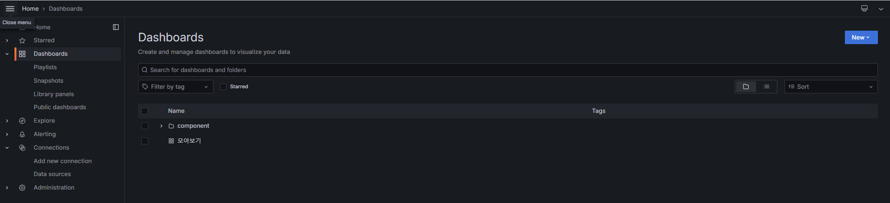

아래처럼 보고싶은 컴포넌트로 구성을 함

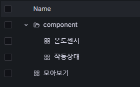

일단 New로 대시보드 생

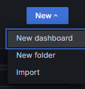

+Add visualization 버튼을 클릭

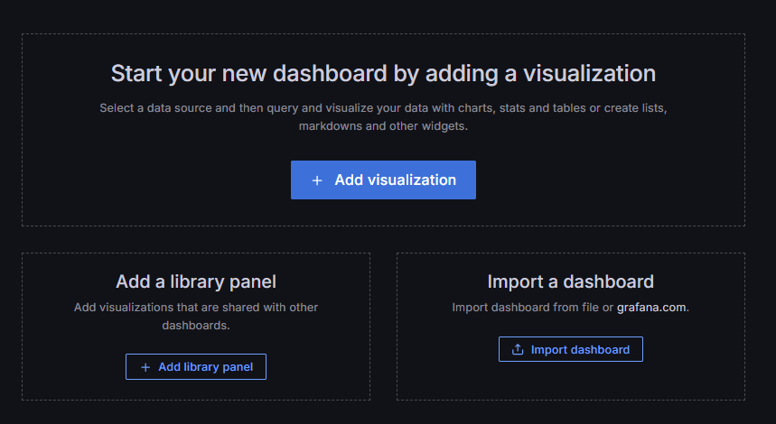


influxdb를 클릭

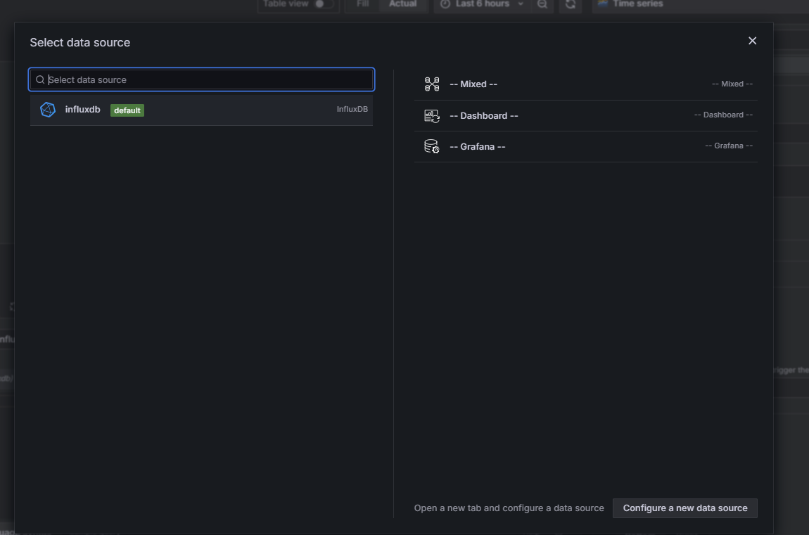


아래와 같은 화면이 나타남

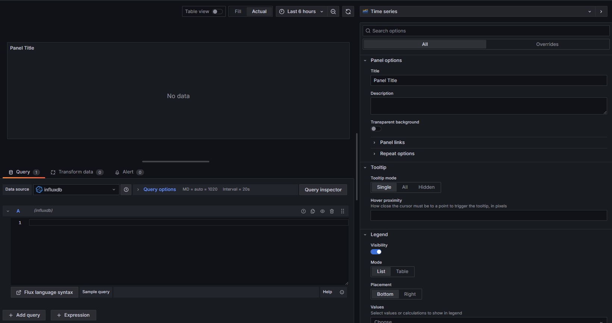


#### 쿼리

- influxdb 2.x 버전에서는 flux 라는 문법으로 데이터를 조회해야함

- Add query를 통해서 여러 쿼리에 대한 결과값을 나타낼 수 있음

  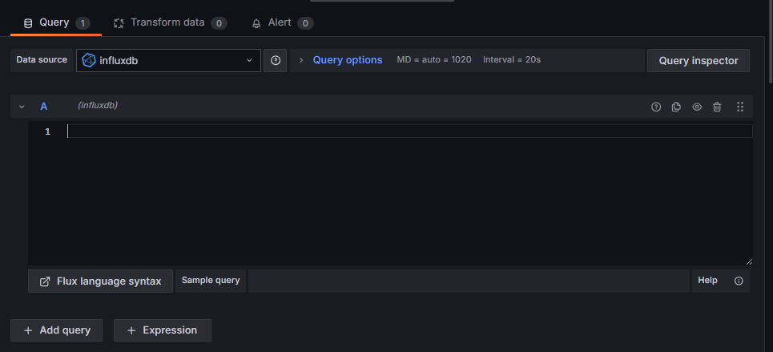


쿼리 결과

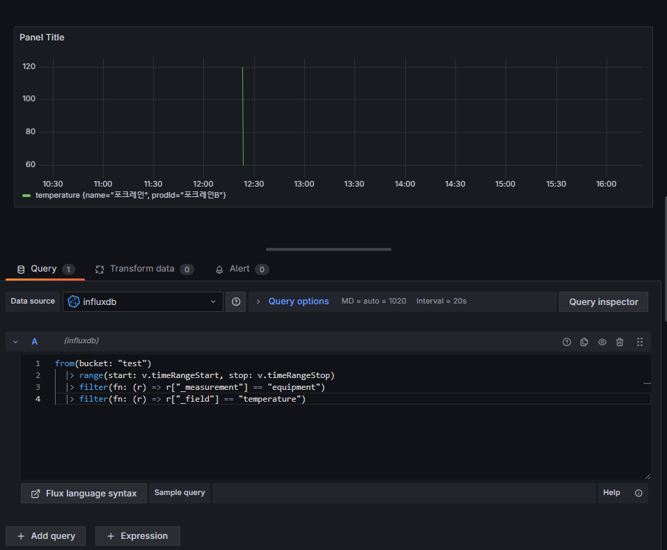


### 패널

데이터에 대한 화면 내용에 대해서 아래와 같은 형태로 나타낼 수 있음

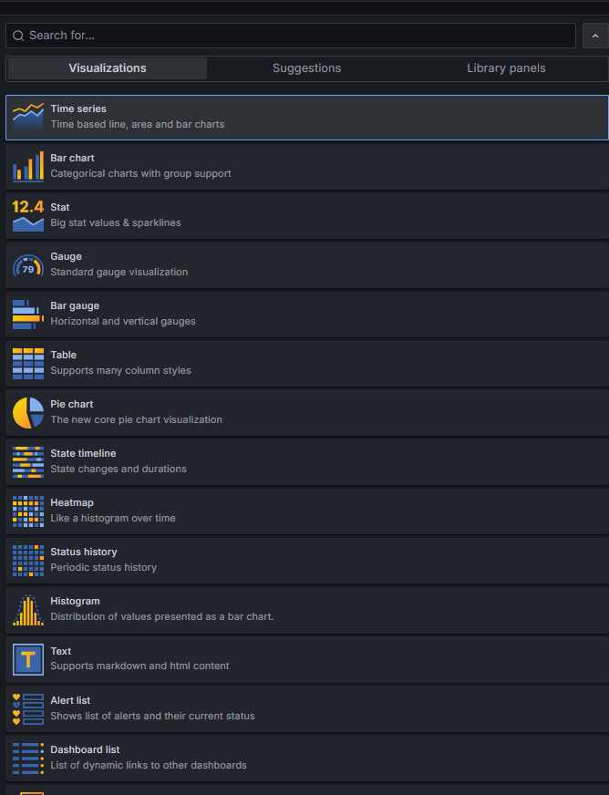

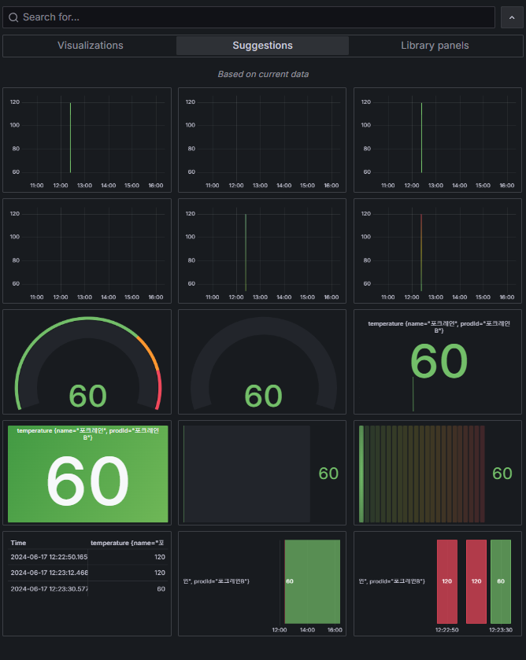


패널에서 시간값을 변경하면 더 많은 데이터를 볼 수 있음

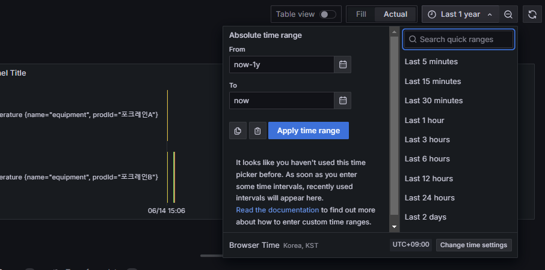


패널을 선택하고 우측에 있는 기능을 통해 UI/UX를 가공을 할 수 있음

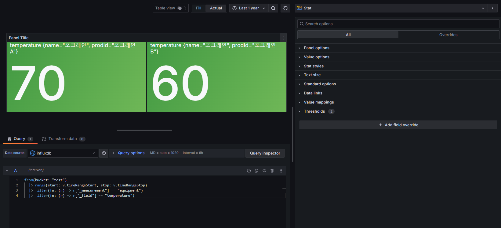


아래와 같은 화면에서 조정이 가능함

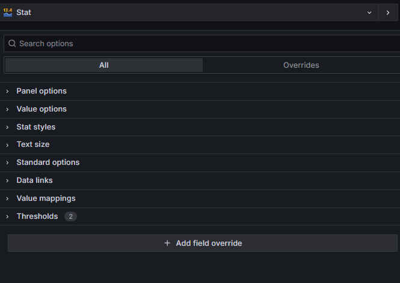


- Panel options
  - 패널명 변경
- Value options
  - 하나의 값을 볼지, 다중 값을 볼지 선택이 가능함
- Stat styles
  - text 스타일 제어
  - 배경 스타일 제어
  - 그래프 스타일 제어
- Text size
  - 글자 크기 제어
- Standard option
  - 숫자 단위
  - 최소 값
  - 최대 값
  - 정수형으로 볼지, 실수형으로 볼지
  - display name 설
  - 색상 제어
- Data links
  - 데이터의 링크걸기
  - 클릭시 해당 링크로 이
- Value mmappings
  - 특정 값은 다른 값으로 나타낼 수 있음
- Thresholds
  - 특정 값에 따라 색상 변경
- +Add field override
  - 특정 필드에 대해서만 위에 있는 내용 따로 적용이 가능


커스텀하게 적용하면 아래와 같이 적용 가능

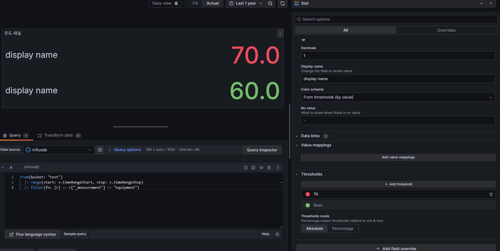


대시보드 저장

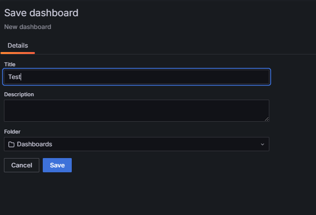


아래와 같은 대시보드가 생김

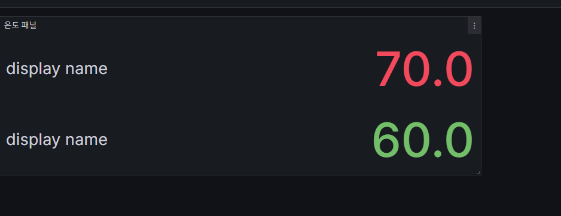


해당 패널에 대해서 share를 누르고 embed를 누르면 iframe 형태로 제공이 가능

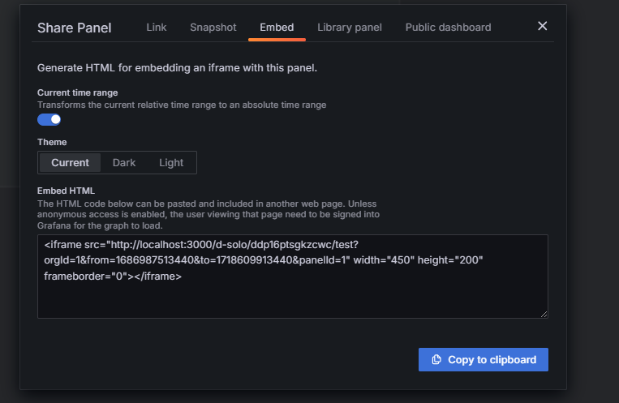


외부 도메인에서 아래와 같이 사용이 가능

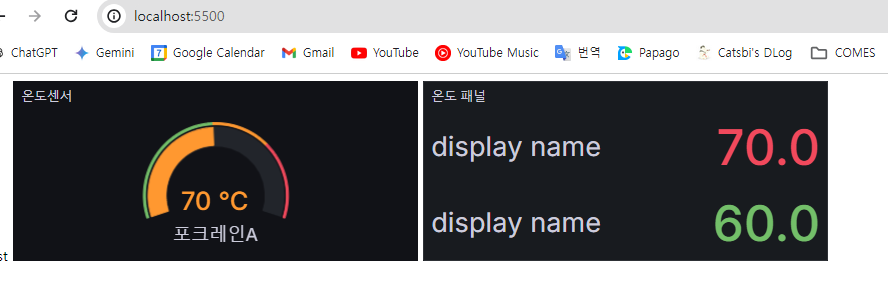


# 도커를 사용하면서 생긴 이슈

https://bluayer.com/45

네트워크 설정을 해야 되며, --name으로 설정한 것으로 통신을 할 수 있음


### 그라파나 iframe 이슈

iframe을 적용하다보니 아래 에러가 발생

```
Refused to display 'http://localhost:3000/' in a frame because it set 'X-Frame-Options' to 'deny'.
```

원인을 파악하니 /etc/grafana/grafana.ini 해당 파일에 아래 allow_embedding 값이 true여야 함

```
[security]
allow_embedding = true
```

파일 직접 변경이 잘 안되서 아래와 같이 진행

```
# 파일 복제
docker cp grafana:/etc/grafana/grafana.ini ./grafana.ini

# 파일내용 수기로 변경

# 수정된 내용을 다시 원본에 덮어쓰기
docker cp ./grafana.ini grafana:/etc/grafana/grafana.ini

# 도커 그라파나 재시작
docker restart grafana
```

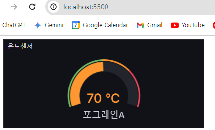

# 설계

## grafana 화면 설정

- tags
  - 장비명
    - 포크레인
    - 지게차
    - 불도저
  - 제품 ID
    - 유니크한 값 ( 장비명 + 영문 순서)
      - 포크레인A
      - 지게차B
      - 불도저C
- fields
  - 온도센서
  - 작동 여부 (시동여부)
  - 공사현장


