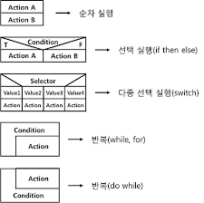
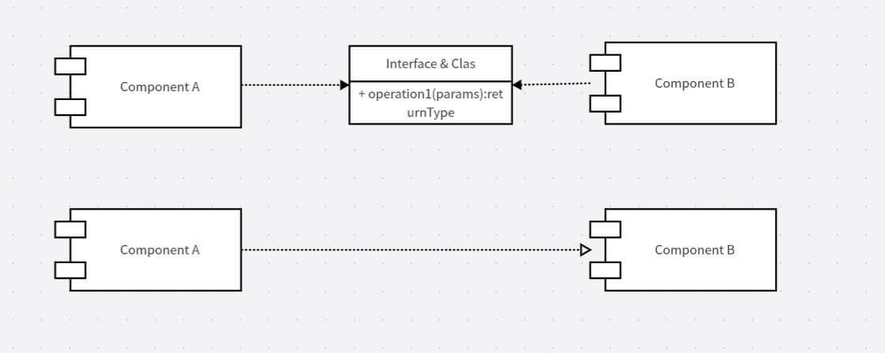
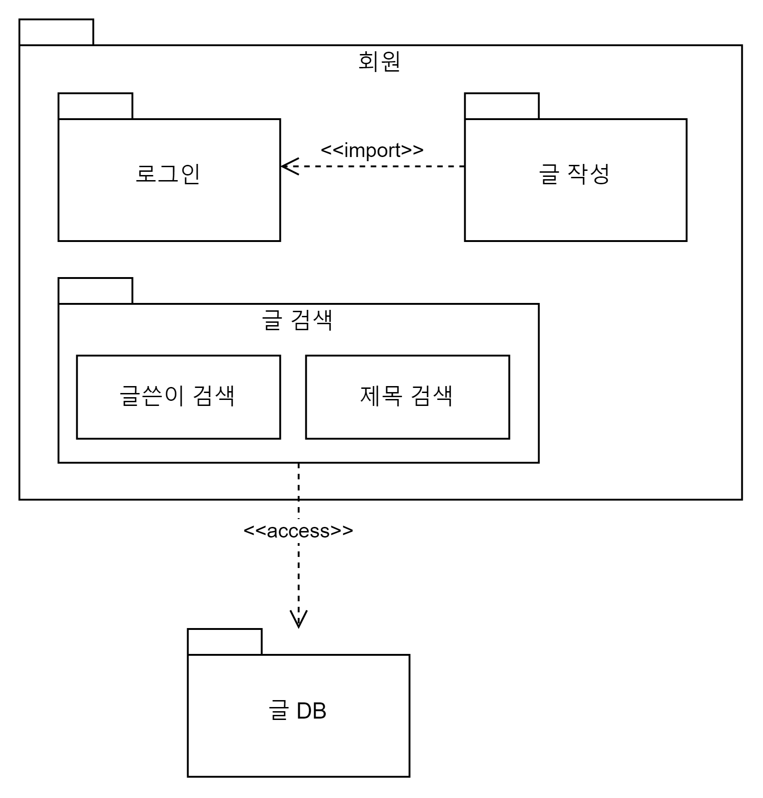
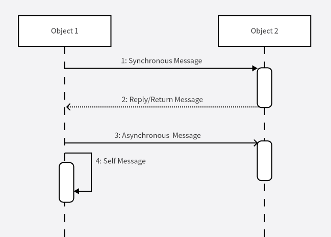
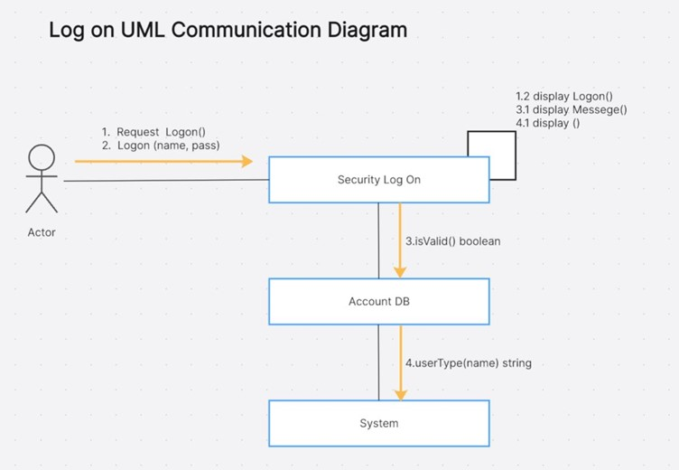
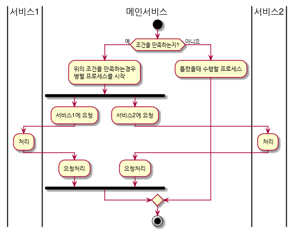
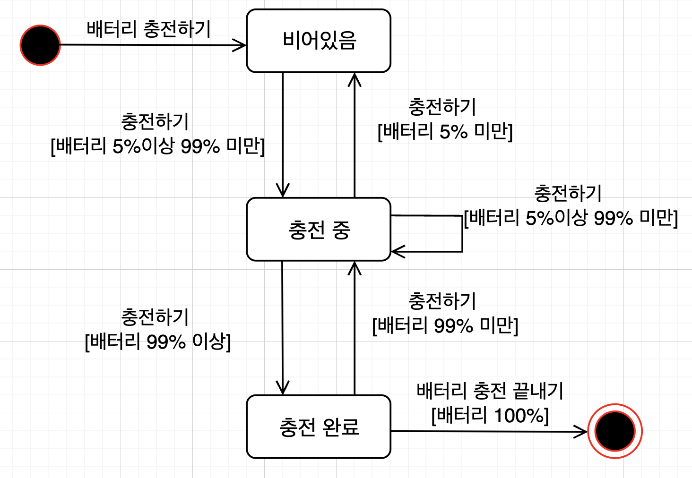
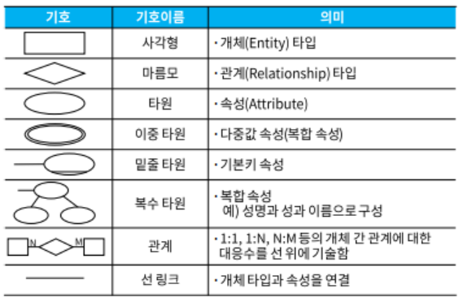
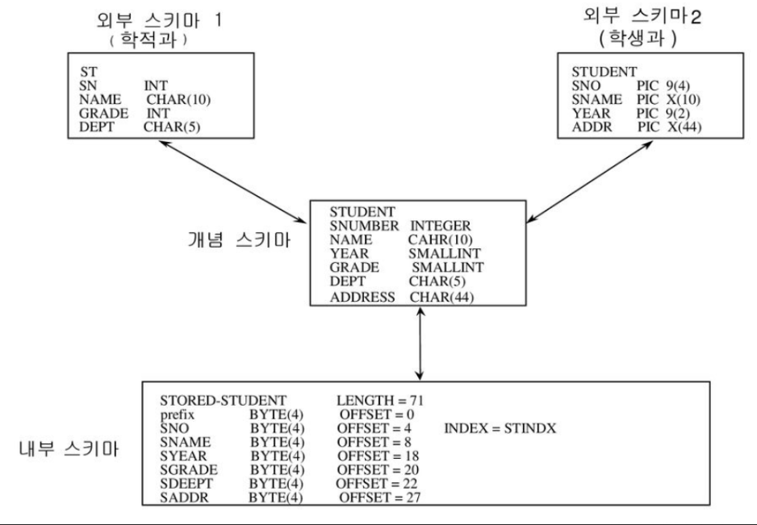

# 1. 요구 사항 확인

| 단어                          | 내용                                                         | 기타                                                         |
| ----------------------------- | ------------------------------------------------------------ | ------------------------------------------------------------ |
| SDLC                          | 시스템의 요구분석 ~ 유지보수까지 전 과정을 모델링 한 것      |                                                              |
| SDLC 모델 종류                | 1. 폭포수 모델(Waterfall Model) 2. 프로토타이핑 모델(Prototyping Model) 3. 나선형 모델(Spiral Model) 4. 반복적 모델(Iteration Model) |                                                              |
| 폭포수 모델                   | - 선형 순차적 모델 => 고전적 생명주기 모델 - 각 개발 단계를 마무리 지은 후 넘어가는 모델 - 가장 오래됐고, 성공사례가 많으며, 단계별 산출물이 명확하고 요구사항 변경이 어려움 |                                                              |
| 프로토타이핑 모델             | - 주요 기능을 프로토타입으로 구현 - 피드백을 반영해 만들어나가는 모델 |                                                              |
| 나선형 모델                   | - 위험을 최소화하기 위해, 점진적으로 개발해나가는 모델 - 절차: 계획 및 정의 → 위험 분석 → 개발 → 고객 평가 |                                                              |
| 반복적 모델                   | 병렬적으로 개발 후 통합하거나, 반복적으로 개발해 점차 완성시켜나가는 모델 |                                                              |
|                               |                                                              |                                                              |
| 소프트웨어 개발 방법론        | 소프트웨어의 개발 시작부터 전 개발 과정을 형상화한 방법론 1. 구조적 방법론 2. 정보공학 방법론 3. 객체지향 방법론 4. 컴포넌트 기반 방법론 5. 애자일 방법론 6. 제품 계열 방법론 |                                                              |
| 구조적 방법론                 | - 전체 시스템을 나눠 개발하고 통합하는 분할-정복 방식의 방법론 - nassi shneiderman diagram 사용 |  |
| 정보공학 방법론               | - 정보 시스템 개발에 필요한 절차를 체계화한 방법론 - 대형 프로젝트에서 사용 |                                                              |
| 객체지향 방법론               | - 객체라는 단위로 시스템을 설계하는 방법론                   |                                                              |
| 컴포넌트 기반 방법론          | - 컴포넌트를 조립해 작성하는 방법론                          |                                                              |
| 애자일 방법론                 | - 정차보다 사람이 우선되는 변화에 유연한 경량 개발 방법론    |                                                              |
| 제품 계열 방법론              | - 제품에 적용할 공통 기능을 정의하여 개발하는 방법론         |                                                              |
|                               |                                                              |                                                              |
| XP                            | 1~3주의 반복(Iteration) 주기를 갖는 애자일 방법론            |                                                              |
| XP의 5가지 가치               | 1. 용기 2. 단순성 3. 의사소통 4. 피드백 5. 존중 |                                                              |
| XP의 12가지 기본 원리         | 1. 짝 프로그래맹 (Pair Programming) : 다른 사람과 페어로 개발하여 공동 책임을 지님 2. 공동 코드 소유 (Collective Ownership) : 시스템에 있는 코드는 누구나 언제든 수정 가능 3. 지속적인 통합 (Continuos Integration) : 여러 번 소프트웨어를 통합하고 빌드해야 함 4. 계획 세우기(Planning Proceess) : 고객이 원하는 가치를 정의하고, 개발에 필요한 건 무엇이며, 어떤 곳에서 지연이 될 수 있는지 알려줘야함 5. 작은 릴리즈 (Small Release) : 작은 시스템을 먼저 만들고, 짧은 단위로 업데이트 6. 메타포어 (Metaphor) :  공통 이름 체계를 통해 의사소통을 원할히 7. 산단한 디자인 (Simple Design) : 요구사항에 적합한 단순한 시스템을 설계 8. 테스트 기반 개발 (Test Driven Develop) : 테스트를 먼저 수행하고, 통과할 수 있는 코드를 작성 9. 리팩토링 (Refactoring) : 기능을 바꾸지 않으면서 중복제거, 단순화 등을 위해 코드를 재구성 10. 40시간 작업 (40-Hour Work) : 피곤으로 인한 실수가 없도록 주 40시간만 일합시다 11. 고객 상주 (On Site Customer) : 개발자들의 질문에 즉각 대답해줄 수 있는 고객이 풀타임 상주해야 함 12. 코드 표준 (Coding Standard) : 코딩 표준을 두고 효과적으로 개발 |                                                              |
|                               |                                                              |                                                              |
| 스크럼                        | 매일 정해진 시간/장소에서 짧은 시간의 개발을 위한 애자일 방법론 - 백로그 : 제품에 대한 요구사항 - 스프린트 : 짧은 기간 내 반복적으로 으쌰으쌰 - 데일리(스크럼) 미팅 : 매일 To-Do List 계획수립, 번다운 차트 작성 - 스크럼 마스터 : 프로젝트 리더 - 스프린트 회고 : 각자 반성하고 개선점 확인 - 번 다운 차트 : 남아있는 백로그 대비 시간을 시각적으로 표현 (백로그를 수직, 시간을 수평) | ![번다운 차트에 관한 모든 것과 번다운 차트 템플릿](data:image/jpeg;base64,/9j/4AAQSkZJRgABAQAAAQABAAD/2wCEAAkGBwgHBgkIBwgKCgkLDRYPDQwMDRsUFRAWIB0iIiAdHx8kKDQsJCYxJx8fLT0tMTU3Ojo6Iys/RD84QzQ5OjcBCgoKDQwNGg8PGjclHyU3Nzc3Nzc3Nzc3Nzc3Nzc3Nzc3Nzc3Nzc3Nzc3Nzc3Nzc3Nzc3Nzc3Nzc3Nzc3Nzc3N//AABEIAKABCQMBIgACEQEDEQH/xAAbAAEAAwEBAQEAAAAAAAAAAAAAAQMEBQIGB//EADsQAAEDAwEECAMGBgIDAAAAAAEAAgMEERIhBTFSkRMiQVFhcYHwFDKhBhUjQrHBM0Ny0eHxYpIkNML/xAAXAQEBAQEAAAAAAAAAAAAAAAAAAQID/8QAIhEBAQEBAAICAgIDAAAAAAAAAAERAhIxIUEDUSJxEzJC/9oADAMBAAIRAxEAPwD9qREWWjeqaiqgpgHVEzIgTYF7rAlXL5z7XHGfZEjnxxsbUPvJLCZGt6h3gIO/DLHPGJIZGyMO5zDcFWL4jY1TNR1EUgMraN+2JennbC5kUzXU12kNI6rA+zb7i5t/zLVs+rr6oSSyVFW1rKGaZrSC27ukeG3Fr3xA0Kpr61eWva5zmtcC5ti4dovuXx1VUbXpKeFsM9ZKZqGF87i0vcz8aNsjmi2jujc827wO5WdK+LalU6mqKl1G+WnbNUWJIZi/c62ova7h3qGvr0XxtRU7XODKeer6CulkooJgw5R3kBbLqNLM6XU6HFvevezqrae0quilqpaqmhnkcx8TLtxwi6xv2Xky17Q0Ia+ucQ0FznBrRvJ7FRFW000ZkiqIntBAJa8EAlfObR+KrPshSPmjnqcZ4H1cbGkySQtlBeLDV2guR+YAjW6p2w6hro5DsqkkBAia+pjhLG/xWkNsQMnaE3/L6oa+x803C6+XmqqmCtmpZJqswNqrMldIWjHAGxfYk6k2A328Fn2HPtHajIfjZ6tjTslj3sxLCZs5GuyFr5AAAhE19e0hwBaQQdxBUrlfZZrW/Z7Z7GuecYWtOZ1BA1B8u5dVFEREBERAREQEREBERAREQEREBERAREQEREBERAS6IhgiIhgnbdEQwTeLHciIYIiIYIgRNBEUAoalEUEgAkkADeSbIbEooBuARqDuI3KUBERAREQEREBERAREQEREBERAUHcb7rKV5kY2VhY8Xa4WIva6DzDNHNl0cjH234m9lYstFQwUbC2na4NsALm+guf1JPqVpt4fVBKKMR7KYj2UEooxHspiPZQSijEeymI9lBKz1FMZ5IXNnmj6KQPIjNg8W+V3eFfiPZTEeyg5ztkNdI95qZXB7w9zTbG413en0XqDZpiqYp31c0vR3s02sb33/W3me9b8fd0xHspgoq6X4p0BFRUQ9E/O0L8Q/wAHd4WSTZAfN0raudjsnnq2/MbkeQ3juOu9dLEeymI9lDGagpDSRuHTPmc780lv2Vcmz83VhdVVB+JDRg592x24QLEeOq24j2UxHsolmua/ZIkkL3VMoJBAxNt9u3f2d/8Any/Y+b8xWTm2OLSAQLdnkdx8F1MR7KYj2UVmoqT4QOHTSSucbudJYk7+31WpRiPZTEeyglFGI9lMR7KCUUYj2UxHsoJRRiPZTEeyglFGI9lLa/5QSiIgIiICIvL3NY0ucbAbyg9IqoaiGe/QyNfa17KnahrBQynZwY6qt1A/cidXJrWi5cNbWxRsFdR4vxAc5jxgT4K6faLKemfPJBOWNaXHBuX1CM/5JmtyLHs7aNPX00c0T8cxcMfo7ktiNc9SzRFF9FKKIlkQEREBERAREQEREBERAREQEREBERAREQEREBERAXmRjZGFjr2PcbL0iDPS0cFKCIWWBAFrk6C5/Uk+pV9m8IUog84NOhaLeSxVtC99NMKGQU87mnFw+W/iO1b0VlxLzL7cqlhqIKKKPakTKp7WgOmhbc3/AKd/K/krehjmge7Z9SY3WIFnXDD4tO79V0O1Z6ukjqQ692SWIbMw2e31H6J7c/HJkc+hh2xTUjBUPpquUXubOaSPPt5K59a+JpM9IY7a6u052x+qjZtJW7No2QvqHV+BJL5TZ59SdfVa2VMMn4T7sefyP0J571Lz+qvF8eXP2RtmPaVO6f4aVjQ8suwGTd/StwrKIaOkZH4S3YeTrKun2bSU4Iom/DkuuTEdCTvuNxVuVRE20jBI3iZofUKfMa8/vqZ/RSVdJWZ/Cyxy9GcXYG9itFm8IXH2Qdi1ZqRQQQiRshEl47HL1XQ+EjBux0zT4SusPS9k1ry/H18834X9XuHops3uC5lLs2qp6qeYbQfK2UgiOUXDR3DXRbDLOzWWEu8YnX+mhTWupPqr7N4Qlm8IWGHbFFNWyUbZCJ4wC5rmkWW4G4uE1Oubz7hZvCEs3hClFpEWbwhLN4QpRQRZvCEs3hClEEWbwhLN4QpRBFm8ISzeEKUQRZvCEs3hClEDyREQY9o7UotmNjdXVDIRI4taX6XIBNvOwKfeuz+ysgN3YgB4Nzpp9RzVG3IKmenaKSmpKh4yuypbcfKR3jfu8lyPu/akMrqil2Nsfp2td0ThGA4G7Tqcu2xvbuG+yD6rtsNV5e8MaXOuAPAlcW/2juGhlHiC2xIubW61+trrrpZaNlyV9bDUs2tSiHrYNDLtBFtbG9yL9ul+5BupqqCqF6eUSCwNxfcb2P0PIq6yogpYIC8xRgF/zXJN957fEk+ZV2DOBvIIJsllGDOBvIJgzgbyCCbJZRgzgbyCYM4G8ggm3JeJYmysLXtDge/sXrBnA3kEwZwN5BEs2Y5uztkfdcDoqKd5aXl9pznv+q1fEmMH4qJ0X/O+TOfZ6gLRgzgbyCjBvC21u4LW77TxyfDNCKCqDzTugkAd1nROBs7zC9lk8X8N/SM4X6EeR/us1NsWjonzPoGup3zPzeWuJDneRuFflLF/HgD2j+ZC3/538rqWT6Yk+GWk21BNVVMEsU1O6AhrnzCzSfPcum0ggFpDwdxB/dY6LaNDWzTwUs0ckkOkjRvarHUVMSXNjbG7tMZLCfO2/wBVMs9nN6z3qz4eFznPMTCXb3YjXzK8Gla3WFz4v6Xaclhhodow7RnndWCemeBhA9oBb36gLa2eLINfH0T+wPaByO5Rrn8lv+zHfaUO1G9NJG6gLbZBvWDvFdVVmOORhBjbi4WIxGoVFPaGT4eUB2l43kfMO7zCT4db15NdksvOLLkYN08ApwZwN5BVlNksowZwN5BMGcDeQQTZLKMGcDeQTBnA3kEE2SyjBnA3kEwZwN5BBNksowZwN5BRgzgbyCD0ieSIG/fqo7NbKUQOxO1F5e5rGOe82a0Ek9wQekVNPUxVBcInhxbvt6j9QR5hXICJ6p6oCJ6p6oCJ6p6oCJ6p6oCg+Gin1T1QZfu+lEj5WQtZLIbukZo4nvupDamL5XCZvc7quHqtPqh13nkrrOSenNptt0dRtObZo6SOriaC5kgA392uq6DmhwIe0OHaCNF5fDG++bGOvvuN6qNO+LWnnIaP5chyafI7xzt4FP41JLPbJ90OZtL42CrlYAzEQb2edlfPkYgyeNzCNWyxjINPf3hZhtnDav3fU0csVo8zUXvHzXUDmuFwWkd4KXmxnicy/wAWejqo5hiXs6RuhDXAg+I8Fpv7K5lVsWlqdoMr3OmjnY0tDopC31Nu1WdDUwbp5pGDtY4F3JwN/Q+izuNTq/8AUdDuRcGrqav4+kjp9p0zGucRJDMwMkf3WH+l1RJUjfFE7+mU3+o/dNdPj66laUXLr9ruoXQCSinIlkwJGJDfE2K6bXBwBHarq3nqTalE9U9UZET1T1CAiIgIiIChzQ5pa4XBFiO8KUQVRU8MJcYo2ty+bx93Ksxbwt5KUQRi3hHJMW8I5KUQRi3hHJMW8I5KUQRi3hHJMW8I5KUQRi3hHJMW8I5KUQRi3hHJMW8I5KUQRi3hHJMW8I5KUQRi3hHJMW8I5KUQecd+7XwVDqOPfF+E7/huPpuWlE1LJXJlrK+DaUFOaAT0r2EyVMf5T5LoRyRT36NzTb5m21HmOxXHXwPeqpoI5dXt6w3OBsR5EahatlZk6imr2bR1c0M1TA10sNzG7da/+l6MMsX8J4e3hkGvNY6v76hq6YURhlpS49P09g9o8CP7FbPi8B+PDLB4kZN5gkD1specZk531jPU7Uo6N8UdaDA+V2LQ5t8j57rblaY/hXF0TcofzRje3xb/AGXqb4KpZF0wp5W5dTIhwLvDxQxSwf8ArHNg/kvNh6Hs/TyUz9rz11LfuLmPikYHsAc13bZerN4W8lxtpzVLGB+yjFFUl7RLDUkAEHS+/fewuF1oJ2yixDmvb8zHDUe+9TXXJnlKsxbwjkmLeEclO/duRVBERAREQFB3KUQUx1MUskjGOuYz1ju7SP1aR6KzNvE3moZDGx73MjaHP+Ygb9+/meapqnSMDHQNa4ZWcMdfC3qgvzZxN5hM2cTeYVFE6Zwk+JjDbP6psBcWH735JUulZJH0UYcx1weru7igvzZxN5hM2cTeYWSmdWOqXNqImNjAd1mgW3i3fv15K2pdIx0boYw5mud23I00t62QXZs4m8wmbOJvMLLD8SZQJWgN69yGgA69Xxuf2VlWZI42uhY02cMwW36vbb2UF2bOJvMJmzibzCwMkrunY10DTEZLOJbiWtxPPWw0Wup6RseUDGucCNC2+l9fpdBZmzibzCZs4m8wsMclY+dv4LehLhclo+XXdr5f2C2SXET3NaMgNLC6D1mzibzCZs4m8wscBqpHRF4DW3If1AL6dx1/0VoqS5tPK6JhL2jSzbk+iCzNnE3mEzZxN5hYHSV/Qh0UMb3YHTG3WFtdbdt9PJa5S5tM5zWXkwJADb9a262n6hBZmzibzCZs4m8wuc2WtNrMbuPzQkC43X3d47BqD5LewExgvaGvsL6CwNte1B6zZxN5hM2cTeYXLbPXuiiLYvxPzNdFY9psRfTS264ud/fvpS91PG6pjayUjrDTRBbm3iH/AGCB7RueP+wWKR9V8RPGyI4AAxuDWi+mo18cea2NaQxocA59hc2ABPagwbS2Ts7aUkElVG0vhk6RrmOxN/EhaMHN/hVfZ8stnBUOlrP/ACGshZk25jyaLOGlhv8Ar/ew0UrpndIamJrCJCGgW1b2FW36Z8Od2OJ9qsZaGJlbs41zRM0AQP1aTfXXw/VbpZGizuke0t+UyNs4eRH7q2WasEszYojiLFhwB7725t5nQ2stNGZyx/xDWg5dXFuNxiOwm41umxifjzryntz27epIAW10rYSPzu3O/wArqslje1rmva4OFxYrm7TgNUZ4JKNs0JZkAYwbka94v3bxv9Tfsz4j8SOojayNgaIi1tgRbVZal6359NyKBuUqtiIiAiIgIiICe9ERA7UREDtuiIgKLDu3KUQE9AiICdt1x9s0e2Kidjtl1jIIwwB7XX1OQPd3XCqZB9omSkfE0jocwQPzY5ai+J7PYtch3e26LgxQ/aVsTGmqo3PDRcubfI4+DRbrXPJdWgFU2kiFe9jqm3XMY6v7INPbdERAQabkRBB136qblEQE3Cw3dyIgiylEQEREBERB/9k=) |
|                               |                                                              |                                                              |
| 린                            | 낭비 요소를 제거해 품질을 향상시키는 애자일 방법론 1. 낭비제거 2. 품질 내재화 3. 지식 창출 4. 늦은 확정 5. 빠른 인도 6. 사람 존중 7. 전체 최적화 |                                                              |
|                               |                                                              |                                                              |
| 소프트웨어 아키텍처 패턴 종류 | 1. 계층화 패턴 2. 클라이언트-서버 패턴 3. 파이프-필터 패턴 4. 브로커 패턴 5. 모델-뷰-컨트롤러 패턴 |                                                              |
| 계층화 패턴                   | - 시스템을 계층으로 구분 ex) OSI 7계층 - 서로 마주보는 계층에서만 상호작용 발생 |                                                              |
| 클라이언트-서버 패턴          | - 하나의 서버 + 다수의 클라이언트 - 사용자는 클라이언트와만 상호작용 |                                                              |
| 파이프-필터 패턴              | - 데이터 스트림을 처리하는 시스템에서 사용 ex) Unix의 Shell - 하나의 서브시스템이 데이터를 받아 처리하고, 결과를 다음 서브 시스템에게 넘겨줌 |                                                              |
| 브로커 패턴                   | - 사용자가 요청하면, 브로커가 적합한 컴포넌트를 연결하는 방식 - 원격 서비스 호출에 응답하는 컴포넌트가 여럿일 때 적합 |                                                              |
| MVC 패턴                      | - 하나의 모델에 여러 개의 뷰를 필요로하는 대화형 어플리케이션에 적합 - 모델 : 핵심 기능과 데이터 보관 - 뷰 : 사용자에게 정보 표시 - 컨트롤러 : 사용자의 입력 처리 |                                                              |
|                               |                                                              |                                                              |
| 디자인 패턴 - 생성패턴        | 1. 팩토리 메소드 (Factory Method) 2. 프로토타입 (Prototype) 3. 빌더 (Builder) 4. 싱글톤 (Singletone) 5. 추상 팩토리 (Abstract Factory) |                                                              |
| 팩토리 메소드                 | - 상위 클래스에서 인터페이스 정의 - 서브 클래스가 실제 생성 |                                                              |
| 프로토타입                    | - 원형 객체를 복사하여 생성 - 객체 생성 시 갖춰야할 기본 형태가 있을 때 사용 |                                                              |
| 빌더                          | - 객체를 조립하여 생성 - 생성 방법과 구현 방법을 구분하여, 동일한 객체 생성이여도 다른 결과가 나올 수 있음 |                                                              |
| 싱글톤                        | - 클래스 내 객체가 하나 뿐임을 보장. - 하나의 객체를 생성해 어디든 참조할 수 있으나 동시 참조 불가 |                                                              |
| 추상 팩토리                   | - 구체적인 클래스에 의존하지 않고, 연관된 객체들의 그룹으로 생성 - 객체간 결합이 느슨해짐 |                                                              |
|                               |                                                              |                                                              |
| 디자인 패턴 - 구조 패턴       | 1. 퍼싸드 (Facade) 2.  플라이웨이트 (Flyweight) 3. 컴포지트 (Composite) 4. 브리지 (Bridge) 5. 어댑터 (Adapter) 6. 데코레이터 (Decorator) 7. 프록시 |                                                              |
| 퍼싸드                        | - 복잡한 시스템에 단순한 인터페이스를 제공해 접근성을 높인 패턴 |                                                              |
| 플라이웨이트                  | - 객체가 필요할 때 생성하는 대신 공유하여 메모리 절약        |                                                              |
| 컴포지트                      | - 객체 관계를 파일 트리 구조로 구성하여, 복합 객체와 단일 객체를 동일하게 취급 |                                                              |
| 브리지                        | - 구현부에서 추상층을 분리하여 결합도를 낮춘 패턴            |                                                              |
| 어댑터                        | - 호환성 없는 클래스의 인터페이스를 이용할 수 있게 변환      |                                                              |
| 데코레이터                    | - 객체 결합을 통해 기능을 확장                               |                                                              |
|                               |                                                              |                                                              |
| 디자인 패턴 - 행위 패턴       | 1. 중재자 (Mediator) 2. 인터프리터 (Interpreter) 3. 템플릿 메소드 (Template Method) 4. 옵저버 (Ovserver) 5. 비지터 (Visitor) 6. 커맨드 (Command) 7. 반복자 (Iterator) 8. 책임 연쇄 (Chain of Responsibility) 9. 상태 (State) 10. 전략 (Strategy) 11. 메멘토 (Memento) |                                                              |
| 중재자                        | - 객체 사이에 중재자를 두어 의존성을 줄이는 패턴             |                                                              |
| 인터프리터                    | - 여러 언어 구문을 해석할 수 있게 해주는 패턴                |                                                              |
| 템플릿 메소드                 | - 상위 클래스에서 기능을 정의하고, 하위 클래스에서 세부 처리 방법을 구체화하는 패턴 cf. 팩토리 메소드 - 상위 클래스에서 인터페이스 정의 후 하위 클래스에서 실제 생성 |                                                              |
| 옵저버                        | - 객체를 지켜보고 있다가, 객체의 상태가 변하면 그 객체에 의존하는 다른 객체들에게 변화된 상태를 전달 |                                                              |
| 비지터                        | - 처리 기능을 별도로 분리한 패턴 - 분리된 처리 기능은 클래스를 방문하여 수행 |                                                              |
| 커맨드                        | - 요청을 객체로 캡슐화하여, 각 요청이 들어오면 그에 맞는 서브 클래스 수행 |                                                              |
| 반복자                        | - 접근이 잦은 객체에 대해 동일한 인터페이스를 사용하도록 하는 패턴 - 내부 노출 없이 순차적 접근 가능 |                                                              |
| 책임 연쇄                     | - 한 객체가 요청을 처리하지 못하면, 연결된 객체로 넘어가 처리 |                                                              |
| 상태                          | - 객체의 상태를 캡슐화하고, 이를 참조해 동작을 다르게 처리   |                                                              |
| 전략                          | - 동일한 계열의 알고리즘을 캡슐화하고, 전약을 선택해 사용    |                                                              |
| 메멘토                        | - 특정 시점의 객체 내부 상태를 객체화하여, 해당 시점으로 되돌리는 기능을 제공 |                                                              |

# 2. 화면 설계

| 단어                    | 내용                                                         | 기타                                                         |
| ----------------------- | ------------------------------------------------------------ | ------------------------------------------------------------ |
| UI 개발을 위한 주요기법 | - 3C 분석 : Customer(고객), Company(자사), Competitor(경쟁자 분석) - SWOT 분석 : 강점, 약점, 기회, 위협 요인을 분석 - 시나리오 플래닝 : 다양한 시나리오를 설계해 불확실성 제거 - 사용성 테스트 : 사용자가 직접 제품을 사용하여 과제 수행 - 워크숍 : 집단이 모여 지식, 아이디어를 교환하고 검토하는 연구회 |                                                              |
| 사용자 요구사항 도출    | 1. 페르소나 정의 2. 콘셉트 모델 정의 3. 요구사항 정의 4. UI 컨셉션 |                                                              |
| 스토리보드              | - 정책, 와이어프레임 등 구축하려는 서비스를 위한 정보가 수록된 문서 |                                                              |
| UML                     | - 표준화된 범용 모델링 언어                                  |                                                              |
| UML의 특징              | 1. 가시화 언어 : 원활한 의사소통을 위해 가시화 2. 구축 언어 : UML → 소스코드 변환 가능 3. 명세화 언어 4. 문서화 언어 |                                                              |
| UML의 구성요소          | 1. 사물 2. 관계 3. 다이어그램                      |                                                              |
| UML 스테레오 타입       | UML 기본 요소 + 새로운 요소를 더한 확장 매커지즘 << >> 길러멧 기호 사용 <<include>> : 어떤 시점에 반드시 다른 유스케이스를 실행함 <<extend>> : 어떤 시점에 다른 유스케이스를 실핼할 수도 있고 아닐 수도 있음 <<abstract>> : 추상 클래스 (인스턴스 생성X, 공통 특징만 정의) <<interface>> : 모든 메소드와 상수가 추상인 클래스 <<entity>> : 정보 또는 행위를 표현하는 클래스 <<boundary>> : 상호작용을 담당하는 클래스 <<control>> : 로직 및 제어를 담당하는 클래스 |                                                              |
| UML 다이어그램          | - 정적(구조적) 다이어그램 - 동적(행위적) 다이어그램     |                                                              |
| 정적 다이어그램 종류    | 1. 클래스 다이어그램 : 클래스간 관계를 표현 2. 객체 다이어그램 : 객체 간 관계 표현 3. 컴포넌트 다이어그램 : 컴포넌트 간 관계를 표현 * 구현 단계에서 사용 4. 배치 다이어그램 : 물리적 요소의 위치 표현 * 구현 단계에서 사용 5. 복합체 구조 다이어그램 : 복합 구조인 경우 그 내부 표현 6. 패키지 다이어그램 : 패키지 간 관계 표현 |                                                              |
| 동적 다이어그램 종류    | 1. 시퀀스 다이어그램 : "시간적 개념" 중심으로 메시지 표현 2. 유스케이스 다이어그램 : 사용자 관점에서 표현 3. 커뮤니케이션 다이어그램 : 객체들이 주고 받는 메세지와, 상호작용(객체 간 연관)까지 표현 4. 활동 다이어그램 : 시스템이 수행하는 활동을 표현 5. 상태 다이어그램 : 객체의 상태와 상태 변화를 표현 6. 타이밍 다이어그램 : 객체의 상태 변화와 시간 제약을 표현 |                                                              |
| 클래스 다이어그램       | - 클래스의 속성(변수), 연산(메소드), 클래스 간 관계를 표현한 다이어그램 - 속성 : 클래스의 구조적 특징 (인스턴스가 보유 가능한 값의 범위) - 접근 제어자 : 접근 가능한 정도 |                                                              |
| 클래스 간 관계          | 1. 일반화(Generalization) : 일반적인지 구체적인지 2. 실체화(Realization) : 기능으로 묶인 관계 3. 의존(Dependency) : 클래스가 다른 클래스 사용 4. 연관(Assoication) : 관련되어 있는지 5. 집합(Aggreegation) : 포함하지만 독립적 6. 포함(Composition) : 포함하고 생명주기를 함께 |  |
| 컴포넌트 다이어그램     | - 컴포넌트와 컴포넌트 간 관계를 표현한 다이어그램 - 컴포넌트 : 탭 2개가 달린 직사각형 + 이름 |  |
| 패키지 다이어그램       | - 패키지 관계를 표현한 다이어그램 - 패키지 : 폴더 형테  |  |
| 시퀀스 다이어그램       | - "시간적 개념" 중심으로 메세지 흐름을 표현한 다이어그램 - 생명선 : --- - 실행 : --[   ] -- (함수 실행시간) |  |
| 유스케이스 다이어그램   | - 사용자 시점에서 표현한 다이어그램 - 유스케이스 : 찌그러진 원형 - 엑터: 0 <-< |  |
| 커뮤니케이션 다이어그램 | - 객체들이 주고받는 메세지와, 상호작용(객체 간 연관)까지 표현한 다이어그램 - 객체 : 사각형(객체명: 클래스명으로 표현) - 메세지 : → 로 표현  |  |
| 활동 다이어그램         | - 시스템의 처리 활동을 순서대로 표현한 다이어그램  - ● : 시작점  - ◉ : 종료점  - 조건 노드, 병합 노드, 포크 노드 |  |
| 상태 다이어그램         | - 객체의 상태와 상태 변화를 표현한 다이어그램  - ● : 시작점  - ◉ : 종료점  - 전이, 전이 조건, 이벤트 |  |

# 3. 데이터 입출력 구현

| 단어                          | 내용                                                         | 기타                                                    |
| ----------------------------- | ------------------------------------------------------------ | ------------------------------------------------------- |
| 데이터 모델                   | - 현실 세계의 정보를 컴퓨터가 이해할 수 있도록 표현한 모델   |                                                         |
| 데이터 모델의 구성 요소       | 1. 연산 2. 구조 3. 제약조건                        |                                                         |
| 데이터 모델의 절차            | - 개념적 → 논리적 → 물리적                                   |                                                         |
| 개념적 데이터 모델            | - 현실 세계의 정보를 추상적, 개념적으로 표현 - DB 종류에 무관 - 주요 산출물 : E-R 다이어그램 |                                                         |
| 논리적 데이터 모델            | - 논리적 데이터베이스 구조로 매핑 - 목표 DBMS 설정, 스키마 설계 - 정규화 수행 - 모델링 종류 1. 관계 데이터 모델 2. 계층 데이터 모델 3. 네트워크 데이터 모델 |                                                         |
| 물리적 데이터 모델            | - 객체 생성 (테이블, 뷰, 인덱스) - 반 정규화 수행       |                                                         |
| 관계 데이터 모델              | - 2차원 테이블 형태 - Codd 박사가 제안 - 1:1, 1:N, N:M 자유롭게 표현 |                                                         |
| 계층 데이터 모델              | - 트리 형태 - 상하 관계 존재 - 1:N 관계만 허용     |                                                         |
| 네트워크 데이터 모델          | - 그래프 형태 - CODASYL DBTG 모델이라고 함 - 상위-하위 레코드 간 N:< 관계 |                                                         |
| 관계 대수                     | 원하는 정보를 어떻게 유도하는가에 대한 절차적 정형 언어      |                                                         |
| 일반 집합 연산자              | 1. 합집합(Union): R ⋃ S (전체)  2. 교집합(Intersection): R ⋂ S (공통)  3. 차집합(Difference): R﹣S (R에만 존재하고 S에는 없음)  4. 카티션 프로덕트(CARTESIAN Product): R 𝙓 S (R과 S에 속한 모든 튜플 연결) |                                                         |
| 순수 관계 연산자              | 릴레이션이 하나만 나오면 𝞼 또는 π 이고, 릴레이션이 둘 나오면 ⋈ 또는 ÷ 이다!  1. 셀렉트 𝞼 : 𝞼 조건 (R) (R에서 조건을 만족하는 튜플 반환) ⇒ 가로  2. 프로젝트 π : π 속성리스트 (R) (R에서 주어진 속성들로만 구성된 튜플 반환) ⇒ 세로  3. 조인 ⋈ : R ⋈ S (공통 속성으로 R과 S의 튜플 연결하여 반환)  4. 디비전 ÷ : R ÷ S (S의 모든 튜플과 관련된 R의 튜플 반환) |                                                         |
| 관계 해석                     | - 원하는 정보가 무엇인가에 대한 비절차적 언어 (프레디킷 해석 기반) |                                                         |
| ERD(E-R 다이어그램)           | - 현실의 정보를 사람이 이해할 수 있는 형태로 표현 - 개체와 개체의 속성, 객체 간 관계를 도식화한 다이어그램 |                                                         |
| E-R 다이어그램 구성 요소      | \- 개체: ☐  - 속성: ○   - 다중 값 속성: ◎  - 관계: ◇  - 관계 -속성: — |  |
| 정규화(Normalization)         | - 데이터의 중복성을 제거하여 이상 현상을 방지하는 과정       |                                                         |
| 이상 현상(Anomaly)            | - 데이터 중복으로 인해 릴레이션 조작 시 발생하는 비합리적 현상 - 사입, 삭제, 갱신 이상 |                                                         |
| 정규화 단계                   | 1NF, 2NF, 3NF, 보이스-코드(BC)NF, 4NF, 5NF                   |                                                         |
| 1차 정규화                    | - 도메인은 원자값으로 만                                     |                                                         |
| 2차 정규화                    | 부분 함수 종속성 제거                                        |                                                         |
| 3차 정규화                    | 이행 함수 종속성 제거 (A→B, B→C, A→C 일 때 이행 함수 종속 관계) |                                                         |
| 보이스-코드 정규화            | - 결정자는 모두 후보키                                       |                                                         |
| 4차 정규화                    | - 다치(다중값) 종속 제거                                     |                                                         |
| 5차 정규화                    | - 조인 종속 제거 (릴레이션의 모든 조인 종속이 후보키를 통해서만 설립) |                                                         |
| 반 정규화 (De-Normalization)  | - 정규화된 개체/속성/관계를 단순화하는 기법 - 장점 : 성능 & 관리 효율성 - 단점 : 일관성 & 무관성 |                                                         |
| 반 정규화 기법                | 1. 테이블 병합 2. 테이블 분할 3. 중복 테이블 추가 - 집계 테이블 - 진행 테이블 - 특정 부분만을 포함하는 테이블 4. 중복 컬럼 허용 5. 중복 관계 허용 |                                                         |
| 데이터베이스                  | - 다수의 인원과 시스템이 사용할 목적으로 관리하는 데이터 집합 1. 통합된 데이터 2. 저장된 데이터 3. 운영 데이터 4. 공용 데이터 |                                                         |
| 데이터베이스의 특성           | 1. 실시간 접근성 : 쿼리에 실시간으로 응답 2. 계속적인 변화 : 삽입/삭제/갱신으로 최신 데이터 유지 3. 동시 공용 : 다수 사용자가 이용 4. 내용 참조 : 사용자가 요구하는 내용으로 참조 |                                                         |
| 데이터베이스의 종류           | 1. 파일 시스템 개념 : DB 전 단계의 데이터 관리 방식 2. 관계형 DBMS (=RDBMS) : 관계형 데이터 모델을 기반 3. 계층형 DBMS (=HDBMS) : 데이터를 상하 종속 관계로 계층화 4. 네트워크형 DBMS (=NDBMS) : 데이터를 망상 형태로 표현 |                                                         |
| DBMS                          | - 데이터의 추가, 변경, 삭제 등의 관리 기능을 제공하는 소프트웨어 |                                                         |
| DBMS의 유형                   | 1. Key-Value DBMS 2. Column Family Data Store DBMS 3. Document Store DBMS 4. Graph DBMS |                                                         |
| Key-Value DBMS                | - Unique한 키에 하나의 값을 갖는 형태 ex) Redis, DynamoDB |                                                         |
| Column Family Data Store DBMS | - Key안에 (Column,Value) 조합의 필드를 갖는  DBMS - 구글의 Bigtable 기반 ex) HBase, Cassandra |                                                         |
| Document Store DBMS           | - 값의 데이터 타입이 문서 타입 (XML,JSON)인 DBMS ex) MonggoDB, Couchbase |                                                         |
| Graph DBMS                    | - 시맨틱 웹과 온톨로지 분야에서 활용되는 그래프로 데이터를 표현 ex) Neo4j, AllegroGraph |                                                         |
| 온톨로지                      | - 실세계에서 존재하는 개념 정보를 컴퓨터가 이해할 수 있도록 서술한 지식베이스 |                                                         |
| DBMS의 특징                   | 1. 데이터 일관성 : 조작 후에도 데이터는 변함없음 2. 데이터 회복성 : 장애 발생 시 복구되어야 함 3. 데이터 무결성 : 동일한 내용에 서로 다른 데이터가 저장되지 않아야 함 4. 데이터 효율성 : 응답 시간, 저장 공간 등을 최적화해야 함 5. 데이터 보안성 : 불법적인 노출, 변경으로부터 보호해야 함 |                                                         |
| 빅테이터 특성                 | 1. Volumn (양) : PB 수준의 대규모 데이터 2. Variety (다양성) : 유형이 로그, 소셜, 위치 등 다양해짐 3. Velocity (속도) : 정보가 빠르게 증가하고 수집됨 |                                                         |
| 빅데이터 수집 및 처리 기술    | 1. 비정형 데이터 수집 2. 정형 데이터 수집 3. 분산 데이터 저장/처리 4. 분산데이터 베이스 |                                                         |
| 빅데이터 분석 및 처리 기술    | 1. 빅데이터 분석 - 데이터 가공 - 데이터 마이닝 2. 빅데이터 실시간 처리 - 실시간 SQL 처리 - 요청 작업의 워크플로우 관리 3. 분산 코디네이션 - 분산 처리 기술 4. 분석 및 시각화 - 시각화 기술 |                                                         |
| NoSQL                         | - Not Only SQL - 전통적인 RDBMS가 아닌 DBMS를 지칭 - 조인 연산 불가 - 수평적으로 확장 가능 |                                                         |
| NoSQL의 특징                  | 1. Basically Avaliable : 언제든지 접근 가능해야 함 2. Soft-State : 노드의 상태는 외부 정보로 결정 3. Eventually Consistency : 일정 시간이 지나면 데이터 일관성이 유지 |                                                         |
| NoSQL의 유형                  | 1. Key-Value 2. Column Family Data Store 3. Document Store 4. Graph |                                                         |
| 데이터 마이닝                 | - 대규모 데이터 속에서 의미있는 정보를 파악해 의사결정에 활용하는 기법 |                                                         |
| 데이터 마이닝 기법            | 1. 분류 규칙 (Classification) : 과거 데이터로부터 분류 모델을 만들어 이를 토대로 새로운 결과 값을 예측  2. 연관 규칙 (Association) : 데이터 항목 간 종속 관계를 찾아냄   3. 연속 규칙 (Sequence) : 연관 규칙에 '시간' 관련 정보가 포함된 기법  4. 데이터 군집화 (Clustering) : 유사한 특성을 지닌 그룹으로 분류하되 정보가 없는 상태에서 분류 |                                                         |
| 텍스트 마이닝                 | - 대량의 텍스트 속에서 의미있는 정보를 찾아내는 기법 - 자연어, 문서 처리기술 적용 |                                                         |
| 웹 마이닝                     | - 웹으로부터 얻는 방대한 정보 속에서 의미있는 정보를 찾아내는 기법 |                                                         |
| 스택                          | - 한 방향으로만 PUSH & POP                                   |                                                         |
| 큐                            | - 끝(Rear)에서는 Enqueue(삽입) & 앞(Front)에서는 Dequeue(삭제) |                                                         |
| 데크                          | - 양쪽 끝에서 PUSH & POP                                     |                                                         |

# 4. 통합 구현

# 5. 인터페이스 구현

| 단어        | 내용                                                         | 기타 |
| ----------- | ------------------------------------------------------------ | ---- |
| EAI         | - 기업에서 운영되는 서로 다른 플랫폼 및 애플리케이션 간 연계를 돕는 솔루션 |      |
| ESB         | - 기업에서 운영되는 서로 다른 플랫폼 및 애플리케이션을 하나의 시스템으로 관리할 수 있도록 하는 아키텍처로, 미들웨어(버스)를 중심으로 애플리케이션 통합을 느슨한 결합 방식으로 지원 |      |
| JSON        | - '키-값' 쌍으로 이루어진 데이터를 전달하기 위해, 인간이 읽을 수 있는 텍스트를 사용한 포맷 |      |
| XML         | - HTML의 단점을 보완하여, 특수한 목적을 갖는 마크업 언어     |      |
| AJAX        | -  서버-클라 간 비동기적으로 데이터를 교환하기 위한 기술     |      |
| REST        | HTTP URI로 자원을 표시하고, HTTP 메소드를 통해 해당 자원에 대한 삽입, 삭제, 갱신 등의 명령을 적용하는 아키텍쳐 |      |
| REST의 구성 | 1. 리소스 2. 메소드 3. 메시지                      |      |
| IPSec       | 네트워크 계층(3계층)에서 사용하는 보안 프로토콜 - AH(인증)  프로토콜 : MAC를 통해 인증 제공 - ESP(암호화) 프로토콜 : MAC + 암호화를 통해 인증 + 기밀성 제공 - IKE(키관리) 프로토콜 : Key를 주고받는 알고리즘 |      |
| SSL/TLS     | 전송계층(4계층)과 응용계층(7계층) 사이에서 안전한 데이터 전송을 보장하는 보안 프로토콜 |      |
| S-HTTP      | 클라/서버 간 메시지를 암호화하는 보안 기술 (HTTP를 사용한 경우에만 가능) |      |

# 6. 프로그래밍 언어 활용

# 7. SQL 응용

| 단어                    | 내용                                                         | 기타                                                         |
| ----------------------- | ------------------------------------------------------------ | ------------------------------------------------------------ |
| 트랜잭션                | - DB 시스템에서 하나의 논리적 기능을 정상적으로 수행하기 위한 작업 단위 |                                                              |
| 원자성(Atomoicity)      | - All or Nothing 연산 전체는 성공 또는 실패여야 하며, 하나라도 실패할 경우 전체가 취소 되어야 하는 특성 |                                                              |
| 일관성(Consistency)     | - 트랜잭션이 성공적으로 실행되면, DB는 일돤된 상태를 유지해야 하는 특성 |                                                              |
| 격리성(Isolation)       | - 트랜잭션 실행 중 중간 연산 결과에 다른 트랜잭션이 접근할 수 없다 |                                                              |
| 영속성(Durability)      | - 성공적으로 완료된 트랜잭션 결과는 DB에 영속적으로 저장되어야 한다. |                                                              |
| TCL                     | - 트랜잭션 제어 언어 - 트랜잭션 결과를 허용하거나 취소하기 위한 제어 언어 Commit, Rollback, Checkpoint |                                                              |
| SQL 문법                | 1. DDL(정의어) 2. DML(조작어) 3. DCL(제어어)       |                                                              |
| DDL의 대상              | 1. 도메인 2. 스키마 3. 테이블 4. 뷰 5. 인덱스 |                                                              |
| 도메인                  | - 하나의 속성이 가질 수 있는 원자값의 집합                   |                                                              |
| 스키마                  | - DB의 구조, 제약조건 등의 정보를 담고 있는 구조             |                                                              |
| 스키마 3계층            | 1. 외부 스키마 2. 개념 스키마 3. 내부 스키마       |  |
| 외부 스키마             | - 사용자(개발자) 관점에서의 구조. - 사용자 뷰를 나타냄  |                                                              |
| 개념 스키마             | - 제약조건, 권한, 보안 등 전체적인 논리 구조                 |                                                              |
| 내부 스키마             | - 물리적 저장장치 관점에서의 구조. - 레코드 형식, 물리적 순서 |                                                              |
| 테이블                  | - 데이터를 저장하는 공간 (= 릴레이션, =엔티티)               |                                                              |
| Attribute               | - Column                                                     |                                                              |
| Degree                  | - 속성의 개수                                                |                                                              |
| Tuple                   | - Row = Record - 한 릴레이션에서 중복되는 튜블은 존재 불가 |                                                              |
| Cardinality             | - 튜플의 개수                                                |                                                              |
| View                    | - 데이터의 독립성을 보장하고 조작 연산을 간소화할 수 있는 논리 테이블 - ALTER로 변경 불가 - 자체 인덱스 불가 |                                                              |
| 인덱스                  | - DB 시스템에서 빠른 검색을 위한 데이터 구조                 |                                                              |
| 클러스터링              | - 검색 속도 향상을 위해 물리적으로 저장하는 것               |                                                              |
| 파티셔닝                | - 테이블을 논리적 단위로 쪼개는 것                           |                                                              |
| 레인지 파티셔닝         | - 숫자나 날짜와 같은 범위 기준으로 파티셔닝                  |                                                              |
| 해시 파티셔닝           | - 해시 함수의 값을 기준으로 파티셔닝                         |                                                              |
| 리스트 파티셔닝         | - 값 목록을 기준으로 파티셔닝                                |                                                              |
| 컴포지트 파티셔닝       | - 2개 이상의 파티셔닝을 결함                                 |                                                              |
| 참조 무결성             | - 외래키 값은 항상 참조되는 테이블의 기본키여야 함           |                                                              |
| 참조 무결성을 위한 옵션 | 1. RESTRICT: 참조 무결성 위배 시 연산 거절 2. CASCADE: 해당 튜플을 참조하는 튜플도 함께 삭제 3. SET NULL : 해당 튜플을 참조하는 튜플의 외래키에 NULL 값 삽입 |                                                              |
| DML 명령어              |                                                              |                                                              |
| LIKE                    | • % (0개 이상의 문자열과 일치)  • [ ] (1개의 문자와 일치)  • [^] (1개의 문자와 불일치)  • _ (특정 위치의 1개의 문자와 일치)  ex) 이름 LIKE '_나%' : 바나나, 가나, 소나기, 김나나나나 |                                                              |
| 논리적 조인             |                                                              |                                                              |
| 1. 내부 조인            | - 양 테이블의 공통 컬럼의 값이 같을 때 사용 - INNER JOIN |                                                              |
| 2. 외부 조인            | - 왼쪽 외부 조인 : 왼쪽 테이블 전체 + 오른쪽 테이블 동일 데이터 LEFT OUTER JOIN - 오른쪽의 외부 조인 : 오른쪽 테이블 전체 + 왼쪽 테이블 동일 데이터 RIGHT OUTER JOIN - 완전 외부 조인 : 양쪽 모든 데이터 추출 FULL OUTER JOIN |                                                              |
| 3. 교차 조인            | - 조인 조건이 없는 모든 데이터 조합 추출 - CROSS JOIN   |                                                              |
| 4. 셀프 조인            | - 자기 자신에게 별칭을 지정한 후 조인                        |                                                              |
| 물리적 조인             | 1. Nested-Loop Join : 중첨 반복 조인 2. Sort-Merge Join : 정렬 합병 조인 3. Hash Join : 해시 조인 |                                                              |
| DCL 명령어              |                                                              |                                                              |
| 1. GRANT                | GRANT 권한 ON 테이블 TO 사용자                               |                                                              |
| 2. REVOKE               | REVOKE 권한 ON 테이블 FROM 사용자                            |                                                              |
| 데이터 분석 함수 요약   |                                                              |                                                              |
| 1. 집계 함수            | 1. STDDEV : 표준편차 2. VARIAN : 분산                   |                                                              |
| 2. 그룹 함수            | 1. ROLLUP : 소계 산출 2. CUBE : 모든 값에 대한 다차원 집계 산출 3. GOUPING SETS : 컬럼별 개별 집계 |                                                              |
| ROLLUP                  | 소계 산출  SELECT 기숙사, 학년, SUM(점수)     FROM 점수  GORUP BY ROLLUP(기숙사, 학년); |                                                              |
| 윈도 함수               | =OLAP 함수. 종류: 순행비  "SELECT" 절에 사용하며, 함수(로우) OVER(ORDER BY 로우 DESC) 별칭 형태로 사용한다   (✋ OVER 빼먹지 않게 주의!)  (✋✋ 별칭 지정할 때 AS 없어도 됨!) |                                                              |
| RBO                     | - 사전에 등록된 규칙에 따라 실행 계획을 선택함 - 사용자가 원하는 처리 경로로 유도하기 쉬움 |                                                              |
| CBO                     | - 모든 접근 경로를 고려해 실핼 계획을 선택함 - 이해도가 낮아도 성능보장 가능 |                                                              |

# 8. 서버 프로그램 구현

| 단어                                   | 내용                                                         | 기타 |
| -------------------------------------- | ------------------------------------------------------------ | ---- |
| 응집도                                 | - 모듈 내부에 구성요소 간 연관 정도                          |      |
| 응집도 유형                            | 1. 우연적 2. 논리적 3. 시간적 4. 절차적 5. 통신적 6. 순차적 7. 기능적 |      |
| 우연적 응집도 (Coincidental Cohesion)  | \- 서로 간에 어떠한 의미 있는 연관 관계도 없는 기능 요소로 구성될 경우의 응집도 \- 서로 다른 상위 모듈에 의해 호출되어 처리상의 연관성이 없는 서로 다른 기능을 수행할 경우의 응집도 |      |
| 논리적 응집도 (Logical Cohesion)       | - 유사한 성격을 갖거나 특정 형태로 분류되는 처리 요소들이 한 모듈에서 처리되는 경우의 응집도 |      |
| 시간적 응집도 (Temporal Cohesion)      | - 연관된 기능이라기보다는 특정 시간에 처리되어야 하는 활동들을 한 모듈에서 처리할 경우의 응집도 |      |
| 절차적 응집도 (Procedural Cohesion)    | - 모듈이 다수의 관련 기능을 가질 때 모듈 안의 구성요소들이 그 기능을 순차적으로 수행할 경우의 응집도 |      |
| 통신적 응집도 (Communication Cohesion) | - 동일한 입력과 출력을 사용하여 다른 기능을 수행하는 활동들이 모여 있을 경우의 응집도 |      |
| 순차적 응집도 (Sequential Cohesion)    | - 모듈 내에서 한 활동으로부터 나온 출력 값을 다른 활동이 사용할 경우의 응집도 |      |
| 기능적 응집도 (Functional Cohesion)    | - 모듈 내부의 모든 기능이 단일한 목적을 위해 수행되는 경우의 응집도 |      |
| 결합도                                 | - 모듈과 다른 모듈 간 상호 의존도                            |      |
| 결합도 유형                            | 1. 내부(내용) 2. 공통 3. 외부 4. 제어 5. 스탬프 6. 자료 |      |
| 내용 결합도 (Content Coupling)         | - 다른 모듈 내부에 있는 변수나 기능을 다른 모듈에서 사용하는 경우의 결합도  - 하나의 모듈이 직접적으로 다른 모듈의 내용을 참조할 때 두 모듈은 내용적으로 결합되어 있는 경우의 결합도 |      |
| 공통 결합도 (Common Coupling)          | - 파라미터가 아닌 모듈 밖에 선언되어 있는 전역 변수를 참조하고 전역 변수를 갱신하는 식으로 상호작용하는 경우의 결합도 |      |
| 외부 결합도 (External Coupling)        | - 모듈이 다수의 관련 기능을 가질 때 모듈 안의 구성요소들이 그 기능을 순차적으로 수행할 경우의 결합도 |      |
| 제어 결합도 (Control Coupling)         | - 어떤 모듈이 다른 모듈의 내부 논리 조직을 제어하기 위한 목적으로 제어 신호를 이용하여 통신하는 경우의 결합도  - 하위 모듈에서 상위 모듈로 제어 신호가 이동하여 상위 모듈에게 처리 명령을 부여하는 권리 전도 현상이 발생하는 결합도 |      |
| 스탬프 결합도 (Stamp Coupling)         | - 모듈 간의 인터페이스로 배열이나 객체, 구조 등이 전달되는 경우의 결합도 |      |
| 자료 결합도 (Data Coupling)            | - 모듈 간의 인터페이스로 전달되는 파라미터를 통해서만 모듈 간의 상호 작용이 일어나는 경우의 결합도 |      |
| FAN-IN                                 | - 어떤 모듈을 제어하는 모듈의 수                             |      |
| FAN-OUT                                | - 어떤 모듈에 의해 제어 되는 모듈의 수                       |      |
| 배치 프로그램 유형                     |                                                              |      |
| 1. 이벤트 배치                         | - 사전에 정의된 조건이 충족될 때 실행                        |      |
| 2. 온디맨드 배치                       | - 사용자의 요구가 있을 때 실행                               |      |
| 3. 정기 배치                           | - 정해진 시점에 실행                                         |      |
| Quartz                                 | -                                                            |      |
| 크론 표현식                            | 초분시일월요연 1=SUN, 7=SAT * : 모든 수  ? : 미사용  - : 기간 설정 , : 특정 기간 설정 / : 시작시간과 반복간격  L : 마지막 기간  W : 가까운 평일  # : 몇 번째 주, 요일 |      |
| 크론 표현식 예시                       | 0 0 12 * * ? : 매일 12시에 실행 0 * 14 * * ? : 매일 14시부터 15시까지 매 분마다 실행 0 0/5 14,20 * * ? : 매일 14:00~14:55까지 5분마다 실행, 매일 20:00~20:55까지 5분마다 실행 0 0 20 ? * MON-FRI : 매주 월요일부터 금요일 20시에 실행 0 15 10 L * ? : 매달 마지막 날 10시 15분에 실행 0 15 10 ? * 6L 2020-2021 : 2020년부터 2021년까지 매달 마지막 금요일 10시 15분에 실행 0 11 11 1 1 ? : 1월 1일 11시 11분마다 실행 0 0 9 * * 15W : 매달 15일 9시에 실행 (단, 15일이 일요일이면 16일 실행, 토요일이면 14일 실행) |      |

# 9. 소프트웨어 개발 보안 구축

# 10. 애플리케이션 테스트 관리

# 11. 응용 SW 기초 기술 활용

# 12. 제품 소프트웨어 패키징