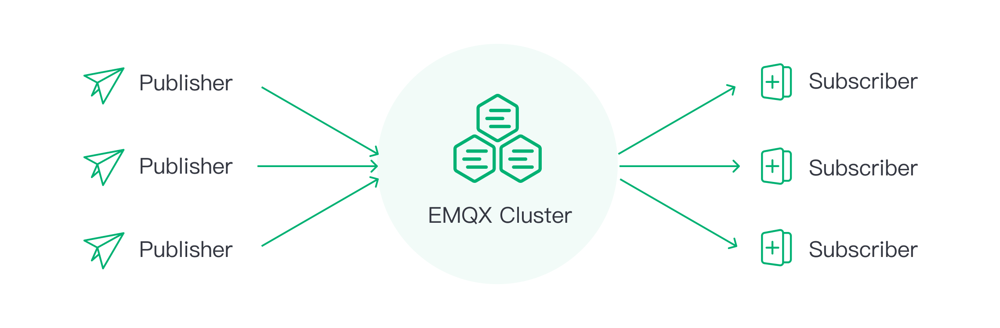

# CCP 서버 스택정리

| 항목                     | 상세내용                                                     |
| ------------------------ | ------------------------------------------------------------ |
| 어플리케이션 이름        | Spring Boot MQTT Server                                      |
| 기능/역할                | 장비 데이터를 적재하고, 장비 기능을 제어하는 역할            |
| 언어 및 프레임워크       | JAVA 17 + Spring Boot 2.7                                    |
| 아키텍처                 | TBD                                                          |
| 데이터베이스             | - MongoDB 7.0 - INFLUX 2.7 - Aurora Mysql 3        |
| 사용 프로토콜            | - HTTPS - WSS - MQTTS                              |
| 캐시                     | TBD                                                          |
| CI/CD                    | Argo Rollouts + Jenkins                                      |
| 사용 도구 및  라이브러리 | - org.springframework.boot                                 - org.springframework.boot:spring-boot-starter-web         - org.springframework.integration:spring-integration-mqtt  - org.springframework.integration:spring-integration-jmx   - com.influxdb:influxdb-client-java |
| 모니터링                 | Grafana                                                      |
| 호스팅 플랫폼            | AWS EKS                                                      |
| 보안 설정                | OAuth2, TLS 1.2                                              |
| 배포 환경                | develop, prod                                                |

### JAVA

| JAVA | version |
| ---- | ------- |
| JDK  | 17      |

### Application

| dependency                                              | version |
| ------------------------------------------------------- | ------- |
| org.springframework.boot                                | 2.7.4   |
| org.springframework.boot:spring-boot-starter-web        | 2.7.4   |
| org.springframework.integration:spring-integration-mqtt | 5.5.15  |
| org.springframework.integration:spring-integration-jmx  | 5.5.15  |
| com.influxdb:influxdb-client-java                       | 6.0.0   |

### Protocol

| protocol |
| -------- |
| HTTPS    |
| WSS      |
| MQTTS    |

### DB

| DB           | version |
| ------------ | ------- |
| Aurora Mysql | 3       |
| INFLUX       | 2.7.6   |
| MongoDB      | 7.0.15  |

# MQTT Broker

| 항목      | 상세내용                |
| --------- | ----------------------- |
| Broker    | EMQX                    |
| 기능/역할 | MQTT 통신을 위한 브로커 |

## EMQX 개요

EMQX는 IoT 및 실시간 메시징 애플리케이션을 위해 설계된 [오픈 소스 , 확장성이 뛰어나고 기능이 풍부한 MQTT 브로커입니다. 클러스터당 최대 1억 개의 동시 IoT 장치 연결을 지원하는 동시에 초당 100만 개의 메시지 처리량과 밀리초 지연 시간을 유지합니다.](https://github.com/emqx/emqx)